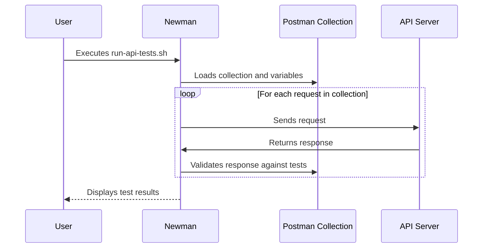

# End-to-End API Validation with Postman

Beyond unit and integration tests, it's crucial to validate that your API is fully compliant with the specification it claims to implement. For this project, we use the official [Conduit Postman Collection](https://github.com/gothinkster/realworld/tree/master/api) to perform end-to-end (E2E) testing. This ensures that our implementation of the RealWorld API is 100% compliant.

This tutorial will guide you through running the full E2E API test suite using the provided Postman collection and [Newman](https://github.com/postmanlabs/newman), a command-line collection runner for Postman.

## Running the API Tests

The `postman/` directory contains everything you need to run the API tests. The `run-api-tests.sh` script is the easiest way to execute the tests against a running server.

```bash
#!/usr/bin/env bash
set -x

SCRIPTDIR="$( cd "$( dirname "${BASH_SOURCE[0]}" )" >/dev/null && pwd )"

APIURL=${APIURL:-https://conduit.productionready.io/api}
USERNAME=${USERNAME:-u`date +%s`}
EMAIL=${EMAIL:-$USERNAME@mail.com}
PASSWORD=${PASSWORD:-password}

npx newman run $SCRIPTDIR/Conduit.postman_collection.json \
  --delay-request 500 \
  --global-var "APIURL=$APIURL" \
  --global-var "USERNAME=$USERNAME" \
  --global-var "EMAIL=$EMAIL" \
  --global-var "PASSWORD=$PASSWORD"
```

To run the tests, simply execute the script from the root of the project:

```bash
./postman/run-api-tests.sh
```

This will run the Postman collection against the default API URL, which is the official RealWorld demo API. To run the tests against your local server, you'll need to set the `APIURL` environment variable:

```bash
APIURL=http://localhost:8000/api ./postman/run-api-tests.sh
```

## API Test Workflow

The following diagram illustrates the workflow of the API tests:



As you can see, Newman acts as a command-line test runner for the Postman collection. It systematically sends each request defined in the collection to the target API server, then runs the associated tests to validate the correctness of the response.

## Conclusion

By running the Conduit Postman collection with Newman, you can be confident that your API is fully compliant with the RealWorld specification. This E2E testing approach is a valuable tool for ensuring the quality and correctness of your API implementation.
