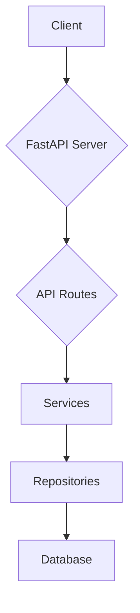
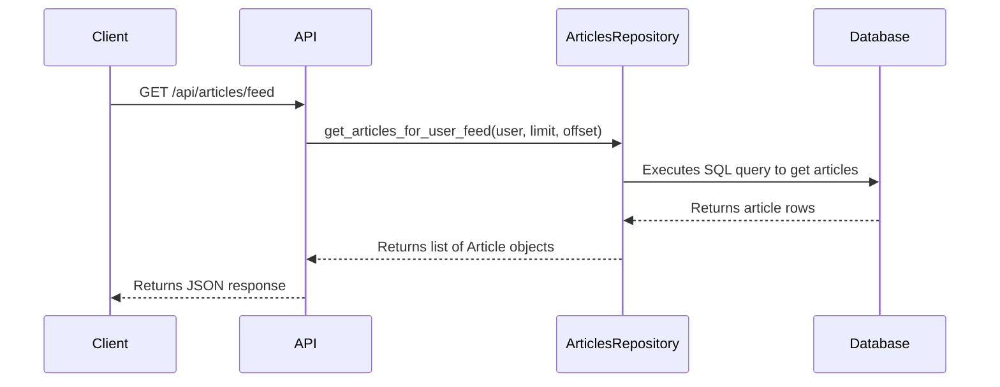
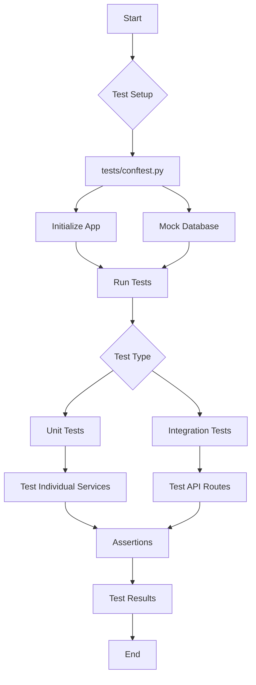
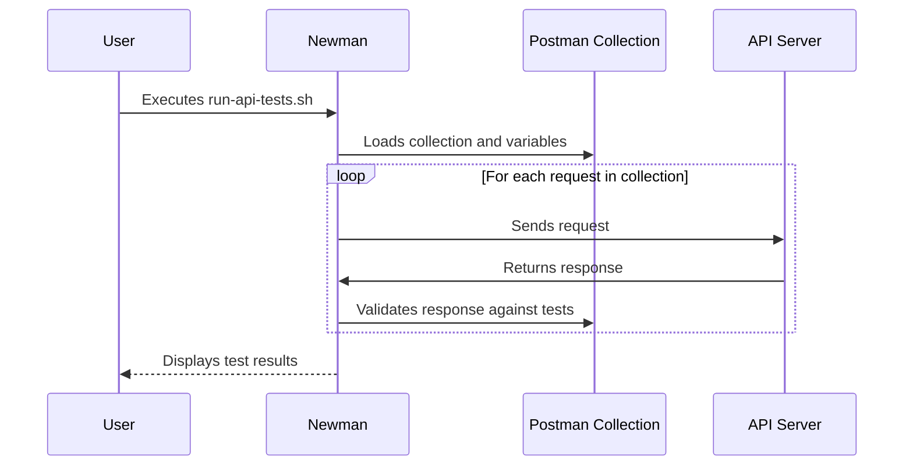

# Tutorials Wiki

> Compact, single-page view of all tutorials. Use the TOC below to jump around.

## Table of Contents
- [01 Quickstart](#01_quickstart)
- [02 Request Flow](#02_request_flow)
- [03 Writing Tests](#03_writing_tests)
- [End-to-End API Validation with Postman](#end_to_end_api_validation_with_postman)

<a id="tutorials_wiki"></a>
---
<a id="01_quickstart"></a>
# 01 Quickstart

'''
# Quickstart: Running the RealWorld Server

This guide will walk you through setting up your local environment, installing dependencies, and launching the FastAPI application to get your local server running.

## Prerequisites

Before you begin, ensure you have the following installed:

- [Docker](https://docs.docker.com/get-docker/)
- [Poetry](https://python-poetry.org/docs/#installation)
- [PostgreSQL Client Tools](https://www.postgresql.org/docs/current/app-createdb.html) (for the `createdb` command)

## 1. Set Up the Database

First, we need to get a PostgreSQL database running. We'll use Docker to simplify this process.

```bash
# Set environment variables for the database
export POSTGRES_DB=rwdb
export POSTGRES_PORT=5432
export POSTGRES_USER=postgres
export POSTGRES_PASSWORD=postgres
export POSTGRES_HOST=localhost

# Run PostgreSQL in a Docker container in detached mode
docker run --name pgdb -d --rm -p $POSTGRES_PORT:$POSTGRES_PORT -e POSTGRES_USER="$POSTGRES_USER" -e POSTGRES_PASSWORD="$POSTGRES_PASSWORD" -e POSTGRES_DB="$POSTGRES_DB" postgres

# Wait for the database to be ready
sleep 5

# Create the database
createdb --host=$POSTGRES_HOST --port=$POSTGRES_PORT --username=$POSTGRES_USER $POSTGRES_DB
```

These commands start a PostgreSQL container and create the necessary database for the application.

## 2. Configure and Install the Application

Next, we'll clone the repository, install dependencies using Poetry, and configure the application.

```bash
# Clone the repository
git clone https://github.com/nsidnev/fastapi-realworld-example-app
cd fastapi-realworld-example-app

# Install dependencies
poetry install

# Activate the virtual environment
poetry shell
```

Now, create and populate a `.env` file in the project root to store your environment variables:

```bash
touch .env
echo APP_ENV=dev >> .env
echo DATABASE_URL=postgresql://$POSTGRES_USER:$POSTGRES_PASSWORD@$POSTGRES_HOST:$POSTGRES_PORT/$POSTGRES_DB >> .env
echo SECRET_KEY=$(openssl rand -hex 32) >> .env
```

This file tells the application how to connect to the database and sets a secret key for signing JWTs.

## 3. Run the Server

With everything configured, you can now run the database migrations and start the FastAPI server.

```bash
# Apply database migrations
alembic upgrade head

# Start the server with auto-reload
uvicorn app.main:app --reload
```

Your server is now running! You can access the API documentation at [http://127.0.0.1:8000/docs](http://127.0.0.1:8000/docs).

## Architecture Overview

This application follows a standard layered architecture, which promotes separation of concerns and modularity. As documented in the knowledge base, the main components are:

- **API Routes**: Handle incoming HTTP requests.
- **Services**: Contain the core business logic.
- **Repositories**: Abstract database interactions.

Here is a diagram illustrating the request flow:



The main entry point of the application is `app/main.py`, which you can inspect to see how the FastAPI app is initialized.
'''

[↩ Back to top](#tutorials_wiki)

---
<a id="02_request_flow"></a>
# 02 Request Flow

'''
# Anatomy of an API Request

This tutorial follows a request from an API route through the service and repository layers to understand the application's core architecture and separation of concerns.

As documented in the knowledge base, the application is designed with a clear separation of concerns. This means that different parts of the application have distinct responsibilities. This makes the code easier to understand, maintain, and test.

The main layers are:

*   **API Layer**: Handles incoming HTTP requests and sends back responses. It's responsible for things like routing, request validation, and authentication.
*   **Service Layer**: Contains the business logic of the application.
*   **Repository Layer**: Responsible for all communication with the database.

Let's trace the flow of a request to see how these layers work together.

## The Request

We'll follow a `GET` request to `/api/articles/feed`, which retrieves the most recent articles for the currently logged-in user.

Here is an example of how to make this request using `curl`:

```bash
curl -X GET http://localhost:8000/api/articles/feed \
  -H "Authorization: Token YOUR_JWT_TOKEN"
```

## 1. The API Layer: Routing

The request first hits the API layer. The file `app/api/routes/api.py` is the main entry point for all API routes:

```python
# app/api/routes/api.py:5-13

from fastapi import APIRouter

from app.api.routes import authentication, comments, profiles, tags, users
from app.api.routes.articles import api as articles

router = APIRouter()
router.include_router(authentication.router, tags=["authentication"], prefix="/users")
router.include_router(users.router, tags=["users"], prefix="/user")
router.include_router(profiles.router, tags=["profiles"], prefix="/profiles")
router.include_router(articles.router, tags=["articles"])
router.include_router(
    comments.router,
    tags=["comments"],
    prefix="/articles/{slug}/comments",
)
router.include_router(tags.router, tags=["tags"], prefix="/tags")
```

The `articles.router` is included with the prefix `/articles`. Let's look at `app/api/routes/articles/api.py`:

```python
# app/api/routes/articles/api.py:3-7
from fastapi import APIRouter

from app.api.routes.articles import articles_common, articles_resource

router = APIRouter()

router.include_router(articles_common.router, prefix="/articles")
router.include_router(articles_resource.router, prefix="/articles")
```

Our target endpoint `/feed` is in `articles_common.router` which is defined in `app/api/routes/articles/articles_common.py`:

```python
# app/api/routes/articles/articles_common.py:22-38
@router.get(
    "/feed",
    response_model=ListOfArticlesInResponse,
    name="articles:get-user-feed-articles",
)
async def get_articles_for_user_feed(
    limit: int = Query(DEFAULT_ARTICLES_LIMIT, ge=1),
    offset: int = Query(DEFAULT_ARTICLES_OFFSET, ge=0),
    user: User = Depends(get_current_user_authorizer()),
    articles_repo: ArticlesRepository = Depends(get_repository(ArticlesRepository)),
) -> ListOfArticlesInResponse:
    articles = await articles_repo.get_articles_for_user_feed(
        user=user,
        limit=limit,
        offset=offset,
    )
    articles_for_response = [
        ArticleForResponse(**article.dict()) for article in articles
    ]
    return ListOfArticlesInResponse(
        articles=articles_for_response,
        articles_count=len(articles),
    )
```

This route handler does a few things:

1.  It uses FastAPI's dependency injection system (`Depends`) to get the current user and an instance of the `ArticlesRepository`.
2.  It calls the `get_articles_for_user_feed` method on the `articles_repo`.
3.  It formats the articles for the response.

## 2. The Repository Layer: Data Access

The `ArticlesRepository` is where the application interacts with the database. Let's look at the `get_articles_for_user_feed` method in `app/db/repositories/articles.py`:

```python
# app/db/repositories/articles.py:255-265
    async def get_articles_for_user_feed(
        self,
        *,
        user: User,
        limit: int = 20,
        offset: int = 0,
    ) -> List[Article]:
        articles_rows = await queries.get_articles_for_feed(
            self.connection,
            follower_username=user.username,
            limit=limit,
            offset=offset,
        )
        return [
            await self._get_article_from_db_record(
                article_row=article_row,
                slug=article_row[SLUG_ALIAS],
                author_username=article_row[AUTHOR_USERNAME_ALIAS],
                requested_user=user,
            )
            for article_row in articles_rows
        ]
```

This method fetches the articles from the database by calling `queries.get_articles_for_feed`. The `queries` object is generated from raw SQL files, providing a clean way to interact with the database.

## 3. The Flow in a Diagram

Here is a sequence diagram to visualize the flow:



## Summary

In this tutorial, we followed a request from the API layer all the way down to the database. We saw how the application is structured to separate concerns, making it easier to understand and maintain. The API layer handles HTTP requests, the repository layer handles data access, and dependency injection ties them together.
'''

[↩ Back to top](#tutorials_wiki)

---
<a id="03_writing_tests"></a>
# 03 Writing Tests

> # Testing Your Code with Pytest

This tutorial will guide you through writing and running unit and integration tests for the FastAPI application using `pytest`. You will learn how to use fixtures, mock database connections, and test individual application services and API routes.

As documented in the knowledge base, the project has a `tests` directory that mirrors the application structure, using `pytest` and fixtures (`conftest.py`) to test components in isolation. This ensures that our application is robust and reliable.

## Setting Up the Test Environment

The foundation of our testing setup is `tests/conftest.py`. This file contains fixtures that prepare the necessary components for our tests, such as the FastAPI application instance, a test client, and a mocked database connection.

Here are some of the key fixtures defined in `tests/conftest.py`:

```python
@pytest.fixture
def app() -> FastAPI:
    from app.main import get_application  # local import for testing purpose

    return get_application()

@pytest.fixture
async def initialized_app(app: FastAPI) -> FastAPI:
    async with LifespanManager(app):
        app.state.pool = await FakeAsyncPGPool.create_pool(app.state.pool)
        yield app

@pytest.fixture
async def client(initialized_app: FastAPI) -> AsyncClient:
    async with AsyncClient(
        app=initialized_app,
        base_url="http://testserver",
        headers={"Content-Type": "application/json"},
    ) as client:
        yield client

@pytest.fixture
def authorized_client(
    client: AsyncClient, token: str, authorization_prefix: str
) -> AsyncClient:
    client.headers = {
        "Authorization": f"{authorization_prefix} {token}",
        **client.headers,
    }
    return client
```

These fixtures provide a clean and consistent way to set up the application for testing. For example, the `initialized_app` fixture uses a `FakeAsyncPGPool` to mock the database connection, which is essential for creating isolated and fast tests. You can see this implementation in the `tests/conftest.py` file.

### Unit Testing a Service

Unit tests focus on testing individual components in isolation. Let's look at how to test the JWT service in `tests/test_services/test_jwt.py`.

```python
from datetime import timedelta

import jwt
import pytest

from app.models.domain.users import UserInDB
from app.services.jwt import (
    ALGORITHM,
    create_access_token_for_user,
    create_jwt_token,
    get_username_from_token,
)

def test_creating_jwt_token() -> None:
    token = create_jwt_token(
        jwt_content={"content": "payload"},
        secret_key="secret",
        expires_delta=timedelta(minutes=1),
    )
    parsed_payload = jwt.decode(token, "secret", algorithms=[ALGORITHM])

    assert parsed_payload["content"] == "payload"
```

This test, `test_creating_jwt_token`, verifies that the `create_jwt_token` function correctly creates a JWT with the expected payload. It does not depend on any other part of the application, making it a true unit test.

### Integration Testing an API Route

Integration tests verify that different parts of the application work together correctly. Here is an example from `tests/test_api/test_routes/test_articles.py` that tests the article creation endpoint:

```python
async def test_user_can_create_article(
    app: FastAPI, authorized_client: AsyncClient, test_user: UserInDB
) -> None:
    article_data = {
        "title": "Test Slug",
        "body": "does not matter",
        "description": "¯\\_(ツ)_/¯",
    }
    response = await authorized_client.post(
        app.url_path_for("articles:create-article"), json={"article": article_data}
    )
    article = ArticleInResponse(**response.json())
    assert article.article.title == article_data["title"]
    assert article.article.author.username == test_user.username
```

This test uses the `authorized_client` and `test_user` fixtures to send a POST request to the `/api/articles` endpoint and asserts that the response is correct. This test ensures that the API route, authentication, and article creation logic all work together as expected.

### Testing Workflow

The following diagram illustrates the testing workflow, from setting up the test environment to running unit and integration tests:



### Running the Tests

You can run the tests using the provided scripts in the `scripts/` directory. To run all tests, use the following command:

```bash
./scripts/test
```

To run the tests with coverage and generate an HTML report, use:

```bash
./scripts/test-cov-html
```

This will create a `htmlcov/` directory with a detailed report of your test coverage.

## Conclusion

In this tutorial, you learned how to write and run unit and integration tests for a FastAPI application using `pytest`. You saw how to use fixtures to create a consistent testing environment, how to mock database connections for isolated testing, and how to test both individual services and API routes. By following these patterns, you can ensure your application is well-tested, reliable, and easy to maintain.

[↩ Back to top](#tutorials_wiki)

---
<a id="end_to_end_api_validation_with_postman"></a>
# End-to-End API Validation with Postman

Beyond unit and integration tests, it's crucial to validate that your API is fully compliant with the specification it claims to implement. For this project, we use the official [Conduit Postman Collection](https://github.com/gothinkster/realworld/tree/master/api) to perform end-to-end (E2E) testing. This ensures that our implementation of the RealWorld API is 100% compliant.

This tutorial will guide you through running the full E2E API test suite using the provided Postman collection and [Newman](https://github.com/postmanlabs/newman), a command-line collection runner for Postman.

## Running the API Tests

The `postman/` directory contains everything you need to run the API tests. The `run-api-tests.sh` script is the easiest way to execute the tests against a running server.

```bash
#!/usr/bin/env bash
set -x

SCRIPTDIR="$( cd "$( dirname "${BASH_SOURCE[0]}" )" >/dev/null && pwd )"

APIURL=${APIURL:-https://conduit.productionready.io/api}
USERNAME=${USERNAME:-u`date +%s`}
EMAIL=${EMAIL:-$USERNAME@mail.com}
PASSWORD=${PASSWORD:-password}

npx newman run $SCRIPTDIR/Conduit.postman_collection.json \
  --delay-request 500 \
  --global-var "APIURL=$APIURL" \
  --global-var "USERNAME=$USERNAME" \
  --global-var "EMAIL=$EMAIL" \
  --global-var "PASSWORD=$PASSWORD"
```

To run the tests, simply execute the script from the root of the project:

```bash
./postman/run-api-tests.sh
```

This will run the Postman collection against the default API URL, which is the official RealWorld demo API. To run the tests against your local server, you'll need to set the `APIURL` environment variable:

```bash
APIURL=http://localhost:8000/api ./postman/run-api-tests.sh
```

## API Test Workflow

The following diagram illustrates the workflow of the API tests:



As you can see, Newman acts as a command-line test runner for the Postman collection. It systematically sends each request defined in the collection to the target API server, then runs the associated tests to validate the correctness of the response.

## Conclusion

By running the Conduit Postman collection with Newman, you can be confident that your API is fully compliant with the RealWorld specification. This E2E testing approach is a valuable tool for ensuring the quality and correctness of your API implementation.

[↩ Back to top](#tutorials_wiki)
