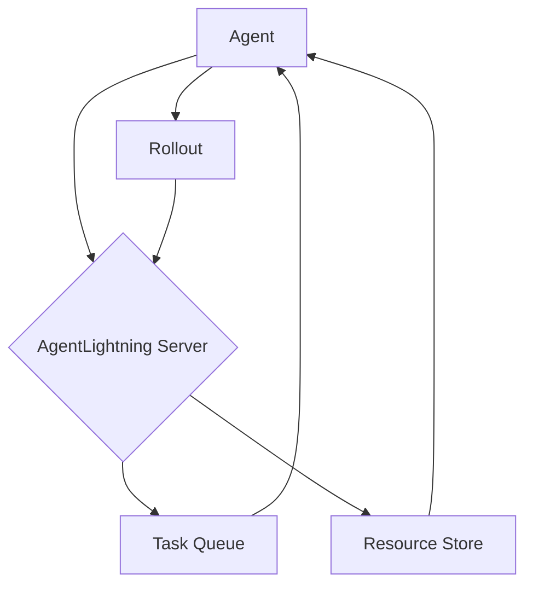

# Getting Started with AgentLightning

This tutorial will guide you through the basics of AgentLightning, a powerful framework for optimizing AI agents.

## 1. Goal

The goal of this tutorial is to introduce the core concepts of AgentLightning and provide a simple example to get you started.

## 2. Prerequisites

- Python 3.10 or later
- `agentlightning` package installed

To install AgentLightning, you can use pip:

```bash
pip install agentlightning
```

## 3. Architecture

AgentLightning works by separating the agent's logic from the optimization process. This is achieved through a client-server architecture, where the agent communicates with the AgentLightning server to get tasks and resources, and to report results.



## 4. Implementation

Let's create a simple agent that uses AgentLightning. This agent will get a task from the AgentLightning server, process it, and report the result.

First, you need to import the necessary classes:

```python
from agentlightning.client import AgentLightningClient
from agentlightning.types import RolloutLegacy
```

Next, you need to create a client instance, pointing to the AgentLightning server:

```python
client = AgentLightningClient(endpoint="http://localhost:8000")
```

Now, you can poll for a task:

```python
task = client.poll_next_task()
```

The `task` object contains the input for your agent, as well as the ID of the resources to use.

```python
if task:
    print(f"Received task: {task.input}")

    # Get the resources for the task
    resources = client.get_resources_by_id(task.resources_id)

    # Your agent's logic goes here
    # For this example, we'll just create a dummy output

    output = {"result": "Hello, AgentLightning!"}

    # Create a rollout to report the result
    rollout = RolloutLegacy(
        rollout_id=task.rollout_id,
        input=task.input,
        output=output,
        traces=[],
        metrics={}
    )

    # Post the rollout to the server
    client.post_rollout(rollout)

    print("Rollout posted successfully!")
```

This is a very basic example, but it shows the main components of an AgentLightning-powered agent. For more advanced use cases, such as using reinforcement learning to optimize your agent, please refer to the official documentation.

**Note:** The `AgentLightningClient` is a legacy client. For new projects, it is recommended to use the store-based APIs available in `agentlightning.store`.
