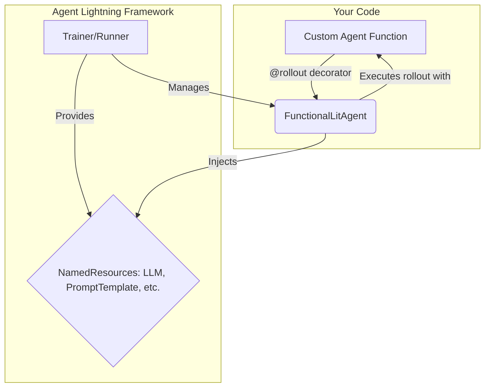

# Integrating with Agent Frameworks

## 1. Goal

This tutorial explains how to create custom agents using `agentlightning` that can be seamlessly integrated into larger agentic frameworks. We will focus on the `LitAgent` class and the convenient decorators that simplify agent creation.

## 2. Prerequisites

Make sure you have the `agentlightning` package installed:

```bash
pip install agentlightning
```

## 3. Architecture

The core idea is to decouple the agent's logic from the orchestration layer (e.g., training, validation, or deployment). `LitAgent` acts as a bridge between your custom code and the `agentlightning` framework.



## 4. Implementation

### The `LitAgent` Class

The `LitAgent` class, found in `agentlightning.litagent`, is the base class for all agents in the framework. It defines a standard interface for agent rollouts, allowing the `Trainer` and `Runner` to manage agent execution, tracing, and data persistence.

While you can create a custom agent by subclassing `LitAgent` and implementing the `rollout` method, `agentlightning` provides a much simpler way to create agents using decorators.

### Creating Agents with Decorators

The easiest way to create a `LitAgent` is by using the decorators from `agentlightning.litagent.decorator`. These decorators wrap your custom functions and turn them into `FunctionalLitAgent` instances.

There are three main decorators:

*   `@rollout`: A general-purpose decorator that inspects your function signature to determine the type of agent.
*   `@llm_rollout`: Specifically for agents that interact with a Large Language Model (LLM).
*   `@prompt_rollout`: For agents that work with tunable prompt templates.

### Using the `@rollout` Decorator

The `@rollout` decorator is the most versatile. It automatically creates the correct type of agent based on your function's signature.

Here's a simple example of an agent that takes a task and an LLM to generate a response:

```python
from agentlightning.litagent import rollout
from agentlightning.types import LLM, Task

# Define a task data structure
class MyTask(Task):
    input: str

# Create an agent using the @rollout decorator
@rollout
def my_llm_agent(task: MyTask, llm: LLM):
    """
    A simple agent that uses an LLM to respond to a prompt.
    """
    # In a real scenario, you would use the llm object to make an API call
    print(f"Using LLM: {llm.model} at {llm.endpoint}")
    response = f"Response for: {task.input}"
    return response

# The 'my_llm_agent' object is now a FunctionalLitAgent instance
print(isinstance(my_llm_agent, FuncLitAgent)) # True

```

### LLM and Prompt-based Rollouts

The `@llm_rollout` and `@prompt_rollout` decorators are specialized versions of `@rollout`.

`@llm_rollout`: Your function must accept `task` and `llm` arguments.

```python
from agentlightning.litagent import llm_rollout
from agentlightning.types import LLM, Task

class MyTask(Task):
    input: str

@llm_rollout
def my_llm_agent(task: MyTask, llm: LLM):
    # llm object is guaranteed to be available
    return f"LLM-based response for: {task.input}"
```

`@prompt_rollout`: Your function must accept `task` and `prompt_template` arguments.

```python
from agentlightning.litagent import prompt_rollout
from agentlightning.types import PromptTemplate, Task

class MyTask(Task):
    input: str

@prompt_rollout
def my_prompt_agent(task: MyTask, prompt_template: PromptTemplate):
    # prompt_template object is guaranteed to be available
    formatted_prompt = prompt_template.format(input=task.input)
    return f"Response based on prompt: {formatted_prompt}"
```

### The `rollout` Method and its Parameters

When you use these decorators, you are essentially creating an implementation for the `LitAgent.rollout` method. The `agentlightning` framework will call this method during execution, providing the necessary arguments:

*   `task`: The input data for the agent.
*   `resources`: A dictionary of named resources available to the agent, such as `llm` or `prompt_template`.
*   `rollout`: Metadata about the current rollout.

The decorators handle the boilerplate of inspecting the `resources` and passing the correct objects to your function.

By using these decorators, you can quickly create modular and reusable agents that are fully compatible with the `agentlightning` ecosystem, making it easy to integrate them into complex agent frameworks for training, evaluation, and deployment.

