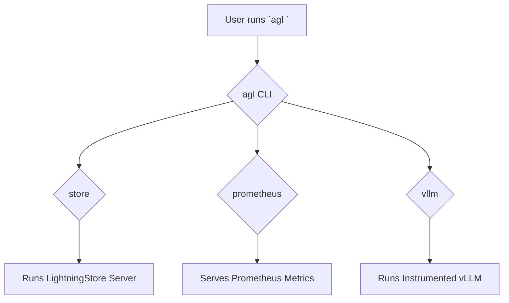

# Using the Agent Lightning Command-Line Interface

Agent Lightning comes with a powerful command-line interface (CLI) named `agl` that provides essential utilities for running its components. This tutorial will guide you through the main functionalities of the `agl` command.

## 1. Goal

The goal of this tutorial is to understand and use the primary subcommands of the `agl` CLI: `store`, `prometheus`, and `vllm`.

## 2. Prerequisites

Before you begin, you must have the `agentlightning` package installed. You can install it using pip:

```bash
pip install agentlightning
```

## 3. Architecture

The `agl` command acts as a dispatcher, routing tasks to different modules based on the subcommand provided. Each subcommand is responsible for a specific piece of functionality within the Agent Lightning ecosystem.



## 4. Implementation

The main entry point for the CLI is `agl`. You can see the available subcommands by running it with the `--help` flag.

```bash
agl --help
```

This will show you the available subcommands and a brief description of each.

### The `store` Subcommand

The `store` subcommand starts a `LightningStore` server, which is a key-value store for sharing data between different processes.

**Usage:**

```bash
agl store [OPTIONS]
```

**Key Options:**

*   `--host`: The host to bind the server to (default: `0.0.0.0`).
*   `--port`: The port for the server (default: `4747`).
*   `--backend`: The storage backend to use. Choices are `memory` (default) or `mongo`.
*   `--tracker`: Enable metrics tracking. You can choose `console` to print metrics to the screen or `prometheus` to expose a metrics endpoint.

**Example: Running a store with console metrics**

```bash
agl store --tracker console
```

### The `prometheus` Subcommand

This command starts a server dedicated to exposing Prometheus metrics. When you run multiple Agent Lightning processes, they can all report metrics to a central place, and this server makes them available for a Prometheus instance to scrape.

**Usage:**

```bash
agl prometheus [OPTIONS]
```

**Important Prerequisite:**

You must set the `PROMETHEUS_MULTIPROC_DIR` environment variable to a directory where metrics files can be stored.

**Key Options:**

*   `--host`: The host for the metrics server (default: `0.0.0.0`).
*   `--port`: The port for the metrics server (default: `4748`).
*   `--metrics-path`: The URL path for the metrics endpoint (default: `/v1/prometheus`).

**Example: Running the Prometheus metrics server**

```bash
# First, create and export the directory
export PROMETHEUS_MULTIPROC_DIR=$(mktemp -d)

# Run the server
agl prometheus --port 9090
```

### The `vllm` Subcommand

The `vllm` subcommand is a wrapper around the standard vLLM command-line interface. It automatically applies Agent Lightning instrumentation to the vLLM server, allowing you to capture detailed performance metrics and traces without modifying the vLLM code.

**Usage:**

This command accepts all the same arguments as the original `vllm` CLI.

```bash
agl vllm [VLLM_OPTIONS]
```

**Example: Running a vLLM server with Agent Lightning**

To run a vLLM server with a specific model, you would use the same arguments as you would with `vllm`, but prepend them with `agl`.

```bash
# This command is equivalent to the standard vllm command but with instrumentation
agl vllm --model facebook/opt-125m
```
