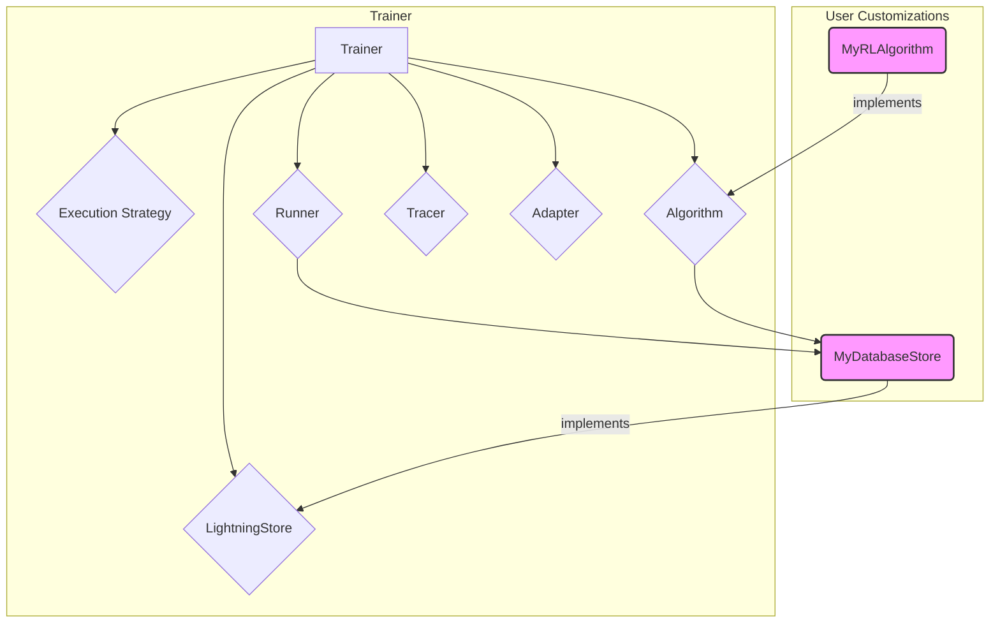

'''
# Advanced Customization in Agent-Lightning

This tutorial explores the advanced customization capabilities of the Agent-Lightning framework. While the default components are powerful, you may need to integrate your own logic for storage, execution, or telemetry. We will focus on how to implement and use a custom `LightningStore`.

## 1. Goal

The goal of this tutorial is to understand the pluggable architecture of the `Trainer` and learn how to replace core components, specifically by creating a custom `LightningStore` for persistent storage.

## 2. Prerequisites

- `agentlightning` package installed.
- Familiarity with the basic concepts of `Trainer`, `LitAgent`, and the training process in Agent-Lightning.

## 3. Architecture: The Pluggable Trainer

The `agentlightning.Trainer` is the central orchestrator, but it delegates most of its responsibilities to swappable components. This design allows for extensive customization without modifying the core trainer logic.



As the diagram shows, you can provide your own implementations for key components. The `Trainer` will seamlessly integrate them into the training loop.

## 4. Implementation: Creating a Custom LightningStore

The `LightningStore` is the backbone of the control plane, managing the state of all training rollouts, telemetry spans, and shared resources. The default is an `InMemoryLightningStore`, but for production scenarios, you might want a persistent store backed by a database.

### Step 1: Understand the `LightningStore` Contract

The abstract base class `agentlightning.store.base.LightningStore` defines the contract that all stores must adhere to. Key methods you'll need to implement include:

- `enqueue_rollout()`: Adds a new training task to the queue.
- `dequeue_rollout()`: Claims a task from the queue for a runner to execute.
- `add_span()`: Ingests telemetry data from an agent's execution.
- `update_rollout_status()`: Updates the state of a task (e.g., to `succeeded` or `failed`).
- `update_resources()`: Manages versioned resources like prompts or model weights.

### Step 2: Implement a Simple Custom Store

Let's create a placeholder for a custom store. In a real-world scenario, the methods would interact with a database like MongoDB or a file system. For this example, we will inherit from `InMemoryLightningStore` and add logging to show that our custom class is being used.

```python
import logging
from typing import Optional, Sequence

from agentlightning.store.memory import InMemoryLightningStore
from agentlightning.types import AttemptedRollout, EnqueueRolloutRequest, Rollout

# Configure basic logging
logging.basicConfig(level=logging.INFO)
logger = logging.getLogger(__name__)

class MyPersistentStore(InMemoryLightningStore):
    """
    A custom LightningStore that adds logging to key operations.
    In a real application, these methods would interact with a persistent
    backend like a database.
    """

    def __init__(self, *args, **kwargs):
        super().__init__(*args, **kwargs)
        logger.info("MyPersistentStore initialized!")

    async def enqueue_many_rollouts(self, rollouts: Sequence[EnqueueRolloutRequest]) -> Sequence[Rollout]:
        logger.info(f"Custom store is enqueuing {len(rollouts)} rollouts.")
        return await super().enqueue_many_rollouts(rollouts)

    async def dequeue_rollout(self, worker_id: Optional[str] = None) -> Optional[AttemptedRollout]:
        logger.info(f"Custom store is dequeuing a rollout for worker: {worker_id}")
        return await super().dequeue_rollout(worker_id)

    @property
    def capabilities(self):
        # Advertise that this store is thread-safe
        caps = super().capabilities
        caps["thread_safe"] = True
        return caps

```

### Step 3: Plug the Custom Store into the `Trainer`

Now, we can instantiate our `MyPersistentStore` and pass it to the `Trainer`. The `Trainer`'s constructor accepts instances of all its key components, making it easy to swap them out.

```python
from agentlightning import Trainer, LitAgent

# Assume MyPersistentStore is defined as above

# 1. Instantiate your custom store
custom_store = MyPersistentStore()

# 2. Pass the store instance to the Trainer
trainer = Trainer(store=custom_store, n_runners=2)

# Define a simple agent and dataset
class MyAgent(LitAgent):
    def run(self, **kwargs):
        print(f"Agent running with input: {kwargs}")
        return {"result": "success"}

train_dataset = [{"input": "task1"}, {"input": "task2"}]

# 3. Run the training loop
# The trainer will now use MyPersistentStore for all operations.
if __name__ == "__main__":
    trainer.fit(
        agent=MyAgent(),
        train_dataset=train_dataset
    )
```

When you run this code, you will see the log messages from `MyPersistentStore`, confirming that the `Trainer` is using your custom component.

## 5. Summary

The Agent-Lightning `Trainer` is built on a foundation of dependency injection, allowing you to replace its core components with your own implementations. By implementing the `LightningStore` interface, you can take full control of state management and integrate Agent-Lightning into your existing production infrastructure. The same principle applies to other components like `Algorithm`, `Runner`, and `Tracer`, giving you the power to tailor the framework to your specific needs.
'''