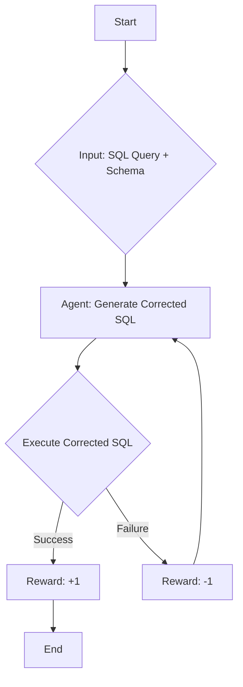

'''
# Example: SQL Correction with RL

This tutorial demonstrates how to use Reinforcement Learning (RL) to teach a Large Language Model (LLM) to correct SQL queries. By the end of this guide, you will understand how to build a simple RL loop for this task using the `agentlightning` library.

## 1. Goal

The primary goal is to train an agent that can take a potentially incorrect SQL query and a database schema, and then generate a corrected, executable SQL query. We will use a reward function to provide feedback to the agent, guiding it towards generating better queries.

## 2. Prerequisites

Before you begin, ensure you have the following installed:

- Python 3.10 or higher
- The `agentlightning` package. You can install it by running `pip install agentlightning`.

## 3. Architecture

The following diagram illustrates the workflow of our SQL correction agent:



## 4. Implementation

Now, let's dive into the code. We will be looking at the `search_r1_agent.py` file, which contains the core logic for our agent.

### The `SearchR1Agent` Class

The `SearchR1Agent` class is the heart of our implementation. It inherits from `LitAgent` and implements the `rollout` method. This method defines the agent's behavior for a single episode of interaction with the environment.

```python
from agentlightning import LitAgent, NamedResources, Rollout

class SearchR1Agent(LitAgent[Dict[str, Any]]):

    def __init__(
        self,
        val_temperature: Optional[float] = 0.0,
        max_turns: int = 4,
    ) -> None:
        super().__init__()
        self.val_temperature = val_temperature
        self.data_dir = os.environ.get("VERL_SEARCHR1_DATA_DIR", "data")
        self.max_turns = max_turns

    def rollout(
        self,
        task: Dict[str, Any],
        resources: NamedResources,
        rollout: Rollout,
    ) -> float | None:
        # ... implementation ...
```

### The `rollout` Method

The `rollout` method is where the agent interacts with the environment. It takes a task (containing the incorrect SQL query and schema), generates a corrected query, and receives a reward based on whether the corrected query is valid.

Here's a simplified version of the `rollout` method:

```python
# Inside the SearchR1Agent class

def rollout(
    self,
    task: Dict[str, Any],
    resources: NamedResources,
    rollout: Rollout,
) -> float | None:
    prompt = INSTRUCTION_FORMAT + task["question"]
    answer_list: List[str] = cast(List[str], task["golden_answers"])

    # ... (LLM client setup)

    # Agent generates a response
    turn_response = call_llm(
        client, llm.model, prompt + rollout_content, temperature=temperature, max_tokens=500
    )

    # ... (Response processing)

    # Evaluate the response and get a reward
    reward_score = eval(rollout_content, answer_list)

    return reward_score
```

### Running the Example

To run this example, you would typically use the `Trainer` class from `agentlightning`. The `debug_search_r1_agent` function shows how you can set up a `Trainer` and run a development session:

```python
def debug_search_r1_agent():
    # ... (Load data)

    trainer = Trainer(
        n_workers=1,
        initial_resources={
            "main_llm": LLM(
                endpoint=os.environ["OPENAI_API_BASE"],
                model="gpt-4.1-nano",
                sampling_parameters={"temperature": 0.0},
            )
        },
    )
    trainer.dev(SearchR1Agent(), df)


if __name__ == "__main__":
    debug_search_r1_agent()
```

## 5. Conclusion

In this tutorial, you learned how to use `agentlightning` to build a simple RL-based agent for SQL correction. This example can be extended to more complex tasks by modifying the agent's logic and the reward function.
'''