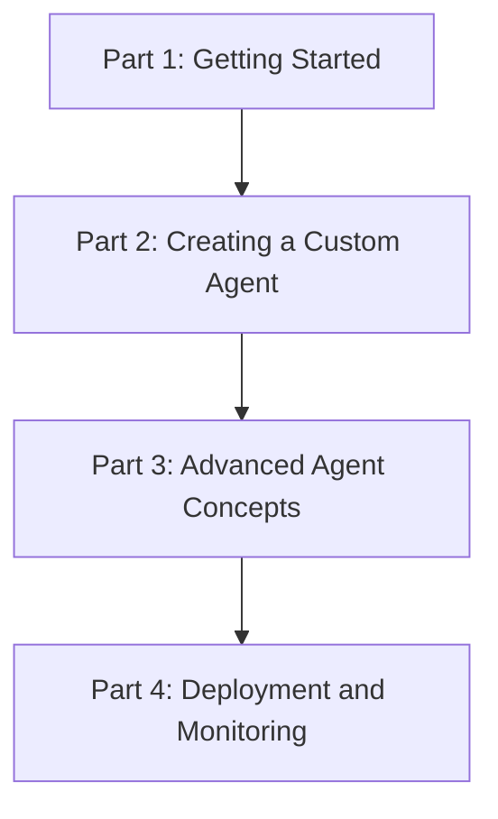

# Plan for Agent-Lightning Tutorial Series

This document outlines a plan for a series of tutorials to help developers learn how to use the `agentlightning` library.

## 1. Goal

The goal of this tutorial series is to provide a comprehensive guide to using `agentlightning` for building, training, and deploying AI agents. The series will cover everything from basic concepts to advanced topics, with a focus on practical examples and real-world applications.

## 2. Target Audience

This tutorial series is intended for developers who have a basic understanding of Python and machine learning concepts. No prior experience with `agentlightning` is required.

## 3. Tutorial Series Outline

### Part 1: Getting Started with Agent-Lightning

*   **Introduction to Agent-Lightning:** What is it, and what problems does it solve?
*   **Installation and Setup:** How to install `agentlightning` and its dependencies.
*   **Running a Basic Agent:** A simple "Hello, World!" example to get up and running quickly.

### Part 2: Creating a Custom Agent

*   **The Agent Class:** Understanding the core components of an agent.
*   **Defining Agent Actions:** How to define the actions that an agent can take.
*   **Managing Agent State:** How to manage the internal state of an agent.

### Part 3: Advanced Agent Concepts

*   **Using Tools with Agents:** How to extend the capabilities of agents with tools.
*   **Agent Communication:** How to enable communication between multiple agents.
*   **Working with Memory:** How to provide agents with short-term and long-term memory.

### Part 4: Deployment and Monitoring

*   **Deploying Agents as Services:** How to deploy agents as scalable web services.
*   **Monitoring Agent Performance:** How to monitor the performance of agents in production.
*   **Scaling Agents:** How to scale agents to handle a large number of requests.

## 4. Next Steps

The next step is to start writing the first tutorial in the series, "Getting Started with Agent-Lightning."
