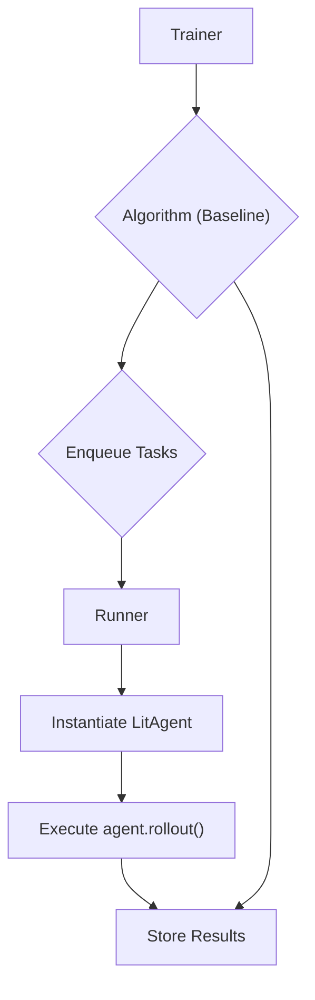

# Getting Started with agentlightning: A "Hello World" Tutorial

## 1. Synopsis

Welcome to `agentlightning`! This library is a powerful framework for training and optimizing AI agents in a distributed environment. It provides a structured way to define agent logic, manage training processes, and scale experiments.

In this tutorial, we will create a "Hello World" example to introduce the fundamental components of `agentlightning`:

-   **`LitAgent`**: The blueprint for your AI agent's logic.
-   **`Trainer`**: The orchestrator that manages the entire training and execution process.
-   **`Baseline`**: A simple algorithm that processes a dataset without any complex optimization, perfect for getting started.

By the end of this guide, you will have a runnable script that demonstrates the core data flow of the system.

## 2. Prerequisites

Before you begin, make sure you have `agentlightning` installed. You can install it using pip:

```bash
pip install agentlightning
```

## 3. Architecture

The relationship between the `Trainer`, `Algorithm` (`Baseline`), and `LitAgent` is central to the framework. The `Trainer` acts as the conductor, the `Algorithm` dictates the workflow, and the `LitAgent` performs the actual work.

Here’s a simple diagram illustrating how they interact:



## 4. Implementation Steps

Let's build our "Hello World" example step-by-step.

### Step 1: Implement the `LitAgent`

The `LitAgent` is where you define your agent's behavior. For this example, our agent will simply receive a string, print it, and return.

We will create a class `MyAgent` that inherits from `agentlightning.litagent.LitAgent`. The core logic goes into the `rollout` method.

```python
from agentlightning.litagent import LitAgent
from agentlightning.types import NamedResources, Rollout, RolloutRawResult

class MyAgent(LitAgent[str]):
    def rollout(self, task: str, resources: NamedResources, rollout: Rollout) -> RolloutRawResult:
        print(f"MyAgent received task: {task}")
        # In a real scenario, you would perform some work here.
        # For this example, we just print the task.
        return None
```

### Step 2: Create a Dataset

`agentlightning` operates on datasets. For this simple example, we'll use a basic Python list as our dataset. Each item in the list represents a "task" that will be sent to our `LitAgent`.

```python
train_dataset = ["Hello", "World", "from", "agentlightning"]
```

### Step 3: Configure and Run the `Trainer`

The `Trainer` is the main entry point for running an `agentlightning` process. We will configure it with the `Baseline` algorithm.

- **`Baseline` algorithm**: This is a straightforward algorithm that takes items from the dataset, enqueues them as tasks, and waits for them to be processed. It's ideal for verifying that your `LitAgent` and `Trainer` are set up correctly.
- **`Trainer`**: We will instantiate the `Trainer`, telling it to use the `Baseline` algorithm. Then, we call the `.dev()` method, which is designed for quick, synchronous test runs.

### Complete Runnable Code

Here is the full script that combines all the pieces. Save it as `hello_agent.py`.

```python
import logging
from agentlightning.litagent import LitAgent, LitAgent
from agentlightning.trainer import Trainer
from agentlightning.algorithm import Baseline
from agentlightning.types import NamedResources, Rollout, RolloutRawResult

# Configure logging to see the output from the framework
logging.basicConfig(level=logging.INFO)

# 1. Implement the LitAgent
class MyAgent(LitAgent[str]):
    """A simple agent that prints the task it receives."""
    def rollout(self, task: str, resources: NamedResources, rollout: Rollout) -> RolloutRawResult:
        print(f"MyAgent received task: '{task}'")
        return None

# 2. Create a Dataset
train_dataset = ["Hello", "World", "from", "agentlightning"]

# 3. Instantiate the agent
my_agent = MyAgent()

# 4. Configure and Run the Trainer
if __name__ == "__main__":
    # Use the Baseline algorithm for a simple run
    algorithm = Baseline()

    # The Trainer orchestrates the process
    trainer = Trainer(algorithm=algorithm, n_runners=1)

    print("Starting agent training...")
    # The .dev() method is for fast, synchronous, local test runs.
    trainer.dev(agent=my_agent, train_dataset=train_dataset)
    print("Agent training finished.")

```

## 5. Running the Example

Execute the script from your terminal:

```bash
python hello_agent.py
```

You should see output similar to this, indicating that the `Trainer` is running, the `Baseline` algorithm is enqueuing tasks, and `MyAgent` is processing them:

```
INFO:agentlightning.trainer.trainer:Starting agent training...
INFO:agentlightning.algorithm.fast:Proceeding epoch 1/1.
...
INFO:agentlightning.algorithm.fast:Enqueued rollout ... in train mode with sample: Hello
MyAgent received task: 'Hello'
...
INFO:agentlightning.algorithm.fast:Enqueued rollout ... in train mode with sample: World
MyAgent received task: 'World'
...
INFO:agentlightning.trainer.trainer:Agent training finished.
```

## 6. Common Pitfalls

-   **`NotImplementedError`**: If you forget to implement the `rollout` method in your `LitAgent` subclass, you will get a `NotImplementedError`. Ensure your agent's logic is defined in this method.
-   **No Output**: If you don't configure the `logging` module, you might not see the informative messages from the `agentlightning` framework. Always include `logging.basicConfig(level=logging.INFO)` at the start of your script for better visibility.

## 7. Challenge Yourself

Now that you have a basic example running, try to extend it:

1.  **Create a `validation_dataset`**: Add a second list of strings (e.g., `val_dataset = ["This", "is", "validation"]`) and pass it to the `trainer.dev()` call.
2.  **Modify the Agent**: Change the `MyAgent.rollout` method to return a number (e.g., the length of the string). `agentlightning` is designed to capture these return values as rewards.

Congratulations! You've successfully run your first `agentlightning` program.

