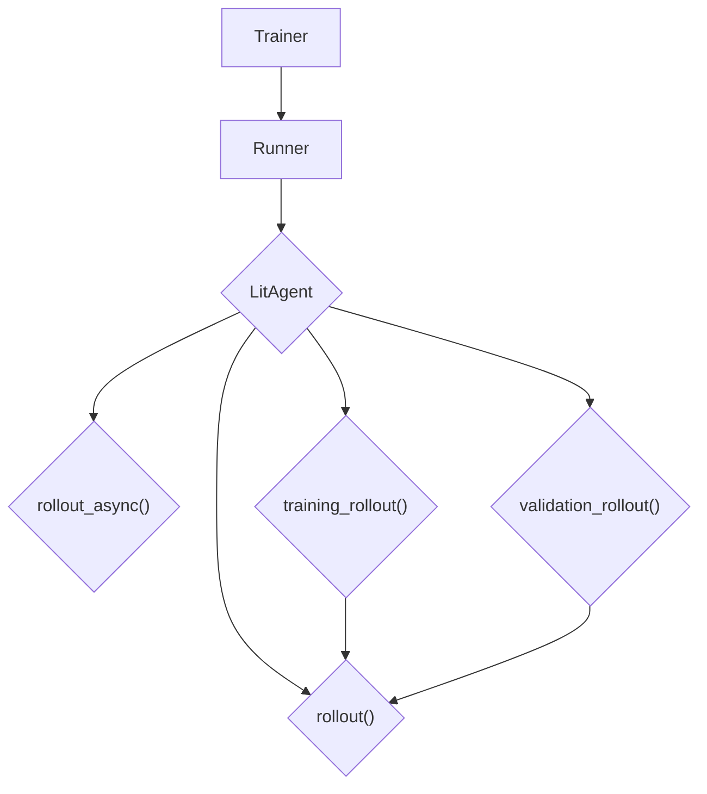

# LitAgent Deep Dive: Mastering Agent Behavior

## 1. Synopsis

The `LitAgent` class is the heart of your custom agent's logic within the `agentlightning` framework. It provides a structured way to define how your agent processes tasks. This tutorial will guide you through the different `rollout` methods available in `LitAgent`, explaining their specific use cases and how to leverage them to create sophisticated agents that can adapt their behavior for training, validation, and asynchronous execution.

## 2. Prerequisites

Before we begin, ensure you have `agentlightning` installed:

```bash
pip install agentlightning
```

## 3. Architecture

The following diagram illustrates the relationship between the `Trainer`, `Runner`, and the `LitAgent`, and how the different `rollout` methods are invoked.



## 4. Implementation Steps

### Step 1: The `LitAgent` Base Class

The `LitAgent` is an abstract base class that you subclass to create your own agent. The core of a `LitAgent` is the `rollout` method and its variants. Let's start with a basic `LitAgent`:

```python
from agentlightning import LitAgent
from agentlightning.types import NamedResources, Rollout, RolloutRawResult, Task

class MyAgent(LitAgent):
    def rollout(self, task: Task, resources: NamedResources, rollout: Rollout) -> RolloutRawResult:
        print(f"Processing task: {task}")
        # Your agent's logic here
        return 1.0 # Return a reward
```

*Verification*: When this agent is run, you will see the "Processing task..." message in the console for each task processed.

### Step 2: Synchronous vs. Asynchronous Rollouts

`LitAgent` supports both synchronous and asynchronous execution.

*   **`rollout()`**: Use this for synchronous tasks. The agent will block until the task is complete.
*   **`rollout_async()`**: For I/O-bound tasks, you can use the `async` version to improve performance.

Here's an example of an agent with an asynchronous rollout:

```python
import asyncio
from agentlightning import LitAgent
from agentlightning.types import NamedResources, Rollout, RolloutRawResult, Task

class MyAsyncAgent(LitAgent):
    async def rollout_async(self, task: Task, resources: NamedResources, rollout: Rollout) -> RolloutRawResult:
        print(f"Starting async processing for task: {task}")
        await asyncio.sleep(1) # Simulate an I/O operation
        print(f"Finished async processing for task: {task}")
        return 1.0

    def is_async(self) -> bool:
        return True
```

*Verification*: The `is_async` method tells the `Runner` to use the `rollout_async` method. You will see the "Starting..." and "Finished..." messages with a 1-second delay between them.

### Step 3: Differentiating Between Training and Validation

You can specify different behaviors for the training and validation phases by implementing `training_rollout` and `validation_rollout`.

```python
from agentlightning import LitAgent
from agentlightning.types import NamedResources, Rollout, RolloutRawResult, Task

class MyTrainingAgent(LitAgent):
    def training_rollout(self, task: Task, resources: NamedResources, rollout: Rollout) -> RolloutRawResult:
        print(f"Training on task: {task}")
        # Training-specific logic, e.g., use dropout
        return 1.0

    def validation_rollout(self, task: Task, resources: NamedResources, rollout: Rollout) -> RolloutRawResult:
        print(f"Validating on task: {task}")
        # Validation-specific logic, e.g., no dropout
        return 1.0
```

*Verification*: When you run this agent with a `Trainer`, you will see "Training on task..." for tasks from the training dataset and "Validating on task..." for tasks from the validation dataset.

### Step 4: Accessing `trainer`, `runner`, and `tracer`

Within your `LitAgent`, you can access the `trainer`, `runner`, and `tracer` properties to get more context about the execution environment.

```python
from agentlightning import LitAgent
from agentlightning.types import NamedResources, Rollout, RolloutRawResult, Task

class MyContextAgent(LitAgent):
    def rollout(self, task: Task, resources: NamedResources, rollout: Rollout) -> RolloutRawResult:
        print(f"Trainer: {self.trainer}")
        print(f"Runner: {self.runner}")
        print(f"Tracer: {self.tracer}")
        self.tracer.add_event("Custom event from my agent")
        return 1.0
```

*Verification*: The console will display the `Trainer`, `Runner`, and `Tracer` objects. The "Custom event..." will be visible in the traces collected by the `Tracer`.

## 5. Common Pitfalls

*   **`NotImplementedError`**: If you don't implement any of the `rollout` methods, a `NotImplementedError` will be raised.
*   **Async Mismatch**: If you implement `rollout_async` but forget to override `is_async` to return `True`, your async method will not be called.
*   **Deprecated `trained_agents`**: The `trained_agents` argument in the `__init__` method is deprecated. Use `agent_match` in the adapter layer instead.

## 6. Challenge Yourself

Implement a `LitAgent` that has different logic for `training_rollout` and `validation_rollout`. In the `training_rollout`, use the `tracer` to log a custom event. In the `validation_rollout`, do not log the event. This will help you understand how to create agents with different behaviors for different execution phases and how to use the `tracer` for custom logging.
