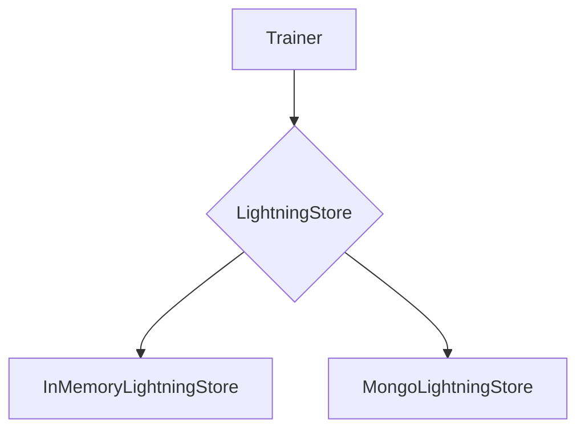

'''
# Data Handling and Storage in agentlightning

## 1. Goal

This tutorial explains how to configure data handling and storage in `agentlightning`. You will learn about the `LightningStore` abstraction and how to use its in-memory and MongoDB backends to store and manage your training data.

## 2. Prerequisites

Before you begin, make sure you have `agentlightning` installed. For the MongoDB example, you will also need to install `pymongo`.

```bash
pip install agentlightning
pip install pymongo
```

## 3. Architecture

The `LightningStore` is a key-value store abstraction that provides a unified interface for handling data persistence in `agentlightning`. It is designed to be pluggable, allowing you to easily switch between different storage backends.

Here is a diagram illustrating the architecture:



The `Trainer` uses a `LightningStore` instance to manage rollouts, attempts, and other data. You can configure the `Trainer` to use either the `InMemoryLightningStore` for local development and testing, or the `MongoLightningStore` for production and distributed environments.

## 4. Implementation

Let's look at how to configure the `Trainer` to use each of the available backends.

### In-Memory Storage

The `InMemoryLightningStore` is the default storage backend. It is a non-persistent, in-memory store that is suitable for local development and testing. To use it, you don't need to provide any specific configuration to the `Trainer`.

Here is an example of how to use the `InMemoryLightningStore`:

```python
from agentlightning import Trainer
from agentlightning.store.memory import InMemoryLightningStore

# The Trainer will use the InMemoryLightningStore by default
trainer = Trainer()

# You can also explicitly pass an InMemoryLightningStore instance
store = InMemoryLightningStore()
trainer = Trainer(store=store)
```

### MongoDB Storage

The `MongoLightningStore` is a persistent backend that uses MongoDB to store data. It is suitable for production and distributed environments.

To use the `MongoLightningStore`, you need to provide a MongoDB connection URI to its constructor. You can then pass the `MongoLightningStore` instance to the `Trainer`.

Here is an example of how to use the `MongoLightningStore`:

```python
from agentlightning import Trainer
from agentlightning.store.mongo import MongoLightningStore

# Make sure you have a MongoDB instance running
# and replace the connection URI with your own.
MONGO_URI = "mongodb://localhost:27017"

store = MongoLightningStore(uri=MONGO_URI)
trainer = Trainer(store=store)
```

## 5. Common Pitfalls

- **Forgetting to install `pymongo`**: When using the `MongoLightningStore`, make sure you have the `pymongo` package installed. Otherwise, you will get an `ImportError`.
- **Incorrect MongoDB URI**: Double-check your MongoDB connection URI to ensure that it is correct and that your MongoDB instance is running and accessible.

## 6. Challenge Yourself

Modify the MongoDB example to connect to a free MongoDB Atlas cluster. This will give you a taste of using a cloud-based MongoDB instance for your `agentlightning` projects.
'''