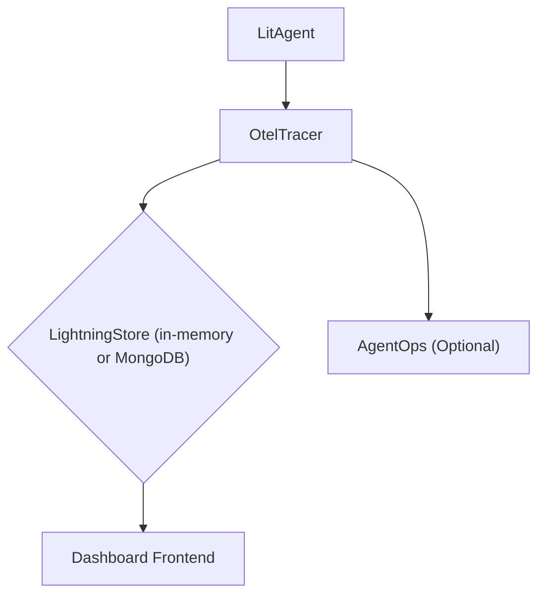

'''
# Monitoring and Debugging with agentlightning

## 1. Goal

This tutorial will guide you through the process of monitoring and debugging your AI agents using the `agentlightning` framework. You will learn how to use the built-in `OtelTracer` to capture detailed execution traces and integrate with `agentops` for enhanced monitoring capabilities. By the end of this tutorial, you will be able to visualize your agent's execution flow, identify bottlenecks, and debug issues with ease.

## 2. Prerequisites

Before you begin, ensure you have the following installed:

- The `agentlightning` package.
- An `agentops` account and API key.

## 3. Architecture

The monitoring and debugging architecture in `agentlightning` is built on top of OpenTelemetry, a powerful and flexible observability framework. The `OtelTracer` captures traces from your agent's execution and sends them to a `LightningStore`, which can be a local in-memory store or a remote MongoDB database. The dashboard then reads the traces from the `LightningStore` and visualizes them in a user-friendly interface.



## 4. Implementation

### Step 1: Initialize the `OtelTracer`

The first step is to initialize the `OtelTracer` in your agent. The tracer is responsible for capturing and exporting traces. You can initialize it in your agent's `__init__` method.

```python
from agentlightning.litagent import LitAgent
from agentlightning.tracer.otel import OtelTracer

class MyAgent(LitAgent):
    def __init__(self):
        super().__init__()
        self.tracer = OtelTracer()
        self.tracer.init_worker(worker_id=0)
```

### Step 2: Create Spans with `trace_context` and `operation_context`

Once the tracer is initialized, you can use the `trace_context` and `operation_context` to create spans and capture traces. The `trace_context` is used to create a new trace, while the `operation_context` is used to create a new span within the current trace.

```python
import asyncio
from agentlightning.litagent import LitAgent
from agentlightning.tracer.otel import OtelTracer

class MyAgent(LitAgent):
    def __init__(self):
        super().__init__()
        self.tracer = OtelTracer()
        self.tracer.init_worker(worker_id=0)

    async def rollout(self):
        async with self.tracer.trace_context(name="my_agent_rollout") as tracer:
            with self.tracer.operation_context(name="step_1") as span:
                # Your agent's logic for step 1
                await asyncio.sleep(1)
                span.record_attributes({"result": "success"})

            with self.tracer.operation_context(name="step_2") as span:
                # Your agent's logic for step 2
                await asyncio.sleep(2)
                span.record_attributes({"result": "success"})
```

### Step 3: Integrate with AgentOps

`agentlightning` provides seamless integration with `agentops` for enhanced monitoring. To enable `agentops` integration, you need to set the `AGENTOPS_API_KEY` environment variable and instrument `agentops` in your code.

```python
import os
from agentlightning.instrumentation.agentops import instrument_agentops

# Set your AgentOps API key
os.environ["AGENTOPS_API_KEY"] = "YOUR_API_KEY"

# Instrument agentops
instrument_agentops()
```

### Step 4: View Traces in the Dashboard

After running your agent, you can view the traces in the `agentlightning` dashboard. The dashboard provides a detailed view of your agent's execution flow, including the duration of each span, the attributes you recorded, and any exceptions that occurred.

To launch the dashboard, run the following command in your terminal:

```bash
agl dashboard
```

Navigate to the "Rollouts" page in the dashboard to see a list of your agent's rollouts. Click on a rollout to view the detailed traces.

## 5. Common Pitfalls

- **`agentops` not installed**: If you forget to install the `agentops` package, you will get an `ImportError`. Make sure to install it using `pip install agentops`.
- **Incorrect API Key**: If you use an incorrect `agentops` API key, you will see errors in your console, and no data will be sent to `agentops`.

## 6. Challenge Yourself

Now that you have learned the basics of monitoring and debugging in `agentlightning`, here's a challenge for you:

1.  Create a new agent that performs a more complex task with multiple steps.
2.  Add custom attributes to your spans to capture more detailed information about your agent's execution.
3.  Introduce an error in your agent's logic and use the traces to debug the issue.

'''