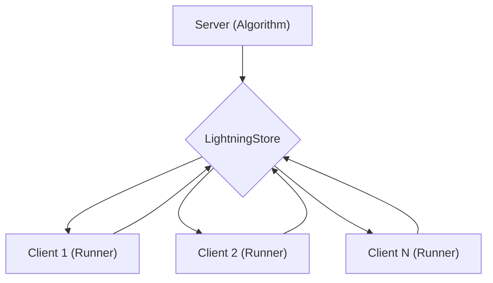

# Distributed Execution with agentlightning

## 1. Goal

This tutorial demonstrates how to scale out your agent experiments using `agentlightning`'s distributed execution capabilities. You will learn how to set up a central server to orchestrate tasks and connect multiple clients (runners) to execute them in parallel. This is essential for large-scale simulations, massive data processing, or any scenario where a single machine is not enough.

## 2. Prerequisites

Make sure you have `agentlightning` installed:

```bash
pip install agentlightning
```

## 3. Architecture

The distributed execution model in `agentlightning` is built around a client-server architecture. The `ClientServerExecutionStrategy` manages this.

- **Server (Algorithm Role)**: The central node that runs the main `Algorithm`. It manages the `LightningStore` and distributes tasks (rollouts) to the clients.
- **Clients (Runner Role)**: Worker nodes that connect to the server. They poll for tasks, execute them using a `LitAgent`, and send the results back to the server.

Here’s a visual representation:



## 4. Implementation Steps

We will create two scripts: one for the server and one for the client.

### Step 1: The Agent

First, let's define a simple `LitAgent` that we'll use for both the server and client. Create a file named `my_agent.py`:

```python
# my_agent.py
from agentlightning import LitAgent

class MyDistributedAgent(LitAgent):
    def rollout(self, state: str):
        print(f"Processing state: {state}")
        return f"Completed: {state}"
```

### Step 2: The Server

Next, create the server script. This script will configure the `Trainer` to run in `algorithm` mode. Create a file named `server.py`:

```python
# server.py
from agentlightning import Trainer
from agentlightning.execution.client_server import ClientServerExecutionStrategy
from my_agent import MyDistributedAgent

# 1. Configure the execution strategy for the server role
strategy = ClientServerExecutionStrategy(
    role="algorithm",
    server_host="0.0.0.0", # Listen on all available network interfaces
    server_port=8000
)

# 2. Configure the trainer
trainer = Trainer(
    strategy=strategy,
)

# 3. Define the dataset
train_dataset = ["task 1", "task 2", "task 3", "task 4"]

# 4. Start the training
trainer.fit(
    agent=MyDistributedAgent(),
    train_dataset=train_dataset
)
```

To start the server, run the following command in your terminal:

```bash
python server.py
```

The server will start and wait for clients to connect.

### Step 3: The Client

Now, create the client script. This script will configure the `Trainer` to run in `runner` mode. Create a file named `client.py`:

```python
# client.py
from agentlightning import Trainer
from agentlightning.execution.client_server import ClientServerExecutionStrategy
from my_agent import MyDistributedAgent

# 1. Configure the execution strategy for the client role
strategy = ClientServerExecutionStrategy(
    role="runner",
    server_host="<YOUR_SERVER_IP>",  # Replace with the server's IP address
    server_port=8000,
    n_runners=2  # Number of parallel runners on this client machine
)

# 2. Configure the trainer
trainer = Trainer(
    strategy=strategy,
)

# 3. Start the client
# Note: The dataset is managed by the server, so we don't provide it here.
trainer.fit(
    agent=MyDistributedAgent()
)
```

Replace `<YOUR_SERVER_IP>` with the IP address of the machine running the `server.py` script. If you are running both on the same machine, you can use `"localhost"`.

To start a client, run the following command in a new terminal:

```bash
python client.py
```

You can start multiple clients on different machines, and they will all connect to the central server to process tasks.

### Step 4: Putting It All Together

1.  **Start the server** on one machine:
    ```bash
    python server.py
    ```

2.  **Start one or more clients** on other machines (or the same one):
    ```bash
    python client.py
    ```

You will see the output of the `rollout` method from `MyDistributedAgent` on the client's console, and the server will manage the distribution of the tasks from `train_dataset`.

## 5. Common Pitfalls

- **Firewall Issues**: Ensure that the port you are using (e.g., `8000`) is open on the server machine and that your network allows connections.
- **Incorrect Host/Port**: Double-check that the `server_host` and `server_port` in the client script match the server's configuration.
- **Package Version Mismatch**: It's good practice to ensure that all client machines and the server are running the same version of `agentlightning`.

## 6. Challenge Yourself

Modify the `MyDistributedAgent` to perform a more complex task, such as making an API call or performing a calculation. Observe how the server distributes the work and how the clients process it in parallel.