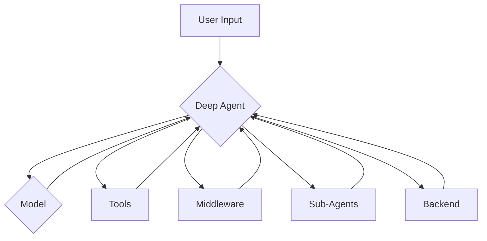

'''
# Customizing Deep Agents

## 1. Goal

This tutorial will guide you through the process of customizing `deepagents` to fit your specific needs. You will learn how to change the underlying language model, add new tools, modify the agent's behavior with middleware, and configure sub-agents for complex tasks.

## 2. Prerequisites

- The `deepagents` package installed.

## 3. Architecture



## 4. Implementation

The `create_deep_agent` function is the main entry point for creating a new agent. It accepts several parameters to customize its behavior.

### `model`

By default, `deepagents` uses `"claude-sonnet-4-5-20250929"`. You can customize this by passing any LangChain model object.

```python
from langchain.chat_models import init_chat_model
from deepagents import create_deep_agent

model = init_chat_model("openai:gpt-4o")
agent = create_deep_agent(
    model=model,
)
```

### `system_prompt`

You can provide a `system_prompt` parameter to `create_deep_agent()`. This custom prompt is **appended to** default instructions that are automatically injected by middleware.

```python
from deepagents import create_deep_agent
research_instructions = """your custom system prompt"""
agent = create_deep_agent(
    system_prompt=research_instructions,
)
```

### `tools`

Provide custom tools to your agent (in addition to the built-in tools).

```python
from deepagents import create_deep_agent

def internet_search(query: str) -> str:
    """Run a web search"""
    # Replace with your actual implementation
    return f"Search results for: {query}"

agent = create_deep_agent(tools=[internet_search])
```

### `middleware`

Deep agents use middleware for extensibility. Add custom middleware to inject tools, modify prompts, or hook into the agent lifecycle.

```python
from langchain_core.tools import tool
from deepagents import create_deep_agent
from langchain.agents.middleware import AgentMiddleware

@tool
def get_weather(city: str) -> str:
    """Get the weather in a city."""
    return f"The weather in {city} is sunny."

class WeatherMiddleware(AgentMiddleware):
    def get_tools(self):
        return [get_weather]

agent = create_deep_agent(middleware=[WeatherMiddleware()])
```

### `subagents`

The main agent can delegate work to sub-agents via the `task` tool. You can supply custom sub-agents for context isolation and custom instructions.

```python
from deepagents import create_deep_agent

research_subagent = {
    "name": "research-agent",
    "description": "Used to research in-depth questions",
    "prompt": "You are an expert researcher",
    "tools": [],
    "model": "openai:gpt-4o",  # Optional, defaults to main agent model
}

agent = create_deep_agent(subagents=[research_subagent])
```

### `interrupt_on`

Some tools may be sensitive and require human approval before execution. Deepagents supports human-in-the-loop workflows through LangGraph’s interrupt capabilities.

```python
from langchain_core.tools import tool
from deepagents import create_deep_agent

@tool
def sensitive_operation(data: str) -> str:
    """Performs a sensitive operation."""
    return f"Operation completed with data: {data}"

agent = create_deep_agent(
    tools=[sensitive_operation],
    interrupt_on={
        "sensitive_operation": {
            "allowed_decisions": ["approve", "edit", "reject"]
        },
    }
)
```

### `backend`

Deep agents use pluggable backends to control how filesystem operations work. By default, files are stored in the agent's ephemeral state. You can configure different backends for local disk access, persistent cross-conversation storage, or hybrid routing.

```python
from deepagents import create_deep_agent
from deepagents.backends import FilesystemBackend

agent = create_deep_agent(
    backend=FilesystemBackend(root_dir="/path/to/project"),
)
```

By leveraging these customization options, you can tailor `deepagents` to a wide variety of tasks and environments.
'''