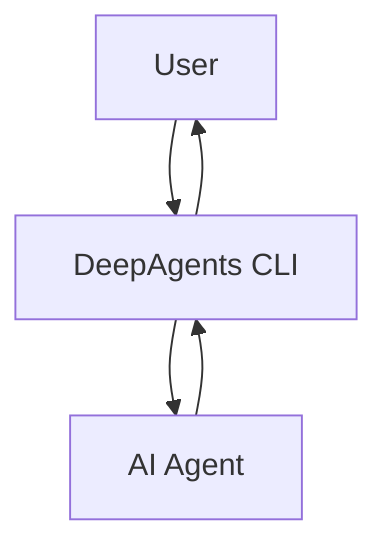

'''
# Getting Started with DeepAgents CLI

## 1. Synopsis

The DeepAgents CLI provides a powerful, terminal-based interface for interacting with AI agents. This tutorial will guide you through the installation process and a basic "hello world" interaction, demonstrating how to ask a question and receive an answer from the agent.

## 2. Prerequisites

To begin, you need to have Python installed on your system (version 3.11 or higher). You can then install the DeepAgents CLI using pip:

```bash
pip install deepagents-cli
```

## 3. Architecture

The DeepAgents CLI acts as a bridge between you and the AI agent. The following diagram illustrates this simple relationship:



## 4. Implementation Steps

### Step 1: Start the DeepAgents CLI

Once the package is installed, you can start the CLI by running the following command in your terminal:

```bash
deepagents
```

This will launch the interactive prompt, and you'll see a welcome message.

### Step 2: Ask a "Hello World" Question

Now, you can interact with the agent. Let's start with a simple question. Type the following message and press Enter:

```
Hello, world!
```

***Verification***

The agent will process your input and respond. You should see an output similar to this:

```
> Hello, world!
Hello there! How can I help you today?
```

## 5. Common Pitfalls

*   **Missing API Keys**: The DeepAgents CLI requires API keys for the underlying language models (e.g., OpenAI). Make sure you have the necessary keys set up as environment variables. The CLI will guide you if any are missing.
*   **Python Version**: Ensure you are using a compatible Python version (>=3.11). You can check your version with `python --version`.

## 6. Challenge Yourself

Try asking the agent a more complex question, such as:

```
What are the first 5 numbers in the Fibonacci sequence?
```

This will test the agent's ability to understand and respond to a more specific query. Experiment with different questions to get a feel for the agent's capabilities.
'''