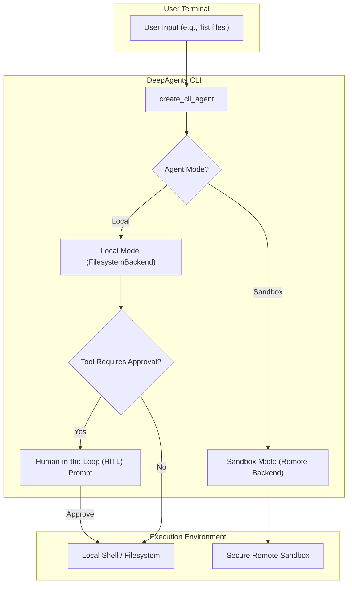

'''
# Tutorial: The Interactive CLI Agent

## 1. Synopsis

This tutorial dives into the heart of the `deepagents-cli` package: the interactive CLI agent. You will learn how to use the `create_cli_agent` function to build a powerful AI assistant that can operate directly within your local development environment or in a secure remote sandbox. We will explore the key tools available to the agent, such as `shell`, `web_search`, and file I/O, and demonstrate the critical Human-in-the-Loop (HITL) safety feature.

## 2. Prerequisites

Before you begin, ensure you have the `deepagents-cli` package installed. If you are working within the quickstart template, the necessary dependencies are already managed for you.

## 3. Architecture

The CLI agent's architecture is designed for flexibility and safety, primarily through its dual-mode operation and the HITL approval system.



## 4. Implementation Steps

### Step 1: Creating a Basic CLI Agent

The `create_cli_agent` function is the factory for building your agent. It assembles the necessary components, including the language model, tools, and middleware.

```python
from deepagents import create_deep_agent
from deepagents_cli.agent import create_cli_agent
from langchain_openai import ChatOpenAI

# 1. Define the model you want to use
# Replace with your preferred model provider and API key setup
model = ChatOpenAI(model="gpt-4o")

# 2. Create the agent
# The 'assistant_id' is used to manage the agent's memory.
agent, backend = create_cli_agent(
    model=model,
    assistant_id="my-cli-agent",
    auto_approve=False, # This ensures the HITL prompt is active
)

# 3. Interact with the agent (example)
# The 'stream' method runs the agent and yields output chunks.
for chunk in agent.stream({"messages": [("user", "Hello! What can you do?")]}):
    for key, value in chunk.items():
        print(f"From {key}:")
        print(value)
        print("---")
```

***Verification***: Running this script will initialize the agent. The agent will respond with a greeting and a summary of its capabilities, which are defined by the tools it has access to.

### Step 2: Local Mode and File Operations

By default, `create_cli_agent` runs in **local mode**. This gives the agent direct access to your filesystem via the `FilesystemBackend`. This is powerful but requires caution, which is why the HITL feature is enabled by default.

Let's ask the agent to write a file.

*User Prompt*: `"Create a file named '''hello_world.txt` with the content `Hello from my DeepAgent!`"'''

When you send this prompt to the agent, it will determine that it needs to use the `write_file` tool. Because `auto_approve` is `False`, the HITL system will intercept this tool call and prompt you for approval in the terminal.

***Verification***: You will see a prompt similar to this in your console:

```
───────────────── Approval Request ──────────────────
 Tool: write_file
─────────────────────────────────────────────────────
 File: hello_world.txt
 Action: Create file
 Lines: 1
─────────────────────────────────────────────────────
Approve this action? (approve/reject) ›
```

If you type `approve` and press Enter, the agent will proceed to create the file. You can then verify that `hello_world.txt` exists in your current directory.

### Step 3: Sandbox Mode for Secure Execution

While local mode is great for trusted development tasks, it carries inherent risks. **Sandbox mode** addresses this by executing the agent's commands in a secure, isolated remote environment. The agent's core logic still runs locally, but its tools (like `shell` and file I/O) operate on the remote backend.

To enable sandbox mode, you must provide a `sandbox` backend instance to `create_cli_agent`.

```python
# This is a conceptual example. A real implementation would require
# a configured sandbox provider like Modal, Daytona, or Runloop.
from deepagents_cli.agent import create_cli_agent
from langchain_openai import ChatOpenAI
# from some_sandbox_provider import MySandboxBackend

# model = ChatOpenAI(model="gpt-4o")
# sandbox_backend = MySandboxBackend()

# agent, backend = create_cli_agent(
#     model=model,
#     assistant_id="my-sandbox-agent",
#     sandbox=sandbox_backend,
#     sandbox_type="my_sandbox" # This informs the system prompt
# )

# Now, if the agent uses `write_file` or `execute`, the operations
# will happen inside the remote sandbox, not on your local machine.
```

The `sandbox_type` parameter is crucial as it informs the agent's system prompt about its operating environment, ensuring it knows the correct working directory and operational constraints.

### Step 4: Exploring Key Tools

The CLI agent comes equipped with a powerful set of default tools.

| Tool         | Description                                                                                             | HITL Trigger |
|--------------|---------------------------------------------------------------------------------------------------------|--------------|
| `shell`      | Executes a shell command in the **local** environment. This tool is only available in local mode.         | **Yes**      |
| `execute`    | Executes a shell command in the **remote sandbox**. This is the sandbox equivalent of `shell`.             | **Yes**      |
| `write_file` | Creates or overwrites a file with the provided content.                                                 | **Yes**      |
| `read_file`  | Reads the entire content of a file.                                                                     | No           |
| `edit_file`  | Performs a search-and-replace operation within a file.                                                  | **Yes**      |
| `web_search` | Uses the Tavily API to search the web for a given query.                                                  | **Yes**      |
| `fetch_url`  | Fetches the content of a URL and converts it to markdown for the agent to process.                      | **Yes**      |

## 5. Common Pitfalls

- **Relative vs. Absolute Paths**: The agent is explicitly instructed to use absolute paths for all file operations. If you find the agent failing to access files, check if it is accidentally using relative paths. Guide it to use the full working directory path.
- **Ignoring HITL Rejections**: If you reject a tool call, the agent is designed to respect your decision. However, in complex scenarios, it might try a slightly different but functionally identical command. You may need to provide explicit instructions like, "Do not try to write that file again. Instead, let's analyze the data first."
- **Forgetting the Sandbox Context**: When in sandbox mode, remember that `ls -l` will show you the contents of the remote container, not your local machine. This is a common point of confusion.

## 6. Challenge Yourself

Now that you understand the basics, try this challenge:

1.  Create a new CLI agent in local mode.
2.  Ask it to use `web_search` to find the official website for the `rich` Python library.
3.  Next, instruct it to use `fetch_url` to get the content of that website.
4.  Finally, ask the agent to summarize the key features of the `rich` library and save the summary to a file named `rich_summary.md`.

This will test the agent's ability to chain multiple tools together while respecting the HITL prompts at each step.
