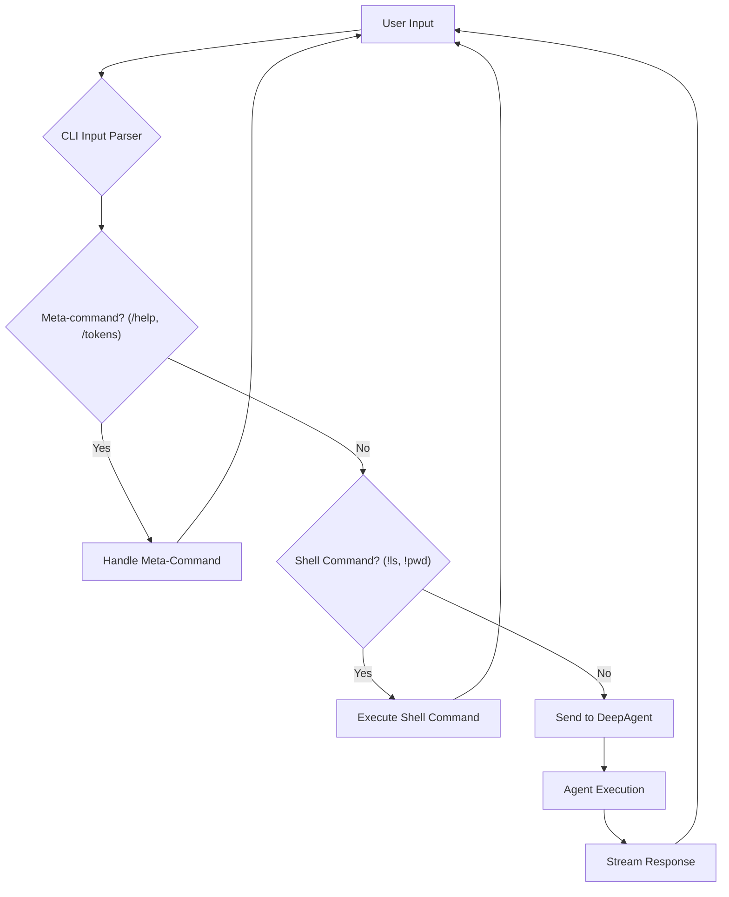

'''
# Advanced CLI Usage and Customization

## 1. Synopsis

This tutorial covers the advanced features of the DeepAgents CLI, designed to enhance your productivity and customize the agent's behavior. You will learn how to use meta-commands for controlling the CLI environment, execute shell commands directly, and configure the agent's startup behavior using command-line arguments.

## 2. Prerequisites

- `deepagents-cli` installed.

## 3. Architecture



## 4. Implementation Steps

### Step 1: Using Meta-Commands

Meta-commands provide quick access to CLI features. They are all prefixed with a forward slash (`/`).

- **`/help`**: Displays the main help message, including the list of available meta-commands and command-line flags.
- **`/tokens`**: Shows the token usage for the current session, breaking down the cost by model and total.
- **`/clear`**: Clears the console screen.
- **`/quit` or `/exit`**: Exits the DeepAgents CLI.

```bash
/help
```

***Verification***:

After running `/help`, you will see a detailed help message printed to your console.

### Step 2: Executing Shell Commands

You can run any shell command directly from the CLI by prefixing it with an exclamation mark (`!`). This is useful for file management, checking environment variables, or running scripts without leaving the CLI.

```bash
!ls -l
```

***Verification***:

The output of the `ls -l` command will be printed directly to your console.

### Step 3: Configuring the CLI with Command-Line Arguments

The DeepAgents CLI can be configured at startup using various flags.

- **`--agent <name>`**: Switches to a different agent profile, allowing you to maintain separate memory and context for different tasks.
- **`--auto-approve`**: Automatically approves all tool usage requests from the agent, disabling the Human-in-the-Loop (HITL) safety feature.
- **`--sandbox <type>`**: Runs the agent in a specified remote sandbox environment (`modal`, `daytona`, `runloop`).
- **`--sandbox-id <id>`**: Reconnects to an existing sandbox session.
- **`--no-splash`**: Disables the startup splash screen for a faster start.

To start the CLI with the `auto-approve` feature enabled for an agent named `tester`, you would run:

```bash
deepagents --agent tester --auto-approve
```

***Verification***:

The CLI will start, and you will see a message indicating that "Auto-approve" is ON.

## 5. Common Pitfalls

- **Shell commands in agent prompts**: Remember that commands prefixed with `!` are executed directly by the CLI, not by the agent. If you want the agent to execute a shell command, you need to ask it to do so using natural language (e.g., "run ls -l for me").
- **Auto-approve risks**: While `--auto-approve` is convenient, it can be dangerous if the agent generates a destructive command. Use it with caution, especially when working on important projects.

## 6. Challenge Yourself

Start the DeepAgents CLI with a new agent profile named `my-experiment` and run it in a `modal` sandbox. Use the `!pwd` command to check the working directory and then ask the agent to write a "Hello, World!" Python script and run it.
'''