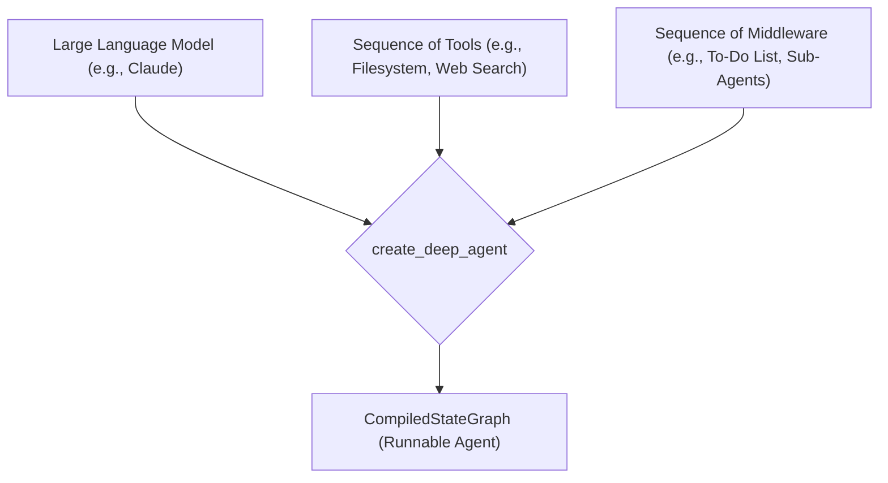

# Understanding the Core: `create_deep_agent`

## 1. Synopsis

The `deepagents` library is built around a powerful factory function: `create_deep_agent`. This function is your primary entry point for creating sophisticated, autonomous agents. Think of it as an assembly line for your AI workforce. It takes core components—a language model, a set of tools, and optional middleware—and wires them together into a fully configured, runnable agent.

This tutorial will walk you through the fundamentals of using `create_deep_agent` to build and launch your first basic agent.

## 2. Prerequisites

Before you begin, ensure you have the `deepagents` library installed. You will also need an appropriate LangChain model provider, such as `langchain-anthropic` or `langchain-openai`.

```bash
pip install deepagents langchain-anthropic
```

## 3. Architecture

The `create_deep_agent` function acts as a central orchestrator that combines several key components into a cohesive `CompiledStateGraph`, which is the final, executable agent.



At its heart, the factory configures a stack of middleware that endows the agent with default capabilities like to-do list management, a virtual filesystem, and the ability to spawn sub-agents.

## 4. Implementation Steps

Let's create our first, most basic agent. This agent will have a language model but no extra tools.

### Step 1: Create the Agent

The simplest way to create an agent is to provide it with a language model. The `create_deep_agent` function will handle the rest.

```python
from langchain_anthropic import ChatAnthropic
from deepagents.graph import create_deep_agent

# 1. Define the model you want the agent to use
model = ChatAnthropic(model="claude-3-haiku-20240307")

# 2. Create the agent instance
# We are not passing any custom tools or middleware yet.
agent = create_deep_agent(
    model=model,
    system_prompt="You are a helpful assistant.",
)

print("Agent created successfully!")
print("Agent Type:", type(agent))
```

***Verification***:

Running this script will output the type of the created object. You should see that it is a `CompiledStateGraph`, the core runnable class from the `langgraph` library.

```
Agent created successfully!
Agent Type: <class 'langgraph.graph.state.CompiledStateGraph'>
```

### Step 2: Understanding Key Parameters

While the example above is simple, the power of `create_deep_agent` comes from its parameters:

-   `model`: **(Required)** This is the brain of the agent. It can be any LangChain-compatible `BaseChatModel`. If you don't provide one, it defaults to `claude-sonnet-4-5-20250929`.
-   `tools`: This is a list of functions or `BaseTool` objects that the agent can call to interact with the outside world. By default, the agent comes with a `write_todos` tool, filesystem tools (`ls`, `read_file`, etc.), and a sub-agent tool.
-   `middleware`: This is an advanced feature that allows you to inject custom logic into the agent's execution flow. The factory automatically includes middleware for to-do lists, filesystem operations, and sub-agents.

## 5. Common Pitfalls

-   **Forgetting to Install Model-Specific Libraries**: If you specify a model like `ChatAnthropic`, you must have the `langchain-anthropic` package installed. The same applies to OpenAI, Google, or other model providers.
-   **Assuming Tools Exist**: While `create_deep_agent` provides a default set of powerful tools (like filesystem access), they are only active if a `backend` is configured. A newly created agent with no `backend` will not be able to perform filesystem operations.

## 6. Challenge Yourself

Your task is to create a new agent that uses a different language model (e.g., from `langchain_openai`).

1.  Install the necessary library (`pip install langchain-openai`).
2.  Import `ChatOpenAI`.
3.  Instantiate `ChatOpenAI` and pass it to the `model` parameter of `create_deep_agent`.
4.  Run the script and verify that the agent is created successfully.