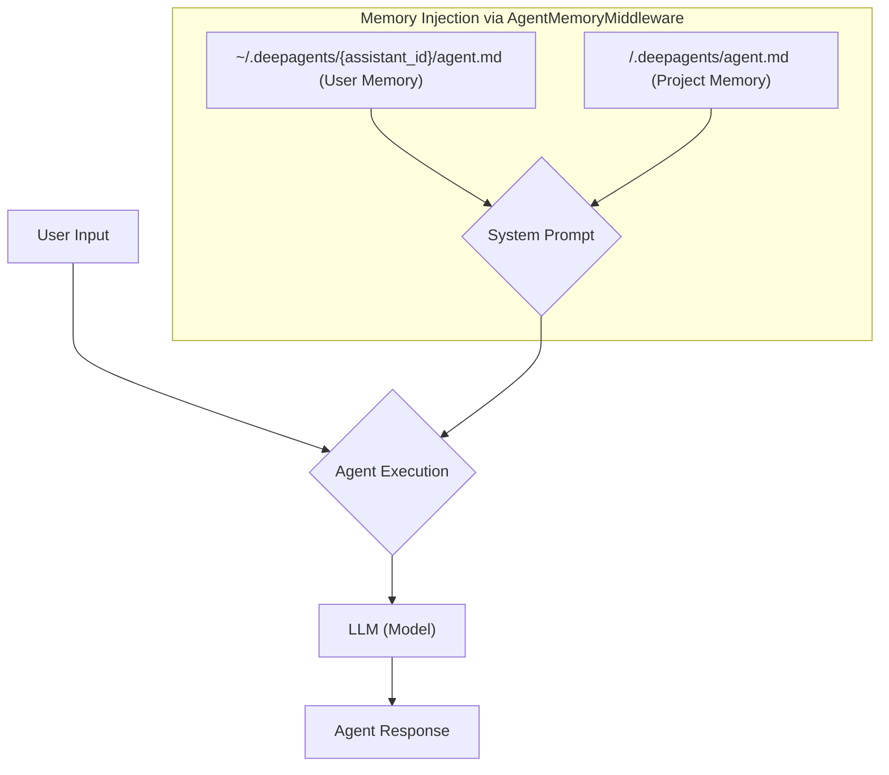

# Configuring Agent Memory & Personality

## 1. Synopsis

Out-of-the-box, an AI agent is a blank slate. It has no memory of past interactions and no intrinsic personality or project-specific knowledge. This forces you to repeat instructions and provide the same context in every session. This tutorial explains how to give your DeepAgent a persistent "personality" and provide it with long-term, project-specific knowledge using its hierarchical memory system.

We will create two configuration files:
*   `~/.deepagents/{assistant_id}/agent.md`: To define the agent's core personality and universal preferences.
*   `./.deepagents/agent.md`: To provide context for a specific project.

## 2. Prerequisites

- `deepagents-cli` installed and configured.
- An initialized agent (e.g., `deepagents init`).

## 3. Architecture

The `AgentMemoryMiddleware` is a component that automatically injects context into the agent's system prompt. It searches for `agent.md` files at two key locations: the user's home directory (for personality) and the current project's root directory (for project-specific knowledge).



## 4. Implementation Steps

### Step 1: Define the Agent's Core Personality (User Memory)

First, we'll give our agent a baseline personality that will apply across all projects. This is done by creating an `agent.md` file in your user-level DeepAgents configuration directory.

1.  **Find your agent's directory**. If your agent ID is `default`, the path will be `~/.deepagents/default/`.
2.  **Create the user `agent.md` file**.

Add the following content to `~/.deepagents/default/agent.md`:

```markdown
# Core Personality & Style

- **Tone**: Professional, friendly, and slightly formal.
- **Style**: Use clear and concise language. Prefer bullet points for lists.
- **Code Generation**: Always include type hints in Python. Add comments to explain complex logic.
- **Rule**: Before writing any code, always ask for clarification on requirements if the request is ambiguous.
```

***Verification***:
Run the agent and ask it a question. Its response should reflect the tone you've defined. For example, ask it to write a simple function, and it should include type hints as instructed.

### Step 2: Provide Project-Specific Context (Project Memory)

Now, let's provide knowledge for a specific project. This allows the agent to understand the project's architecture, conventions, and goals without you having to explain them repeatedly.

1.  **Navigate to your project's root directory**.
2.  **Create a `.deepagents` directory**.
3.  **Create a project `agent.md` file** inside it.

Add the following content to `./.deepagents/agent.md`:

```markdown
# Project: "Phoenix" Web App

## Architecture
- **Backend**: Python with FastAPI.
- **Database**: PostgreSQL with SQLAlchemy ORM.
- **Frontend**: React with TypeScript.
- **Authentication**: JWT-based.

## Coding Conventions
- All API endpoints must be documented with OpenAPI schemas in the code.
- Use the `pytest` framework for tests. Test files must be in the `tests/` directory and mirror the source structure.
- All database models are defined in `src/models/`.
```

***Verification***:
Start the agent from your project's root directory. Ask a question related to the project, like: "How should I write tests for a new API endpoint?" The agent should now provide an answer based on the project-specific conventions you defined (e.g., using `pytest` and placing the test in the `tests/` directory).

### How It Works: The `AgentMemoryMiddleware`

When the DeepAgent starts, the `AgentMemoryMiddleware` performs the following actions:

1.  **Reads User Memory**: It looks for `agent.md` in `~/.deepagents/{assistant_id}/` and reads its content.
2.  **Reads Project Memory**: It detects the project root (e.g., the `.git` directory) and looks for `.deepagents/agent.md`.
3.  **Injects into Prompt**: It combines the content from both files and injects them into the system prompt that is sent to the language model, using XML-like tags (`<user_memory>` and `<project_memory>`).

This process ensures the agent is "primed" with your specified personality and all relevant project context before it even starts processing your request.

## 5. Common Pitfalls

- **Incorrect File Location**: The most common error is placing the `agent.md` files in the wrong directories. Double-check the paths: `~/.deepagents/{assistant_id}/agent.md` for user memory and `./.deepagents/agent.md` for project memory.
- **No `.git` directory**: Project memory detection relies on finding a project root, which is often the location of the `.git` folder. If your project isn't a git repository, the project memory might not be loaded.
- **Blank Files**: An empty `agent.md` file will have no effect. Ensure you have added content to it.

## 6. Challenge Yourself

Extend the project memory (`./.deepagents/agent.md`) with a new section called "## Common Commands". In this section, add instructions for the agent on how to run common project tasks, such as:

- How to run the test suite.
- How to start the development server.
- How to build the project for production.

Then, ask the agent: "How do I run the tests for this project?" and see if it can follow your new instructions.