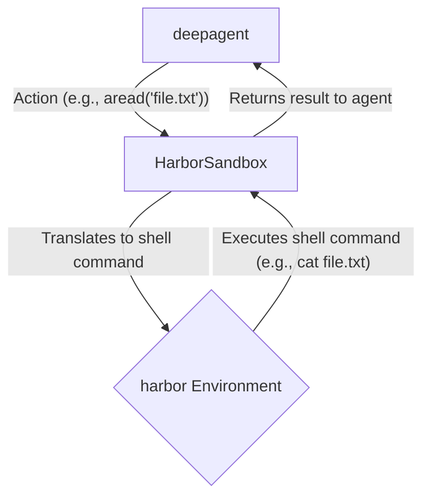

# Secure Remote Execution with Harbor

## 1. Synopsis

When running AI agents that can execute code, security is paramount. Allowing an agent to have unrestricted access to your local file system can be risky, especially when dealing with complex or untrusted tasks. This tutorial explains how to use the `HarborSandbox` backend to run a `deepagent` in a secure, isolated environment provided by Harbor.

The `HarborSandbox` acts as a bridge between the `deepagent` and the Harbor environment. It translates the agent's abstract actions (e.g., "read a file," "execute a command") into secure shell commands that run within the sandbox, preventing any potential harm to your local system.

## 2. Prerequisites

To follow this tutorial, you need to have the following packages installed:

- `deepagents`: The core framework for creating agents.
- `deepagents-harbor`: The package containing the `HarborSandbox` backend.

## 3. Architecture

The following diagram illustrates the interaction between the `deepagent`, the `HarborSandbox`, and the Harbor environment:



## 4. Implementation Steps

### Step 1: Configure and Run an Agent with `HarborSandbox`

First, you need to create an instance of the `HarborSandbox` and pass it to your `deepagent`. The `HarborSandbox` requires a `harbor` environment object to function.

```python
import asyncio
from deepagents import create_deep_agent
from deepagents_harbor.backend import HarborSandbox
from harbor.environments.docker import DockerEnvironment  # Example environment

async def main():
    # 1. Create a Harbor environment (e.g., a local Docker container)
    # In a real scenario, this would be provided by the Harbor runtime.
    environment = DockerEnvironment()
    await environment.setup()

    # 2. Instantiate the HarborSandbox with the environment
    sandbox = HarborSandbox(environment=environment)

    # 3. Create a deepagent with the HarborSandbox backend
    agent = create_deep_agent(
        backend=sandbox,
        model="gpt-4",  # Or any other supported model
    )

    # 4. Run a simple command
    instruction = "List the files in the current directory."
    response = await agent.run(instruction)

    print("Agent Response:")
    print(response)

    # Clean up the environment
    await environment.close()

if __name__ == "__main__":
    asyncio.run(main())
```

***Verification***:

When you run this code, the `deepagent` will use the `HarborSandbox` to execute the `ls -F` command inside the Docker container. The output will be the list of files in the container's working directory, not your local machine's directory.

### Step 2: Writing a File

Let's try a more advanced operation: writing a file. The `HarborSandbox` handles this by creating a shell command that base64-encodes the content to ensure it's written correctly, even with special characters.

```python
import asyncio
from deepagents import create_deep_agent
from deepagents_harbor.backend import HarborSandbox
from harbor.environments.docker import DockerEnvironment

async def main():
    environment = DockerEnvironment()
    await environment.setup()

    sandbox = HarborSandbox(environment=environment)

    agent = create_deep_agent(
        backend=sandbox,
        model="gpt-4",
    )

    # Instruction to write a file
    instruction = "Create a file named 'hello.txt' with the content 'Hello, Harbor!'"
    await agent.run(instruction)

    # Verify the file was written
    read_instruction = "Read the file 'hello.txt'"
    response = await agent.run(read_instruction)

    print("Agent Response after reading the file:")
    print(response)

    await environment.close()

if __name__ == "__main__":
    asyncio.run(main())

```

***Verification***:

The output will show the content of `hello.txt` as read from within the sandbox, confirming that the agent successfully wrote the file in the isolated environment.

## 5. Common Pitfalls

- **Shell Command Reliance**: The `HarborSandbox` relies on common shell utilities (`grep`, `awk`, `perl`, `find`). If these are not available in the Harbor environment, some operations may fail.
- **Glob Pattern Support**: The `aglob_info` method for finding files with glob patterns has limited support and may not work for all patterns.
- **Async Only**: The `HarborSandbox` is fully asynchronous. You must use the `async` and `await` keywords when interacting with it.

## 6. Challenge Yourself

Try to extend the example by performing more complex file operations. For example, instruct the agent to:

1.  Create a directory.
2.  Write a file inside that directory.
3.  Use the `aedit` function to modify the file's content.
4.  Read the modified file to verify the changes.