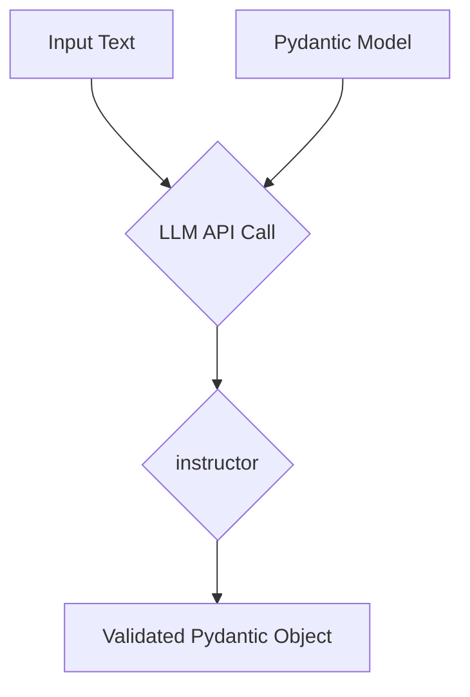

# Getting Started with Instructor

## 1. Goal

This tutorial will guide you through the process of using `instructor` to get structured, validated data from Large Language Models (LLMs). We will cover the basic setup and a simple example to extract information from a sentence into a Pydantic model.

## 2. Prerequisites

- Python 3.9+ installed.
- An OpenAI API key.
- `instructor` and `openai` packages installed.

To install the necessary packages, run the following command:

```bash
pip install instructor openai
```

## 3. Architecture

The core idea behind `instructor` is to use Pydantic models to define the structure of the data you want to extract. `instructor` then patches your LLM client (e.g., OpenAI's client) to handle the conversion of unstructured text into a validated Pydantic object.



## 4. Implementation

Let's walk through a basic example of extracting user information from a simple sentence.

### Step 1: Define Your Pydantic Model

First, we need to define the structure of the data we want to extract. We'll create a `User` model with `name` and `age` fields.

```python
from pydantic import BaseModel

class User(BaseModel):
    name: str
    age: int
```

### Step 2: Create an `instructor`-patched Client

Next, we'll import `instructor` and use it to patch an OpenAI client. This adds the `response_model` parameter to the client's `chat.completions.create` method.

```python
import instructor
from openai import OpenAI

# By default, the client will use the OPENAI_API_KEY environment variable.
client = OpenAI()

# Patch the client with instructor
client = instructor.patch(client)
```

### Step 3: Make the API Call

Now, we can call the `chat.completions.create` method with our `response_model` and the input text. `instructor` will handle the logic of creating a JSON schema from the `User` model, passing it to the LLM, and validating the response.

```python
import instructor
from openai import OpenAI
from pydantic import BaseModel

# Define the Pydantic model
class User(BaseModel):
    name: str
    age: int

# Create and patch the OpenAI client
client = instructor.patch(OpenAI())

# Make the API call
user = client.chat.completions.create(
    model="gpt-4o-mini",
    response_model=User,
    messages=[
        {"role": "user", "content": "John Doe is 30 years old."},
    ],
)

# The result is a validated Pydantic object
assert isinstance(user, User)
print(user.name)  # Output: John Doe
print(user.age)  # Output: 30
```

That's it! You've successfully used `instructor` to extract structured data from text. The `user` object is a fully-fledged Pydantic model, so you get all the benefits of type hinting, validation, and more.

## 5. Conclusion

This tutorial covered the basics of getting started with `instructor`. You learned how to define a Pydantic model, patch an OpenAI client, and extract structured data from a simple sentence. `instructor` simplifies the process of working with structured outputs from LLMs, making your code more reliable and easier to maintain.
