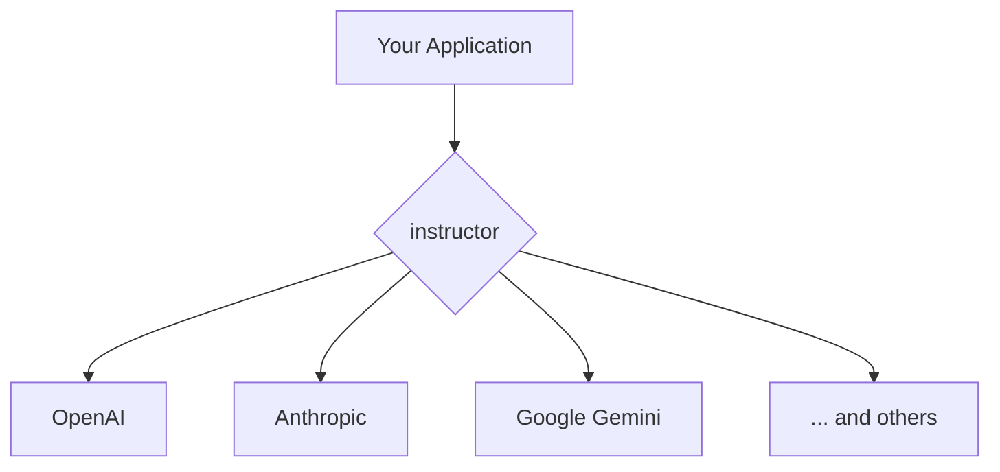

# Working with Different LLM Providers

## 1. Goal

This tutorial will guide you on how to use `instructor` with various Large Language Model (LLM) providers. You will learn how to seamlessly switch between providers like OpenAI, Anthropic, Google, and more, while keeping your code clean and consistent.

## 2. Prerequisites

- The `instructor` package installed. You can install it via pip:

```bash
pip install instructor
```

- You will also need to have the specific library for the LLM provider you intend to use. For example, to use OpenAI, you need the `openai` package:

```bash
pip install openai
```

## 3. Architecture

The following diagram illustrates how `instructor` acts as a unified interface between your application and the different LLM providers.



## 4. Implementation

`instructor` offers a convenient and unified API to interact with multiple LLM providers. The recommended way is to use the `from_provider` function, which simplifies client instantiation.

### Using `from_provider`

The `from_provider` function is the easiest way to get started. It takes a string in the format `"provider_name/model_name"` and returns a patched client ready to be used with `instructor`.

Here are some examples for popular providers:

#### OpenAI

```python
import instructor
from pydantic import BaseModel

# Define your data model
class User(BaseModel):
    name: str
    age: int

# Create a client for OpenAI's GPT-4o-mini
client = instructor.from_provider("openai/gpt-4o-mini")

# Extract structured data
user = client.chat.completions.create(
    response_model=User,
    messages=[{"role": "user", "content": "John Doe is 30 years old."}],
)

assert isinstance(user, User)
print(user.model_dump_json(indent=2))
# Expected output:
# {
#   "name": "John Doe",
#   "age": 30
# }
```

#### Anthropic

To use Anthropic's models, you first need to install the `anthropic` package:
```bash
pip install anthropic
```
Then, you can use it with `instructor` as follows:

```python
import instructor
from pydantic import BaseModel

class User(BaseModel):
    name: str
    age: int

# Create a client for Anthropic's Claude 3.5 Sonnet
client = instructor.from_provider("anthropic/claude-3-5-sonnet")

# Extract structured data
user = client.messages.create(
    response_model=User,
    max_tokens=1024,
    messages=[{"role": "user", "content": "Jane Doe is 25 years old."}],
)

assert isinstance(user, User)
print(user.model_dump_json(indent=2))
# Expected output:
# {
#   "name": "Jane Doe",
#   "age": 25
# }
```

#### Google Gemini

For Google's Gemini models, install the `google-generativeai` package:
```bash
pip install google-generativeai
```
And then use it with `instructor`:

```python
import instructor
from pydantic import BaseModel

class User(BaseModel):
    name: str
    age: int

# Create a client for Google's Gemini Pro
client = instructor.from_provider("google/gemini-pro")

# Extract structured data
user = client.generate_content(
    response_model=User,
    prompt="James is 40 years old.",
)

assert isinstance(user, User)
print(user.model_dump_json(indent=2))
# Expected output:
# {
#   "name": "James",
#   "age": 40
# }
```

As you can see, the main logic for data extraction remains consistent across different providers, with only minor differences in the client creation and the method called to generate the response (`chat.completions.create`, `messages.create`, `generate_content`).

`instructor` supports many other providers, including:

- `ollama/llama3.2` (for local models)
- `groq/llama-3.1-8b-instant`
- `mistral/mistral-large-latest`
- and many more.

The process is the same: install the required package and use `instructor.from_provider`.