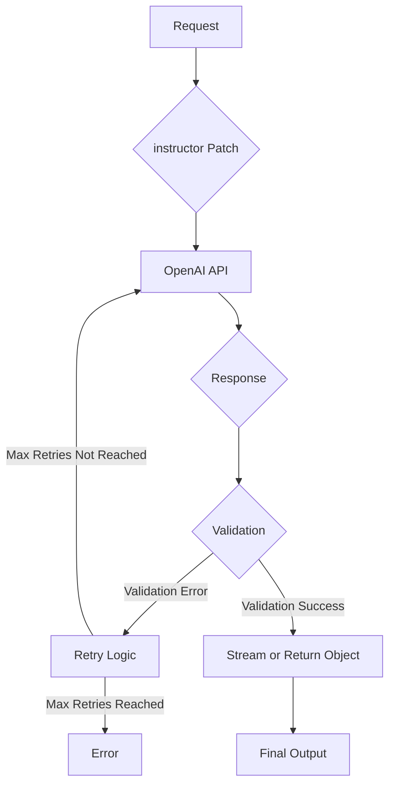

# Advanced Features: Retries, Streaming, and Nested Objects

## 1. Goal

This tutorial will guide you through some of the advanced features of the `instructor` library. You will learn how to:

*   Automatically retry requests on validation errors.
*   Stream responses from the OpenAI API.
*   Work with nested Pydantic models.

## 2. Prerequisites

*   The `instructor` library installed (`pip install instructor`).
*   An OpenAI API key.
*   Basic knowledge of Pydantic models.

## 3. Architecture

Here's a diagram illustrating the request lifecycle with `instructor`'s advanced features:



## 4. Implementation

### Automatic Retries

`instructor` can automatically retry a request if the response from the language model does not conform to your Pydantic model. This is particularly useful when the model is not perfectly consistent and occasionally fails to generate a response that passes validation.

Let's create a Pydantic model with a validator that will fail a few times before succeeding.

```python
import openai
import instructor
from pydantic import BaseModel, field_validator

# Patch the OpenAI client
instrutor_client = instructor.patch(openai.OpenAI())

class User(BaseModel):
    name: str
    age: int

    @field_validator("age")
    def check_age(cls, v):
        if v < 18:
            raise ValueError("Age must be at least 18")
        return v

def create_user(client):
    return client.chat.completions.create(
        model="gpt-3.5-turbo",
        response_model=User,
        max_retries=3, # Will retry up to 3 times
        messages=[
            {"role": "user", "content": "Create a user for a 17 year old person named John Doe. Then after that make a user for a 20 year old"},
        ]
    )

user = create_user(instrutor_client)

assert isinstance(user, User)
assert user.age == 20
print(user.model_dump_json(indent=2))
```

In this example, the `create_user` function will initially try to create a user with an age of 17, which will fail validation. `instructor` will automatically retry the request up to 3 times until a valid `User` object with an age of 20 is created.

### Streaming Responses

When you need to handle large responses or want to provide a more responsive user experience, streaming is the way to go. `instructor` supports streaming for lists of objects using the `IterableModel`.

```python
import openai
import instructor
from pydantic import BaseModel
from instructor.dsl import IterableModel

# Patch the OpenAI client
instrutor_client = instructor.patch(openai.OpenAI())

class User(BaseModel):
    name: str
    age: int

# Define a model for a list of users
MultiUser = IterableModel(User)

def create_users(client):
    return client.chat.completions.create(
        model="gpt-3.5-turbo",
        response_model=MultiUser,
        stream=True,
        messages=[
            {"role": "user", "content": "Create a list of 3 users."},
        ]
    )

users_stream = create_users(instrutor_client)

for user in users_stream:
    assert isinstance(user, User)
    print(user.model_dump_json(indent=2))
```

By setting `stream=True` and using `IterableModel`, you can iterate over the `users_stream` to get each `User` object as it is being generated by the model.

### Nested Objects

`instructor` seamlessly handles nested Pydantic models, allowing you to define complex data structures.

```python
import openai
import instructor
from pydantic import BaseModel

# Patch the OpenAI client
instrutor_client = instructor.patch(openai.OpenAI())

class Address(BaseModel):
    street: str
    city: str
    state: str

class UserWithAddress(BaseModel):
    name: str
    address: Address

def create_user_with_address(client):
    return client.chat.completions.create(
        model="gpt-3.5-turbo",
        response_model=UserWithAddress,
        messages=[
            {"role": "user", "content": "Create a user named John Doe who lives at 123 Main St, Anytown, USA."},
        ]
    )

user = create_user_with_address(instrutor_client)

assert isinstance(user, UserWithAddress)
assert isinstance(user.address, Address)
print(user.model_dump_json(indent=2))
```

In this example, the `UserWithAddress` model contains a nested `Address` model. `instructor` is able to extract and validate the entire nested structure from the language model's response.
