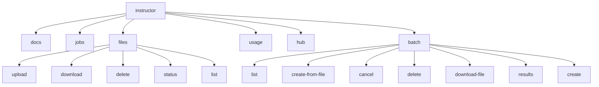

# Command-Line Interface (CLI) Usage

The `instructor` library comes with a powerful command-line interface (CLI) that allows you to interact with various services and manage your resources directly from the terminal. This tutorial will guide you through the available commands and their usage.

## 1. Goal

This tutorial aims to provide a comprehensive overview of the `instructor` CLI, covering its main commands and subcommands for managing files and batch jobs.

## 2. Prerequisites

- The `instructor` package installed. The CLI is automatically installed with the package.

## 3. Architecture



## 4. Implementation

### Top-Level Commands

The `instructor` CLI is invoked with the `instructor` command. It has several subcommands:

- `docs`: Opens the instructor documentation website.
- `jobs`: Manages fine-tuning jobs.
- `files`: Manages files on the server.
- `usage`: Checks API usage data.
- `hub`: (DEPRECATED) The instructor hub is no longer available.
- `batch`: Manages batch jobs.

### `files` Subcommand

The `files` subcommand is used to manage files on the server.

#### `upload`

Upload a file to the server.

```bash
instructor files upload --filepath <path_to_file> --purpose <purpose>
```

- `--filepath`: The path to the file to upload.
- `--purpose`: The purpose of the file (e.g., `fine-tune`).

#### `download`

Download a file from the server.

```bash
instructor files download <file_id> <output_path>
```

- `<file_id>`: The ID of the file to download.
- `<output_path>`: The path to save the downloaded file.

#### `delete`

Delete a file from the server.

```bash
instructor files delete <file_id>
```

- `<file_id>`: The ID of the file to delete.

#### `status`

Check the status of a file.

```bash
instructor files status <file_id>
```

- `<file_id>`: The ID of the file to check.

#### `list`

List all files on the server.

```bash
instructor files list
```

### `batch` Subcommand

The `batch` subcommand is used to manage batch jobs.

#### `list`

List all batch jobs.

```bash
instructor batch list --limit <limit> --provider <provider>
```

- `--limit`: The number of batch jobs to show.
- `--provider`: The provider to use (e.g., `openai`, `anthropic`).

#### `create-from-file`

Create a batch job from a file.

```bash
instructor batch create-from-file --file-path <path_to_file> --model <model>
```

- `--file-path`: The path to the file containing the batch job requests.
- `--model`: The model to use (e.g., `openai/gpt-4o-mini`).

#### `cancel`

Cancel a batch job.

```bash
instructor batch cancel --batch-id <batch_id> --provider <provider>
```

- `--batch-id`: The ID of the batch job to cancel.
- `--provider`: The provider to use.

#### `delete`

Delete a batch job.

```bash
instructor batch delete --batch-id <batch_id> --provider <provider>
```

- `--batch-id`: The ID of the batch job to delete.
- `--provider`: The provider to use.

#### `download-file`

Download the file associated with a batch job.

```bash
instructor batch download-file --batch-id <batch_id> --download-file-path <path_to_download>
```

- `--batch-id`: The ID of the batch job to download.
- `--download-file-path`: The path to download the file to.

#### `results`

Retrieve the results of a batch job.

```bash
instructor batch results --batch-id <batch_id> --output-file <path_to_output>
```

- `--batch-id`: The ID of the batch job to get results from.
- `--output-file`: The file to save the results to.

#### `create`

Create a batch job from a list of messages.

```bash
instructor batch create --messages-file <path_to_messages> --response-model <response_model> --model <model>
```

- `--messages-file`: A JSONL file with message conversations.
- `--response-model`: The Python class path for the response model (e.g., `examples.User`).
- `--model`: The model to use (e.g., `openai/gpt-4o-mini`).
