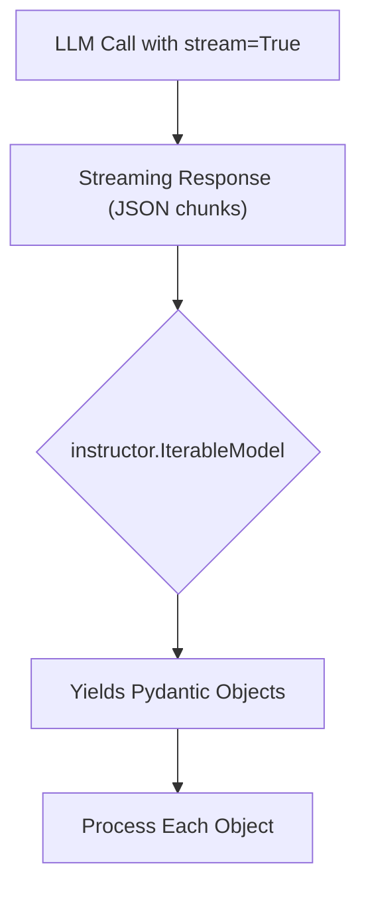

# Streaming Lists of Objects with `instructor`

## 1. Goal

In many applications, you need to extract an unknown number of structured objects from a piece of text. For example, you might want to find all the user profiles, products, or events mentioned in a document. Standard approaches often require you to guess the number of items or make multiple calls to the language model. This is inefficient and can lead to incomplete data.

This tutorial will teach you how to efficiently stream a list of Pydantic objects from a single LLM call using `instructor.IterableModel`.

## 2. Prerequisites

Make sure you have `instructor` and `openai` installed:

```bash
pip install instructor openai
```

## 3. Architecture

The `IterableModel` works by creating a new model that wraps your target model (e.g., `User`) and is designed to parse a JSON array of those objects from a streaming response. As the LLM generates the list, `instructor` parses each object as it becomes available, allowing you to process them in real-time.



## 4. Implementation Steps

Let's say we have a block of text containing multiple user profiles, and we want to extract each one into a `User` object.

### Step 1: Define Your Model and Create an Iterable

First, define the Pydantic model for the object you want to extract. Then, use `instructor.IterableModel` to create a new model that can handle a stream of these objects.

```python
import instructor
from openai import OpenAI
from pydantic import BaseModel, Field

# 1. Define the model for a single user
class User(BaseModel):
    name: str = Field(description="The name of the person")
    age: int = Field(description="The age of the person")
    role: str = Field(description="The role of the person")

# 2. Create a model that can handle a stream of Users
IterableUser = instructor.IterableModel(User)

# 3. Patch the OpenAI client
client = instructor.from_openai(OpenAI())

# 4. Make the streaming call
response_stream = client.chat.completions.create(
    model="gpt-4-turbo",
    messages=[
        {
            "role": "user",
            "content": "Alice is a 25-year-old software engineer. Bob is a 30-year-old data scientist. Charlie is a 35-year-old product manager.",
        }
    ],
    response_model=IterableUser,
    stream=True,
)

# 5. Iterate over the streamed objects
for user in response_stream:
    print(user)
```

### *Verification*

When you run this code, you will see the `User` objects printed to the console one by one as they are parsed from the stream. The output will look like this:

```
name='Alice' age=25 role='software engineer'
name='Bob' age=30 role='data scientist'
name='Charlie' age=35 role='product manager'
```

## 5. Common Pitfalls

*   **LLM Doesn't Return a List**: If the LLM doesn't return a JSON array, the iterable will not yield any objects. You may need to adjust your prompt to explicitly ask for a list of items.
*   **Invalid JSON in Stream**: `instructor` is designed to be robust to malformed JSON, but in some rare cases, the stream may be unrecoverable. Ensure your prompt engineering is solid to get the best results.

## 6. Challenge Yourself

Modify the example to extract a list of `Event` objects from a paragraph describing a series of historical events. The `Event` model should have `name`, `date`, and `description` fields. Try to see if you can make it work with a more complex text that includes nested information.