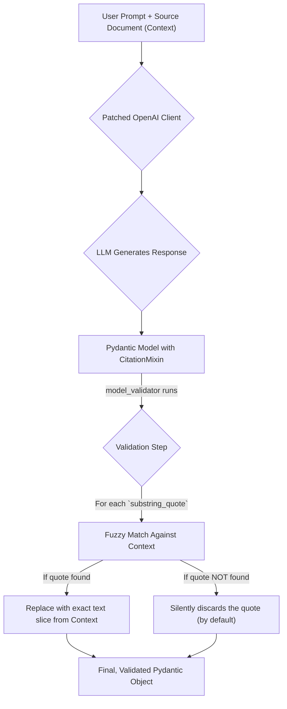

# Grounding LLM Outputs with Citations

## 1. Synopsis: The Problem of Hallucination

Large Language Models (LLMs) are incredibly powerful, but they have a critical flaw: they can "hallucinate" or invent information. When building systems that require factual accuracy—such as summarizing legal documents, answering questions based on a user manual, or creating financial reports—this is unacceptable. We need a way to force the model to back up its claims with direct evidence from a trusted source document.

This tutorial introduces the `instructor.dsl.citation.CitationMixin`, a powerful tool for building simple, verifiable Retrieval-Augmented Generation (RAG) systems. You will learn how to define a data model that requires the LLM to extract not just an answer, but also the specific quotes from the source text that support it.

## 2. Prerequisites

This tutorial assumes you have `instructor` installed and an OpenAI client configured.

```bash
pip install instructor "openai>=1.3.0"
```

You will also need an environment variable for your OpenAI API key.

## 3. Architecture: The Citation Workflow

The `CitationMixin` validator intercepts the LLM's output and cross-references it against a trusted `context` document that you provide. It ensures every piece of data is traceable to a source.



This diagram shows that the validation is not just a simple check; it actively cleans the data by replacing the LLM's potentially paraphrased quotes with the exact, verifiable text from the source document.

## 4. Implementation Steps

### Step 1: Define Your Citable Model

First, define the data structure you want to extract. Instead of inheriting directly from `pydantic.BaseModel`, you'll use `instructor.dsl.citation.CitationMixin`. This mixin automatically adds a `substring_quotes: list[str]` field and the validation logic.

```python
import instructor
from openai import OpenAI
from pydantic import Field
from instructor.dsl.citation import CitationMixin

# 1. Define your data model with CitationMixin
# This adds a `substring_quotes` field and a validator.
class UserDetail(CitationMixin, instructor.BaseModel):
    name: str = Field(description="The name of the person")
    age: int = Field(description="The age of the person")
    role: str = Field(description="The role of the person, according to the document.")

# 2. Patch the OpenAI client
client = instructor.patch(OpenAI())

# 3. Provide a source document for context
source_document = """
Jason is a 20-year-old student who loves to code. 
He is a member of the AI club and is working on a new project.

Sarah, aged 25, is a software engineer at Google and a mentor to Jason.
She previously worked at Microsoft.
"""

# 4. Make the request with `validation_context`
def extract_user(name: str, context: str) -> UserDetail:
    return client.chat.completions.create(
        model="gpt-4o",
        response_model=UserDetail,
        messages=[
            {
                "role": "user",
                "content": f"Extract the details for '{name}' from the provided text. Your answer must be based SOLELY on the text."
            }
        ],
        # This is the crucial part: `validation_context` passes the source
        # document to the `CitationMixin` validator.
        validation_context={"context": context}
    ).model_dump(exclude_none=True)


jason_details = extract_user("Jason", source_document)
```

***Verification***:

To verify that the extraction was successful and grounded in the source document, you can print the result. The `substring_quotes` will contain the exact phrases from `source_document` that the LLM used.

```python
# Expected Output:

# > print(jason_details)
# {
#     'name': 'Jason', 
#     'age': 20, 
#     'role': 'student', 
#     'substring_quotes': ['Jason is a 20-year-old student']
# }

# You can programmatically check for correctness:
assert "Jason is a 20-year-old student" in jason_details["substring_quotes"]
```

### Step 2: Why This is Powerful

The real magic lies in the `validation_context`. The `CitationMixin`'s internal validator (`validate_sources`) receives this context and performs a fuzzy search. This means even if the LLM hallucinates a slightly different quote, like `"Jason was a 20 year old student"`, the validator can still find the correct span in the original text and return the *exact* quote: `"Jason is a 20-year-old student"`. This self-correcting mechanism is vital for building reliable RAG systems.

## 5. Common Pitfalls

**Watch Out: Forgetting `validation_context`**

If you forget to pass the `validation_context` to your `create` call, the `CitationMixin` will have nothing to check against. In the current implementation, it will simply return the model without erroring, but your quotes will not be validated. 

```python
# INCORRECT - No validation will occur
user = client.chat.completions.create(
    model="gpt-4o",
    response_model=UserDetail,
    messages=[...]
    # Missing validation_context! 
).model_dump()
```

Always ensure the `validation_context={"context": your_document}` argument is present.

## 6. Challenge Yourself

Modify the `extract_user` function and the `UserDetail` model to handle cases where a user might not exist in the document. How would you change the system to return a clear "Not Found" message instead of hallucinating details? (Hint: The `instructor.dsl.Maybe` tool, covered in another tutorial, could be very useful here).