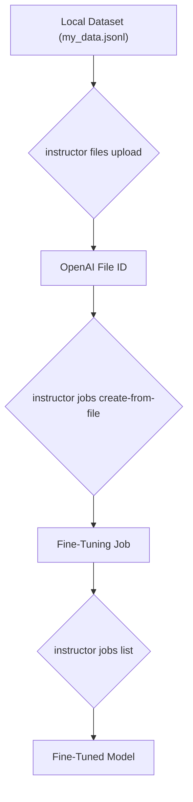

# Fine-Tuning with the `instructor` CLI

## 1. Goal

This tutorial will guide you through the process of fine-tuning a model using the `instructor` CLI. Fine-tuning allows you to adapt a base model to your specific data, improving its performance on a particular task. We will cover the end-to-end workflow, from uploading your dataset to creating and monitoring the fine-tuning job.

## 2. Prerequisites

- The `instructor` package installed (`pip install instructor`).
- Your OpenAI API key configured as an environment variable (`OPENAI_API_KEY`).

## 3. Architecture

The fine-tuning process involves two main stages: uploading your data and then creating the fine-tuning job. The CLI tools streamline this process.



## 4. Implementation Steps

### Step 1: Prepare Your Data

First, you need to prepare your training data in the JSONL format. Each line should be a JSON object containing a `messages` array. Each message in the array should have a `role` and `content`.

Here is an example of a valid `my_data.jsonl` file:

```json
{"messages": [{"role": "system", "content": "You are a helpful assistant."}, {"role": "user", "content": "Hello!"}, {"role": "assistant", "content": "Hi, how can I help you?"}]}
{"messages": [{"role": "system", "content": "You are a helpful assistant."}, {"role": "user", "content": "What is fine-tuning?"}, {"role": "assistant", "content": "Fine-tuning is the process of adapting a pre-trained model to a new task."}]}
```

### Step 2: Upload Your Dataset

Next, upload your dataset to OpenAI using the `instructor files upload` command. This command takes the path to your file and the purpose of the file as arguments. For fine-tuning, the purpose is `fine-tune`.

```bash
instructor files upload --filepath my_data.jsonl
```

The CLI will monitor the upload process and wait until the file is fully processed by OpenAI. You will see an output similar to this:

```
Monitoring upload: file-AbCdEfGhIjKlMnOpQrStUvWx...
File file-AbCdEfGhIjKlMnOpQrStUvWx uploaded successfully!
```

Keep a note of the `File ID` (`file-AbCdEfGhIjKlMnOpQrStUvWx` in this example), as you will need it in the next step.

### Step 3: Create the Fine-Tuning Job

Now that your file is uploaded and processed, you can create a fine-tuning job using the `instructor jobs create-from-file` command. You need to provide the file path of your local machine, not the ID of the file you just uploaded.

```bash
instructor jobs create-from-file --file my_data.jsonl --model gpt-3.5-turbo
```

This command will first upload the file, and then start the fine tuning job. You can also specify other parameters, such as the number of epochs, batch size, and learning rate multiplier:

```bash
instructor jobs create-from-file --file my_data.jsonl --model gpt-3.5-turbo --n_epochs 5 --batch_size 2 --learning_rate_multiplier 0.1
```

Upon successful creation, you will see a confirmation with the job ID:

```
Fine-tuning job created with ID: ft-aBcDeFgHiJkLmNoPqRsTuVwX from file ID: file-AbCdEfGhIjKlMnOpQrStUvWx
```

### Step 4: Monitor the Job

To monitor the status of your fine-tuning job, you can use the `instructor jobs list` command. This will display a table with the most recent jobs and their status.

```bash
instructor jobs list
```

The table will automatically refresh, showing the progress of your job. Once the status changes to `succeeded`, your fine-tuned model is ready to be used.

## 5. Common Pitfalls

- **Incorrect Data Format**: Ensure your data is in the correct JSONL format. Any deviation will cause the file processing to fail.
- **File Not Processed**: You must wait for the file to be `processed` before you can use it in a fine-tuning job. The `instructor files upload` command handles this for you by polling the file status.

## 6. Challenge Yourself

- **Use a Validation File**: The `create-from-file` command has a `--validation_file` option. Try creating a separate validation dataset and use it to get more detailed feedback on your model's performance.
- **Cancel a Job**: The `instructor jobs cancel` command allows you to stop a running job. Try starting a job and then cancelling it using its job ID.