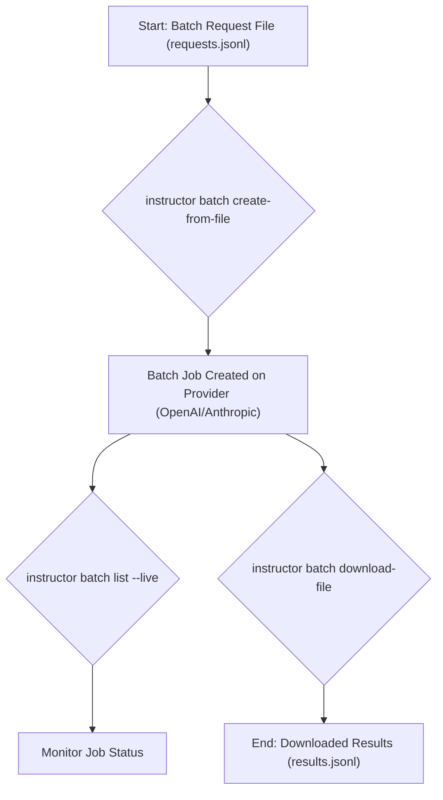

# Asynchronous Batch Processing with the CLI

## 1. Goal

This tutorial will guide you through using the `instructor` CLI for asynchronous batch processing. This is useful when you have a large number of tasks to run that don't require immediate results, allowing for cost savings and efficient processing of large datasets.

## 2. Prerequisites

- The `instructor` package installed (`pip install instructor`).
- An OpenAI or Anthropic API key set as an environment variable (e.g., `OPENAI_API_KEY`).

## 3. Architecture



## 4. Implementation Steps

### Step 1: Create a Batch Request File

First, you need to create a JSONL file containing your batch requests. Each line in the file should be a JSON object representing a single request. For OpenAI, the format is as follows:

```json
{"custom_id": "request-1", "method": "POST", "url": "/v1/chat/completions", "body": {"model": "gpt-4o-mini", "messages": [{"role": "user", "content": "What is the capital of France?"}], "response_format": {"type": "json_object"}}}
{"custom_id": "request-2", "method": "POST", "url": "/v1/chat/completions", "body": {"model": "gpt-4o-mini", "messages": [{"role": "user", "content": "Who wrote 'To Kill a Mockingbird'?"}], "response_format": {"type": "json_object"}}}
```

Save this file as `requests.jsonl`.

### Step 2: Create the Batch Job

Next, use the `instructor batch create-from-file` command to create the batch job on the provider's servers:

```bash
instructor batch create-from-file --file-path requests.jsonl --model openai/gpt-4o-mini
```

This command will upload your `requests.jsonl` file and start a new batch job. You will get a batch ID in response.

### Step 3: Monitor the Batch Job

You can monitor the status of your batch job using the `instructor batch list` command with the `--live` flag:

```bash
instructor batch list --live --provider openai
```

This will show a live-updating table with the status of your batch jobs. Wait for the status to become `completed`.

### Step 4: Download the Results

Once the job is complete, you can download the results using the `instructor batch download-file` command. You will need the batch ID from the previous step.

```bash
instructor batch download-file --batch-id <YOUR_BATCH_ID> --download-file-path results.jsonl --provider openai
```

Replace `<YOUR_BATCH_ID>` with the actual ID of your batch job. The results will be saved in `results.jsonl`.

## 5. Common Pitfalls

- **API Key Not Set**: Make sure you have set the appropriate environment variable for your provider (e.g., `OPENAI_API_KEY`).
- **Incorrect File Format**: The batch request file must be in JSONL format, with each line being a valid JSON object.
- **Provider Mismatch**: Ensure that the `--provider` flag matches the provider you are using.

## 6. Challenge Yourself

Create a batch request file with at least 10 requests. Use the `instructor` CLI to create a batch job, monitor it to completion, and download the results. Then, write a Python script to parse the `results.jsonl` file and print the content of each response.