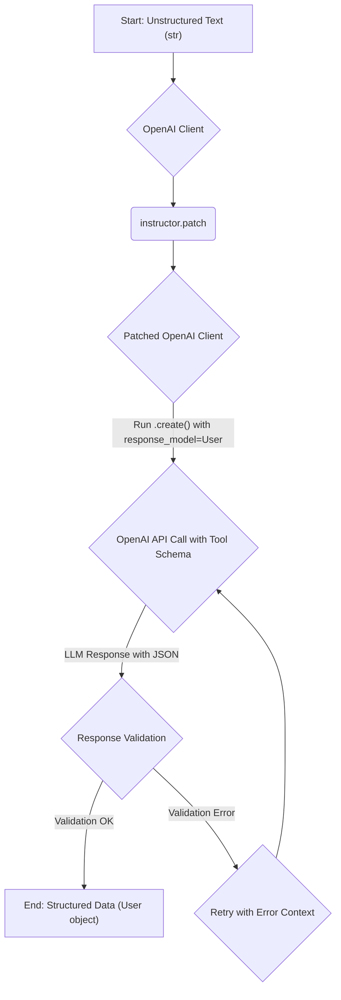

# Tutorial Plan: 01_getting_started.md

## Synopsis
This tutorial demonstrates the most fundamental feature of the `instructor` library: getting structured data out of an LLM using a Pydantic model. We will ask a language model to extract user information from a simple text string and return it as a validated `User` object. This solves the real-world problem of turning unstructured text into structured, actionable data without writing manual parsing and validation logic.

## Prerequisites
- Python 3.9+ installed
- An OpenAI API key
- The following libraries installed:
  ```bash
  pip install instructor openai pydantic
  ```

## Architecture


## Implementation Steps

### Step 1: Define the Pydantic Model
First, we define the `User` model. This tells `instructor` what structure to expect. The docstrings are automatically used to generate descriptions for the LLM, improving accuracy.

```python
import pydantic

class User(pydantic.BaseModel):
    name: str = pydantic.Field(description="The user's full name.")
    age: int = pydantic.Field(description="The user's age.")
```

***Verification***: The Python script should execute without errors. This step only defines a data structure.

### Step 2: Patch the OpenAI Client
Next, we import `instructor` and `openai`. We patch the `openai` client, which modifies its `.chat.completions.create()` method to support the `response_model` argument.

```python
import instructor
import openai
from pydantic import BaseModel, Field

# 1. Define the Pydantic Model
class User(BaseModel):
    name: str = Field(description="The user's full name.")
    age: int = Field(description="The user's age.")

# 2. Patch the OpenAI Client
# Make sure your OPENAI_API_KEY environment variable is set.
client = openai.OpenAI()

# The patch is applied in-place.
instructor.patch(client)

# 3. Call the Patched Method
user: User = client.chat.completions.create(
    model="gpt-3.5-turbo",
    response_model=User,
    messages=[
        {"role": "user", "content": "Extract user data from: John Doe is 30 years old."},
    ]
)

print(user)
# > name='John Doe' age=30

assert isinstance(user, User)
```

***Verification***: Running this script should print the `User` object to the console. The output will look like `name='John Doe' age=30`.

## Common Pitfalls
- **Missing `OPENAI_API_KEY`**: The script will fail with an `AuthenticationError`. Make sure the environment variable is correctly set.
- **Incorrect Model Name**: Using a model that does not support tool calling (like older GPT-3 models) will result in errors or poor performance. `gpt-3.5-turbo` or `gpt-4` is recommended.
- **ImportError**: Forgetting to `pip install openai instructor pydantic` will cause an `ImportError`.

## Challenge Yourself
Modify the `User` model to also extract the user's location (city and state). Then, update the `messages` prompt with a sentence that includes this new information (e.g., "John Doe is 30 years old and lives in San Francisco, CA.") and verify that the `location` field is correctly populated in the final `User` object.