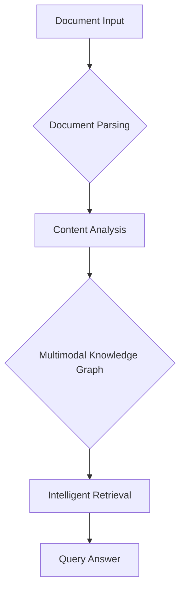

'''
# Getting Started with RAGAnything

## 1. Goal

This tutorial will guide you through the process of setting up and using `RAGAnything`, an all-in-one multimodal RAG (Retrieval-Augmented Generation) system. You will learn how to process a document containing various content types (text, images, tables) and perform queries on the extracted information.

## 2. Prerequisites

Before you begin, ensure you have Python 3.10+ installed. You will also need to install the `raganything` library.

### Installation

You can install the package using pip:

```bash
# Basic installation
pip install raganything

# To include all optional dependencies for handling different file types:
pip install 'raganything[all]'
```

You will also need an OpenAI API key to use the models in this tutorial.

## 3. Architecture

The `RAGAnything` framework follows a multi-stage pipeline to process and query multimodal documents. Here is a simplified overview of the architecture:



- **Document Parsing**: The system first parses the input document, extracting text, images, tables, and other elements.
- **Content Analysis**: Each content type is analyzed by specialized processors.
- **Multimodal Knowledge Graph**: The extracted information is used to build a knowledge graph that represents the relationships between different content elements.
- **Intelligent Retrieval**: When a query is made, the system retrieves relevant information from the knowledge graph to generate a comprehensive answer.

## 4. Implementation

Now, let's walk through a complete example of how to use `RAGAnything`.

### Step 1: Configuration

First, we configure `RAGAnything` by creating an instance of `RAGAnythingConfig`. This class allows you to customize various settings, such as the working directory and processing options.

```python
from raganything import RAGAnythingConfig

# Create a RAGAnything configuration
config = RAGAnythingConfig(
    working_dir="./rag_storage",
    parser="mineru",  # Use the mineru parser
    enable_image_processing=True,
    enable_table_processing=True,
    enable_equation_processing=True,
)
```

### Step 2: Model and Embedding Functions

Next, we define the functions for the language model, vision model, and embeddings. For this example, we will use OpenAI's models.

```python
from lightrag.llm.openai import openai_complete_if_cache, openai_embed
from lightrag.utils import EmbeddingFunc

# Make sure to set your OPENAI_API_KEY environment variable
api_key = "your-openai-api-key"

# Define the LLM model function
def llm_model_func(prompt, **kwargs):
    return openai_complete_if_cache(
        "gpt-4o-mini",
        prompt,
        api_key=api_key,
        **kwargs,
    )

# Define the vision model function for image processing
def vision_model_func(prompt, image_data=None, **kwargs):
    messages = [
        {
            "role": "user",
            "content": [
                {"type": "text", "text": prompt},
                {
                    "type": "image_url",
                    "image_url": {
                        "url": f"data:image/jpeg;base64,{image_data}"
                    },
                },
            ],
        }
    ]
    return openai_complete_if_cache(
        "gpt-4o",
        "",
        messages=messages,
        api_key=api_key,
        **kwargs,
    )

# Define the embedding function
embedding_func = EmbeddingFunc(
    embedding_dim=3072, # text-embedding-3-large dimension
    func=lambda texts: openai_embed(
        texts,
        model="text-embedding-3-large",
        api_key=api_key
    ),
)
```

### Step 3: Initialize RAGAnything

Now we can initialize the `RAGAnything` object with the configuration and functions we defined.

```python
from raganything import RAGAnything

# Initialize RAGAnything
rag = RAGAnything(
    config=config,
    llm_model_func=llm_model_func,
    vision_model_func=vision_model_func,
    embedding_func=embedding_func,
)
```

### Step 4: Process a Document

With `RAGAnything` initialized, we can process a document. For this example, create a dummy PDF file named `example.pdf` or use an existing one.

```python
import asyncio

async def main():
    # You need a PDF file for this step. Let's assume 'example.pdf' exists.
    # Create a dummy file if you don't have one.
    try:
        from reportlab.pdfgen import canvas
        from reportlab.lib.pagesizes import letter
        c = canvas.Canvas("example.pdf", pagesize=letter)
        c.drawString(100, 750, "This is a test PDF for RAGAnything.")
        c.showPage()
        c.save()
    except ImportError:
        print("Please install reportlab to create a dummy PDF: pip install reportlab")
        return

    await rag.process_document_complete(
        file_path="example.pdf",
        output_dir="./output",
    )

    # Query the processed content
    result = await rag.aquery(
        "What is this document about?",
        mode="hybrid"
    )
    print("Query Result:", result)

if __name__ == "__main__":
    asyncio.run(main())

```

### Step 5: Putting It All Together

Here is the complete, runnable script. Save it as `run_raganything.py`:

```python
import asyncio
import os
from raganything import RAGAnything, RAGAnythingConfig
from lightrag.llm.openai import openai_complete_if_cache, openai_embed
from lightrag.utils import EmbeddingFunc

# Ensure you have an OpenAI API key set as an environment variable or here
api_key = os.getenv("OPENAI_API_KEY", "your-openai-api-key")

# 1. Configuration
config = RAGAnythingConfig(
    working_dir="./rag_storage",
    parser="mineru",
    enable_image_processing=True,
    enable_table_processing=True,
    enable_equation_processing=True,
)

# 2. Model and Embedding Functions
def llm_model_func(prompt, **kwargs):
    return openai_complete_if_cache("gpt-4o-mini", prompt, api_key=api_key, **kwargs)

def vision_model_func(prompt, image_data=None, **kwargs):
    if not image_data:
        return llm_model_func(prompt, **kwargs)
    messages = [
        {
            "role": "user",
            "content": [
                {"type": "text", "text": prompt},
                {
                    "type": "image_url",
                    "image_url": {"url": f"data:image/jpeg;base64,{image_data}"},
                },
            ],
        }
    ]
    return openai_complete_if_cache("gpt-4o", "", messages=messages, api_key=api_key, **kwargs)

embedding_func = EmbeddingFunc(
    embedding_dim=3072,
    max_token_size=8192,
    func=lambda texts: openai_embed(
        texts, model="text-embedding-3-large", api_key=api_key
    ),
)

# 3. Initialize RAGAnything
rag = RAGAnything(
    config=config,
    llm_model_func=llm_model_func,
    vision_model_func=vision_model_func,
    embedding_func=embedding_func,
)

async def main():
    # 4. Create a dummy PDF for demonstration
    pdf_path = "example.pdf"
    if not os.path.exists(pdf_path):
        try:
            from reportlab.pdfgen import canvas
            from reportlab.lib.pagesizes import letter
            c = canvas.Canvas(pdf_path, pagesize=letter)
            c.drawString(100, 750, "This is a test document for the RAGAnything library.")
            c.drawString(100, 735, "RAGAnything is an all-in-one multimodal RAG system.")
            c.showPage()
            c.save()
            print(f"Created dummy PDF: {pdf_path}")
        except ImportError:
            print("Please install reportlab to create a dummy PDF: pip install reportlab")
            return

    # 5. Process the document
    print(f"Processing document: {pdf_path}")
    await rag.process_document_complete(
        file_path=pdf_path,
        output_dir="./output",
    )
    print("Document processing complete.")

    # 6. Query the content
    query_text = "What is RAGAnything?"
    print(f"Querying with: '{query_text}'")
    result = await rag.aquery(query_text, mode="hybrid")
    print("Query Result:", result)

if __name__ == "__main__":
    # Ensure the API key is set before running
    if api_key == "your-openai-api-key":
        print("Please replace 'your-openai-api-key' with your actual OpenAI API key.")
    else:
        asyncio.run(main())

```

To run this script, save it and execute it from your terminal:

```bash
python run_raganything.py
```

This will process the PDF, store the extracted information, and then query it to find out what `RAGAnything` is. The output will be the answer generated by the language model based on the content of the document.
'''