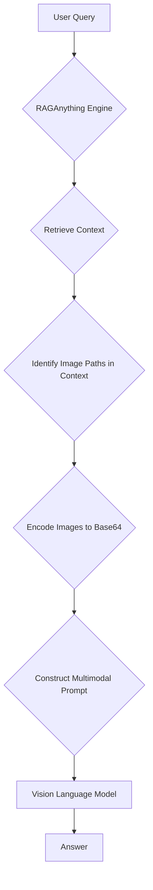

'''markdown
# Advanced Topics in RAGAnything

This tutorial explores the advanced capabilities of the `raganything` library, focusing on VLM (Vision Language Model) enhanced queries, multimodal queries, and efficient batch processing. These features extend the core RAG functionality, allowing you to work with complex documents and large datasets more effectively.

## 1. Goal

The goal of this tutorial is to demonstrate how to:

- Use VLM-enhanced queries to reason about images within your documents.
- Perform multimodal queries that combine text with other data types like images and tables.
- Process large numbers of documents efficiently using batch processing.

## 2. Prerequisites

- `raganything` library installed.
- An environment with the necessary dependencies, including a compatible vision model for VLM features.

## 3. VLM Enhanced Queries

RAGAnything can automatically identify images referenced in your documents, encode them, and pass them to a Vision Language Model (VLM) for analysis. This allows you to ask questions directly about the visual content of your documents.

### Architecture

The VLM-enhanced query process follows this workflow:



### Implementation

The `aquery_vlm_enhanced` method orchestrates this process. When you issue a query, it retrieves relevant text chunks. If these chunks contain paths to images, it loads those images, creates a multimodal prompt, and sends it to the VLM.

Here is an example of how to use this feature. Assume you have a document that contains text referring to an image, like `Image Path: assets/diagram.png`.

```python
import asyncio
from raganything import RAGAnything

async def main():
    # Initialize RAGAnything with a vision model
    # You need to provide your own async vision model function
    # For example, using an OpenAI compatible client:
    # from openai import AsyncOpenAI
    # client = AsyncOpenai()
    # async def vision_model_func(prompt, messages=None, **kwargs):
    #    if messages:
    #        completion = await client.chat.completions.create(model="gpt-4-vision-preview", messages=messages, max_tokens=1024)
    #        return completion.choices[0].message.content
    #    ...

    rag = RAGAnything(
        vision_model_func=my_async_vision_model_func # Replace with your actual vision model function
    )

    # First, process the document containing the image reference
    await rag.process_document_complete("path/to/your/document.md")

    # Now, ask a question about the image in the document
    query = "Describe the diagram shown in the document."
    result = await rag.aquery_vlm_enhanced(query)

    print(result)

if __name__ == "__main__":
    asyncio.run(main())
```

## 4. Multimodal Queries

Beyond analyzing images already in your documents, you can introduce new multimodal content at query time. The `aquery_with_multimodal` method allows you to combine a text query with images, tables, or other content types.

### Querying with an Image

You can provide an image directly with your query to ask questions about it.

```python
import asyncio
from raganything import RAGAnything

async def main():
    rag = RAGAnything()
    # Assume the RAG system is already populated with some documents

    query = "How does this image relate to the main topic of the documents?"
    multimodal_content = [
        {
            "type": "image",
            "img_path": "path/to/your/image.jpg"
        }
    ]

    result = await rag.aquery_with_multimodal(
        query,
        multimodal_content=multimodal_content
    )

    print(result)

if __name__ == "__main__":
    asyncio.run(main())
```

### Querying with a Table

Similarly, you can provide tabular data and ask for analysis in the context of your document collection.

```python
import asyncio
from raganything import RAGAnything

async def main():
    rag = RAGAnything()
    # Assume the RAG system is already populated with some documents

    query = "Compare the trends in this table with the financial reports."
    multimodal_content = [
        {
            "type": "table",
            "table_data": "Year,Revenue\n2022,10M\n2023,12M"
        }
    ]

    result = await rag.aquery_with_multimodal(
        query,
        multimodal_content=multimodal_content
    )

    print(result)

if __name__ == "__main__":
    asyncio.run(main())

```

## 5. Batch Processing

When dealing with a large number of documents, processing them one by one can be inefficient. `RAGAnything` provides a `process_documents_batch` method to handle this.

This method uses a `BatchParser` to process multiple files in parallel, which can significantly speed up the ingestion process.

### Implementation

The `process_documents_batch` method takes a list of file paths or directories and processes them concurrently.

```python
from raganything import RAGAnything

# Note: This is a synchronous method
def main():
    rag = RAGAnything()

    file_paths = ["path/to/doc1.pdf", "path/to/doc2.md", "path/to/directory"]

    # Process documents in batch
    result = rag.process_documents_batch(
        file_paths=file_paths,
        recursive=True, # Process directories recursively
        show_progress=True
    )

    print(f"Successfully parsed: {len(result.successful_files)}")
    print(f"Failed files: {len(result.failed_files)}")

    # Once parsed, you can add them to the RAG index
    # This example shows parsing, a full implementation would also include indexing.

if __name__ == "__main__":
    main()
```

For a fully integrated batch processing and RAG ingestion workflow, you can use the `process_documents_with_rag_batch` async method, which handles both parsing and adding to the RAG index.

## 6. Conclusion

`RAGAnything` offers powerful advanced features for building sophisticated RAG applications. By leveraging VLM-enhanced queries, multimodal inputs, and efficient batch processing, you can create systems that understand and reason about a wide variety of content at scale.
'''