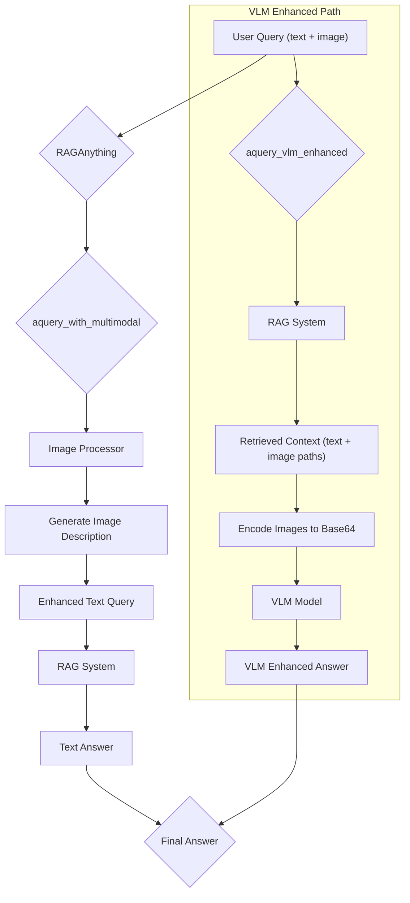

'''
# Advanced Querying with Multimodal Content

## 1. Goal

This tutorial demonstrates how to use the advanced querying capabilities of the `raganything` library to ask questions about multimodal content. You will learn how to perform queries that involve both text and images, leveraging the `aquery_with_multimodal` and `aquery_vlm_enhanced` methods.

## 2. Prerequisites

- The `raganything` package is installed.
- You have access to a language model (LLM), an embedding model, and a vision model.

## 3. Architecture



## 4. Implementation

### Step 1: Querying with Multimodal Content

The `aquery_with_multimodal` method allows you to enhance a text query with additional multimodal content, such as images. The method will first generate a description of the multimodal content and then use this description to augment the original query. This enhanced query is then sent to the RAG system to retrieve a more accurate answer.

Here is an example of how to use `aquery_with_multimodal`:

```python
import asyncio
from raganything import RAGAnything

# Assume llm_func, embedding_func, and vision_model_func are defined

async def main():
    rag = RAGAnything(
        llm_model_func=llm_func, 
        embedding_func=embedding_func,
        vision_model_func=vision_model_func
    )

    # Create a dummy image file
    with open("my_image.jpg", "w") as f:
        f.write("This is a dummy image file.")

    # Process a document (replace with a real document if you have one)
    await rag.process_file("my_document.pdf")

    # Ask a question about the image
    answer = await rag.aquery_with_multimodal(
        query="What is in this image?",
        multimodal_content=[{
            "type": "image",
            "img_path": "my_image.jpg"
        }]
    )
    print(answer)

if __name__ == "__main__":
    asyncio.run(main())
```

***Verification***: Running the code above will print the description of the image generated by the vision model.

### Step 2: VLM-Enhanced Querying

The `aquery_vlm_enhanced` method provides an even more powerful way to query multimodal content. It first retrieves relevant context from the RAG system based on your text query. Then, it identifies any image paths within the retrieved context, loads the corresponding images, and sends both the text and the images to a Vision Language Model (VLM). This allows the VLM to directly "see" the images and provide a more accurate and context-aware answer.

Here is an example of how to use `aquery_vlm_enhanced`:

```python
import asyncio
from raganything import RAGAnything

# Assume llm_func, embedding_func, and vision_model_func are defined

async def main():
    rag = RAGAnything(
        llm_model_func=llm_func, 
        embedding_func=embedding_func,
        vision_model_func=vision_model_func
    )

    # Assume "my_document.pdf" contains references to "my_image.jpg"
    # Create a dummy image file
    with open("my_image.jpg", "w") as f:
        f.write("This is a dummy image file.")

    await rag.process_file("my_document.pdf")

    # Ask a question that requires understanding the image in context
    answer = await rag.aquery_vlm_enhanced(
        query="Describe the object mentioned in the document and shown in the image."
    )
    print(answer)

if __name__ == "__main__":
    asyncio.run(main())

```

***Verification***: The output will be a detailed description of the object, combining information from both the text in the document and the visual content of the image.

## 5. Common Pitfalls

- **Missing `vision_model_func`**: Both `aquery_with_multimodal` (for image content) and `aquery_vlm_enhanced` require a `vision_model_func` to be provided during the initialization of the `RAGAnything` object. If you forget to provide it, you will get an error.
- **Incorrect File Paths**: Ensure that the `img_path` in the `multimodal_content` list and the image paths in your documents are correct and accessible to the program.

## 6. Challenge Yourself

Modify the provided examples to work with a real PDF document and a real image. Experiment with different queries and observe how the `aquery_with_multimodal` and `aquery_vlm_enhanced` methods respond. Try to ask a question that requires understanding the relationship between the text and the image.
'''