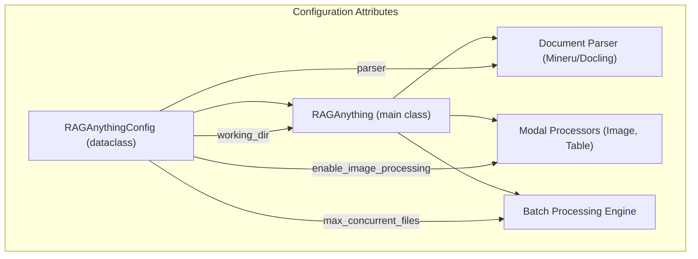

'''
# Configuring RAGAnything

## 1. Synopsis

The `RAGAnything` system is designed to be highly flexible, and its behavior is controlled through a centralized configuration object called `RAGAnythingConfig`. This tutorial will guide you through the process of customizing the system's settings, from specifying storage locations to toggling features like image processing. Understanding how to use `RAGAnythingConfig` is the first step toward tailoring the RAGAnything pipeline to your specific needs.

## 2. Prerequisites

Before you begin, ensure you have the `raganything` library installed. If not, you can install it using pip:

```bash
pip install raganything
```

## 3. Architecture

The `RAGAnythingConfig` dataclass is the single source of truth for all system settings. It is passed to the `RAGAnything` class upon initialization, and its attributes control various components, including the document parser, modal processors, and batch processing engine.



## 4. Implementation Steps

### Step 1: Initialize the Configuration

The `RAGAnythingConfig` class can be imported from `raganything.config`. You can create a default configuration instance or override its attributes during initialization.

*Code Block:*
```python
from raganything.config import RAGAnythingConfig

# Create a default configuration
default_config = RAGAnythingConfig()
print(f"Default working directory: {default_config.working_dir}")

# Create a custom configuration
custom_config = RAGAnythingConfig(
    working_dir="./my_custom_rag_storage",
    parser="mineru",
    enable_image_processing=False
)
print(f"Custom working directory: {custom_config.working_dir}")
print(f"Image processing enabled: {custom_config.enable_image_processing}")
```

*Verification:*

Running the code above will produce the following output, confirming that the configuration objects have been created with the specified settings:

```
Default working directory: ./rag_storage
Custom working directory: ./my_custom_rag_storage
Image processing enabled: False
```

### Step 2: Update Configuration at Runtime

You can also modify the configuration of a `RAGAnything` instance after it has been created. This is useful for dynamically adjusting the system's behavior.

*Code Block:*
```python
from raganything.config import RAGAnythingConfig

# Assume rag_instance is an initialized RAGAnything object
# For demonstration, we'll just use the config object directly
config = RAGAnythingConfig()
print(f"Initial parse method: {config.parse_method}")

# Update the parse method
config.parse_method = "ocr"
print(f"Updated parse method: {config.parse_method}")
```

*Verification:*

This will show that the `parse_method` attribute has been successfully updated:

```
Initial parse method: auto
Updated parse method: ocr
```

## 5. Common Pitfalls

- **Invalid Parser Selection**: Setting the `parser` attribute to a value other than `"mineru"` or `"docling"` will cause an error when you try to process documents.
- **Environment Variable Overrides**: The `RAGAnythingConfig` class can be configured using environment variables. Be aware that if an environment variable (e.g., `WORKING_DIR`) is set, it will take precedence over the values you provide in your code.

## 6. Challenge Yourself

Create a Python script that does the following:

1.  Initializes a `RAGAnythingConfig` object.
2.  Sets the `supported_file_extensions` to only include `.txt` and `.md` files.
3.  Sets `max_concurrent_files` to `4`.
4.  Prints the modified configuration attributes to the console.

This exercise will help you practice creating and modifying custom configurations for your `RAGAnything` projects.
'''