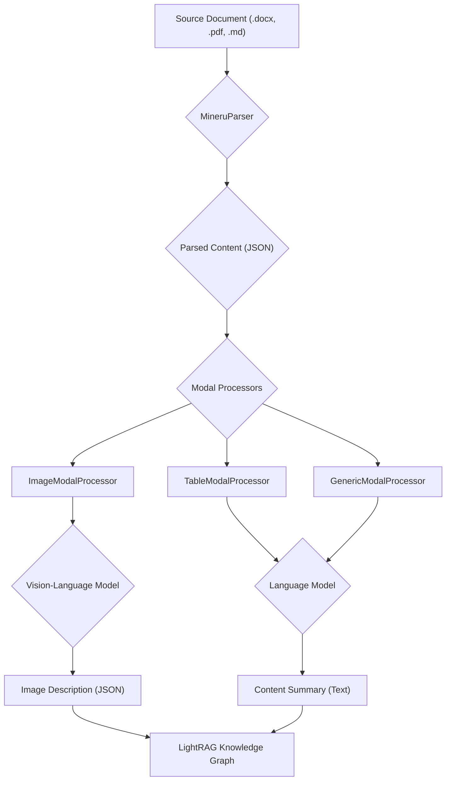

'''
# Handling Multimodal Content in RAGAnything

## 1. Goal

This tutorial explains how to use `raganything` to process documents that contain a mix of text, images, and tables. We will learn how to extract and analyze non-textual content and integrate it into a `LightRAG` knowledge graph.

## 2. Prerequisites

Make sure you have `raganything` and its dependencies installed. For this tutorial, you will need the `all` extras, which includes support for office documents, images, and markdown.

```bash
pip install "raganything[all]"
```

You will also need to have LibreOffice installed to handle `.docx` files, as `raganything` uses it for conversion to PDF.

- **macOS**: `brew install --cask libreoffice`
- **Ubuntu/Debian**: `sudo apt-get install libreoffice`

## 3. Architecture

The following diagram illustrates the multimodal content processing pipeline in `raganything`:



## 4. Implementation Steps

### Step 1: Parsing a Document

First, we use `MineruParser` to parse a source document. This parser handles various file formats, converting them to PDF if necessary, and then extracts a structured list of content blocks.

```python
from raganything.parser import MineruParser
import asyncio

async def parse_document():
    # Initialize the parser
    parser = MineruParser()

    # Path to your document (can be .docx, .pdf, .md, etc.)
    doc_path = "path/to/your/document.docx"

    # Parse the document
    # The output is a list of dictionaries, each representing a content block
    content_list = await parser.parse_document(doc_path)

    # Print the first few content blocks
    for item in content_list[:5]:
        print(item)
    
    return content_list

# To run the async function
# content_list = asyncio.run(parse_document())
```

***Verification***: After running this code, you will see a list of dictionaries printed to the console. Each dictionary represents a block of content (e.g., text, image, table) and contains metadata like `page_idx` and `type`.

### Step 2: Processing Modalities with ModalProcessors

Once we have the parsed content, we can use the `modalprocessors` to analyze each block. The `ImageModalProcessor`, for example, sends images to a vision-language model to get a description.

Let's set up a `LightRAG` instance and the modal processors.

```python
from raganything.modalprocessors import ImageModalProcessor, TableModalProcessor, GenericModalProcessor, ContextExtractor, ContextConfig
from lightrag.lightrag import LightRAG
from lightrag.components.model_client import GroqAPIClient, ollama

# Dummy functions for demonstration
async def dummy_modal_caption_func(prompt, image_data):
    return '{"description": "A dummy description of the image.", "entity_name": "Dummy Image"}'

# Setup a LightRAG instance
# You would typically configure this with your actual API keys and models
lightrag_instance = LightRAG()

# Initialize modal processors
context_config = ContextConfig(context_window=2)
context_extractor = ContextExtractor(config=context_config)

image_processor = ImageModalProcessor(
    lightrag=lightrag_instance,
    modal_caption_func=dummy_modal_caption_func, 
    context_extractor=context_extractor
)

async def process_content(content_list, doc_path):
    # Set the full content list as the source for context extraction
    image_processor.set_content_source(content_list, content_format="minerU")

    for i, item in enumerate(content_list):
        item_info = {
            "index": i,
            "page_idx": item.get("page_idx", 0),
            "type": item.get("type", "unknown")
        }

        if item['type'] == 'image':
            print(f"Processing image on page {item['page_idx']}...")
            # The modal_content for an image is its base64 representation
            image_base64 = item['b64_image']
            await image_processor.process_multimodal_content(
                modal_content=image_base64,
                content_type='image',
                item_info=item_info,
                file_path=doc_path
            )
        # Add logic for other processors (Table, Generic) here

# To run the processing
# asyncio.run(process_content(content_list, "path/to/your/document.docx"))
```

***Verification***: When you run this, the `ImageModalProcessor` will call the `dummy_modal_caption_func`. You'll see the "Processing image..." message for each image in your document. The processor will then create a chunk with the description and an entity for the image in the `LightRAG` instance.

## 5. Common Pitfalls

- **Missing LibreOffice**: If you get an error related to `soffice` or `libreoffice` not being found, it means you need to install LibreOffice for Office document conversion.
- **API Keys**: Ensure your `LightRAG` instance is configured with the correct API keys for the language models you are using.
- **File Paths**: Always use absolute paths or correct relative paths to your documents to avoid `FileNotFoundError`.

## 6. Challenge Yourself

Extend the `process_content` function to handle tables and generic text. You will need to initialize `TableModalProcessor` and `GenericModalProcessor` and add `elif` blocks to call their respective `process_multimodal_content` methods. You can create dummy functions for their captioning logic similar to the one for the `ImageModalProcessor`.

This will give you a complete pipeline for ingesting all content from a multimodal document into your knowledge graph.
'''