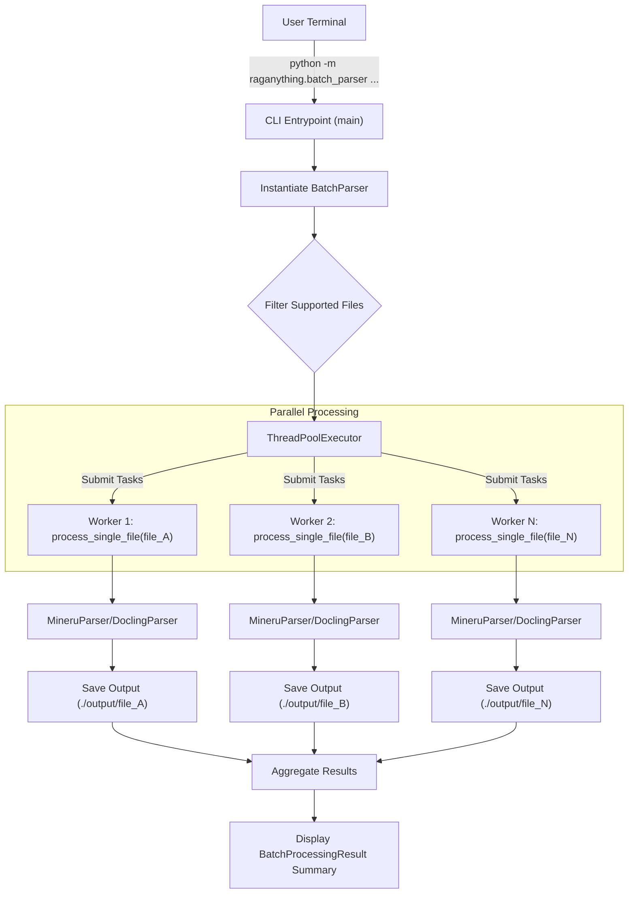

'''
# Tutorial: Using the Command-Line Interface for Batch Processing

## 1. Goal

This tutorial will teach you how to process a large number of documents (e.g., PDFs, Word files, images) directly from your terminal using `raganything`'s built-in command-line interface (CLI). This is perfect for bulk data ingestion and setting up a knowledge base without writing any Python code.

## 2. Prerequisites

- The `raganything` package must be installed in your Python environment.
- You should have a folder containing various documents you wish to process.

## 3. Architecture

The CLI batch processing system is designed for efficiency. When you execute the command, it triggers a workflow that utilizes multiple CPU cores to parse documents in parallel.



## 4. Implementation Steps

The core of the CLI is the `raganything.batch_parser` module, which can be run as a script.

### Step 1: Understanding the Command Arguments

The script accepts several arguments to control the batch processing. You can see all of them by running the help command:

```bash
python -m raganything.batch_parser --help
```

This will display the following key arguments:

-   **`paths`**: (Required) One or more file paths or directories to process.
-   **`--output` / `-o`**: (Required) The directory where the parsed output will be saved. The script will create a subfolder for each processed file.
-   **`--parser`**: The parsing engine to use. Defaults to `mineru`. Options: `mineru`, `docling`.
-   **`--method`**: The parsing method. `auto` is usually best. Options: `auto`, `txt`, `ocr`.
-   **`--workers`**: The number of parallel threads to use. Defaults to 4.
-   **`--recursive`**: If you provide a directory path, this flag makes the script search in all its subdirectories for files. It is enabled by default.
-   **`--timeout`**: Sets a time limit in seconds for processing a single file. Defaults to 300.

### Step 2: Running a Batch Job

Imagine you have a directory named `my_documents` containing a mix of PDFs, DOCX files, and PNG images.

```
my_documents/
├── annual_report.pdf
├── meeting_notes.docx
└── system_diagram.png
```

To process all of them and save the results into a new folder called `parsed_output`, you would run the following command:

```bash
python -m raganything.batch_parser ./my_documents -o ./parsed_output --workers 8
```

### *Verification*

Once the command is executed, you will see a progress bar and logging output in your terminal. Upon completion, a summary is printed:

```
2024-10-27 14:30:15 - raganything.batch_parser - INFO - Found 3 files to process
Processing files (mineru): 100%|██████████| 3/3 [00:15<00:00,  5.0s/file]
2024-10-27 14:30:30 - raganything.batch_parser - INFO - Batch Processing Summary:
  Total files: 3
  Successful: 3 (100.0%)
  Failed: 0
  Processing time: 15.21 seconds
  Output directory: ./parsed_output

Batch Processing Summary:
  Total files: 3
  Successful: 3 (100.0%)
  Failed: 0
  Processing time: 15.21 seconds
  Output directory: ./parsed_output
```

Furthermore, the `parsed_output` directory will now contain the results:

```
parsed_output/
├── annual_report/
│   ├── page_1.md
│   └── ...
├── meeting_notes/
│   ├── page_1.md
│   └── ...
└── system_diagram/
    └── image_1.md
```

## 5. Common Pitfalls

-   **Forgetting the Output Directory**: You must always provide the `--output` (or `-o`) argument. The script will exit with an error if it's missing.
-   **Invalid Parser or Method**: If you specify a `--parser` or `--method` that doesn't exist, the program will raise an error. Always use the options listed in the `--help` menu.
-   **Permissions**: Ensure you have read permissions for the source files and write permissions for the output directory.
-   **Unsupported Files**: The script will automatically skip files with unsupported extensions and log a warning. If you expect a file to be processed and it isn't, check that its extension is supported.

## 6. Challenge Yourself

Try running the batch parser on a directory with at least ten different documents. Experiment with the following:

1.  Process the same directory using both the `mineru` and `docling` parsers and compare the processing time.
2.  Change the number of workers (`--workers`) from 2 to 8 and observe the impact on performance.
3.  Create a subdirectory within your main documents folder and add files to it. Confirm that the default recursive behavior processes them correctly.
'''