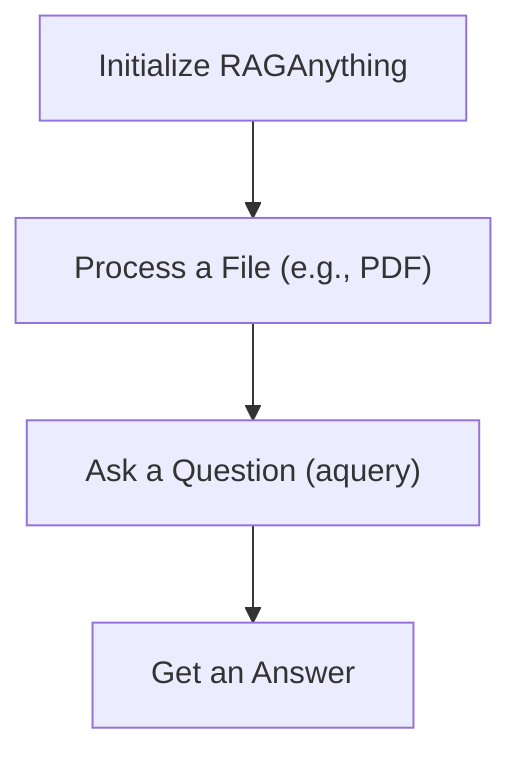

# Getting Started with RAGAnything

## 1. Goal

This tutorial will guide you through the most basic use case of the `RAGAnything` library. You will learn how to initialize the `RAGAnything` class, process a single document, and ask a question about its content. This is the "Hello World" of RAGAnything.

## 2. Prerequisites

Before you begin, ensure you have the following installed:

- Python 3.10 or higher
- The `raganything` library: `pip install raganything`
- A Large Language Model (LLM) and an embedding model. For this tutorial, we'll use OpenAI's models.

## 3. Architecture

The basic workflow of RAGAnything involves three main steps: initializing the system, processing a data source, and querying the indexed information. The following diagram illustrates this process:



## 4. Implementation

Let's walk through the code needed to get RAGAnything up and running.

### Step 1: Initialize RAGAnything

First, you need to import the necessary libraries and define your model functions. In this example, we'll use OpenAI's `gpt-3.5-turbo` for language generation and `text-embedding-ada-002` for embeddings. You'll need to have your OpenAI API key set as an environment variable (`OPENAI_API_KEY`).

```python
import asyncio
from raganything import RAGAnything
from lightrag.components.model_client import OpenAIModelClient
from lightrag.core.embedder import OpenAIEmbedder

# Define your model functions
def llm_model_func():
    return OpenAIModelClient(model="gpt-3.5-turbo")

def embedding_func():
    return OpenAIEmbedder(model="text-embedding-ada-002")

async def main():
    # Initialize RAGAnything
    rag = RAGAnything(
        llm_model_func=llm_model_func,
        embedding_func=embedding_func
    )

    # We will add more code here in the next steps

if __name__ == "__main__":
    asyncio.run(main())
```

*Verification*: Running this script should create a `rag_workspace` directory in your current working directory. This is where RAGAnything will store its data.

### Step 2: Process a Single Document

Next, you need to process a document to build your knowledge base. For this example, create a simple text file named `test.txt` with the following content:

```
Hello world! RAGAnything is a powerful tool for building RAG applications.
```

Now, add the following code to your `main` function to process this file:

```python
import asyncio
from raganything import RAGAnything
from lightrag.components.model_client import OpenAIModelClient
from lightrag.core.embedder import OpenAIEmbedder

# Define your model functions
def llm_model_func():
    return OpenAIModelClient(model="gpt-3.5-turbo")

def embedding_func():
    return OpenAIEmbedder(model="text-embedding-ada-002")

async def main():
    # Initialize RAGAnything
    rag = RAGAnything(
        llm_model_func=llm_model_func,
        embedding_func=embedding_func
    )

    # Create a dummy file for testing
    with open("test.txt", "w") as f:
        f.write("Hello world! RAGAnything is a powerful tool for building RAG applications.")

    # Process the file
    await rag.process_file_or_folder("test.txt")

    # We will add more code here in the next steps

if __name__ == "__main__":
    asyncio.run(main())

```

*Verification*: After running this script, you should see log messages indicating that the file has been parsed and processed.

### Step 3: Ask a Question

Finally, you can ask a question about the content of the document you just processed. Add the following code to your `main` function:

```python
import asyncio
from raganything import RAGAnything
from lightrag.components.model_client import OpenAIModelClient
from lightrag.core.embedder import OpenAIEmbedder

# Define your model functions
def llm_model_func():
    return OpenAIModelClient(model="gpt-3.5-turbo")

def embedding_func():
    return OpenAIEmbedder(model="text-embedding-ada-002")

async def main():
    # Initialize RAGAnything
    rag = RAGAnything(
        llm_model_func=llm_model_func,
        embedding_func=embedding_func
    )

    # Create a dummy file for testing
    with open("test.txt", "w") as f:
        f.write("Hello world! RAGAnything is a powerful tool for building RAG applications.")

    # Process the file
    await rag.process_file_or_folder("test.txt")

    # Ask a question
    answer = await rag.aquery("What is RAGAnything?")
    print(answer)

if __name__ == "__main__":
    asyncio.run(main())
```

*Verification*: Running this script should print an answer similar to this:

```
RAGAnything is a powerful tool for building RAG applications.
```

## 5. Common Pitfalls

- **Missing API Keys**: Ensure that your `OPENAI_API_KEY` environment variable is set correctly.
- **Incorrect File Paths**: Double-check the path to the file you want to process.
- **Firewall Issues**: If you are behind a corporate firewall, you might need to configure proxy settings for the OpenAI API calls.

## 6. Challenge Yourself

Now that you have a basic understanding of RAGAnything, try the following:

1.  Process a different type of file, such as a PDF or a Markdown file.
2.  Ask a more complex question about the content of the file.
3.  Experiment with different LLMs and embedding models.