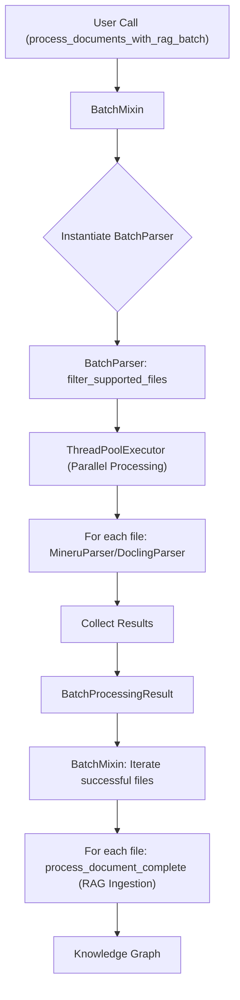

# Tutorial: Processing Documents in Bulk

## 1. Synopsis

When building a knowledge base, you often need to process a large number of documents at once. Doing this one-by-one is slow and inefficient. This tutorial will teach you how to use the `raganything` library to ingest entire directories of documents in a single, parallelized operation.

We will cover the `process_documents_with_rag_batch` method, which leverages the `BatchParser` class to process files concurrently, significantly speeding up the ingestion process.

## 2. Prerequisites

- The `raganything` library installed.
- A directory with some documents (PDFs, Word documents, images, etc.) to process.

## 3. Architecture

The batch processing system is designed for efficiency and scalability. Here's how it works:



## 4. Implementation Steps

### Step 1: Process a Directory of Documents

The most common use case is to point the system to a directory and let it discover and process all supported files. The `process_documents_with_rag_batch` method is the perfect tool for this.

Here's how you can use it:

```python
import asyncio
from raganything import RAGAnything

async def main():
    # Initialize RAGAnything
    rag = RAGAnything()

    # Point to a directory of documents
    # This can also be a list of file paths: ["path/to/doc1.pdf", "path/to/doc2.docx"]
    file_paths = ["/path/to/your/documents"]

    # Process the documents in batch
    result = await rag.process_documents_with_rag_batch(
        file_paths=file_paths,
        recursive=True, # Process subdirectories as well
    )

    print(f"Total processing time: {result['total_processing_time']:.2f} seconds")
    print(f"Successfully ingested {result['successful_rag_files']} files into the knowledge base.")

if __name__ == "__main__":
    asyncio.run(main())
```

### *Verification*

After running the script, you will see output in your console detailing the progress. The `result` dictionary contains a wealth of information about the process:

- `parse_result`: A `BatchProcessingResult` object with details about the parsing phase.
- `rag_results`: A dictionary with the status of each file's ingestion into the RAG system.
- `total_processing_time`: The total time taken for the entire operation.
- `successful_rag_files`: The number of files successfully ingested.

## 5. Common Pitfalls

- **Unsupported File Types**: The system will automatically skip files with unsupported extensions. You can get a list of supported extensions by calling `rag.get_supported_file_extensions()`.
- **File Permissions**: Ensure that your application has read permissions for all the files and directories you want to process.
- **Large Number of Files**: For a very large number of files, you might need to adjust the `max_workers` parameter to control the level of parallelism and memory usage.

## 6. Challenge Yourself

Modify the script to:

1. Process a list of individual file paths instead of a directory.
2. Change the `max_workers` parameter and observe the impact on processing time.
3. Implement error handling to log any files that failed to process and why.