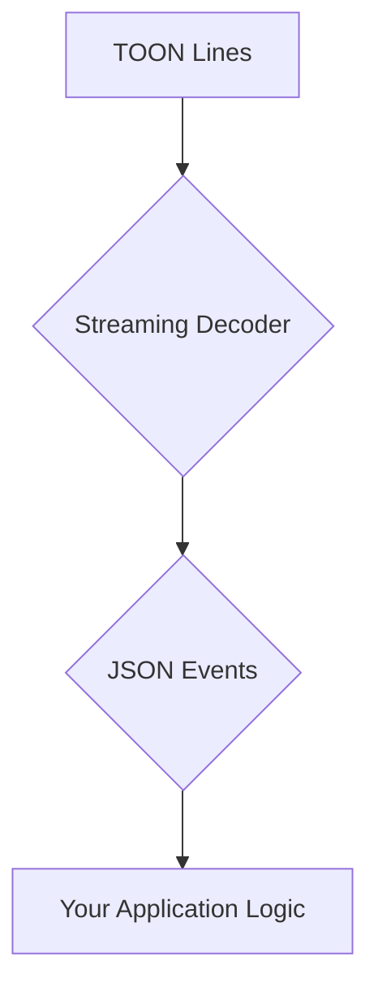

# Decoding TOON Streams

This tutorial explains how to decode TOON formatted strings in a streaming fashion, which is useful for handling large data sets without loading everything into memory.

## 1. Goal

The goal is to process TOON data as a stream of events, allowing for efficient and memory-friendly parsing of large files or network streams.

## 2. Prerequisites

Make sure you have the `@toon-format/toon` package installed:

```bash
npm install @toon-format/toon
```

## 3. Architecture

The streaming decoder processes TOON lines one by one and emits events representing the structure of the data.



## 4. Implementation

There are two primary functions for stream decoding: `decodeStreamSync` for synchronous operations and `decodeStream` for asynchronous sources.

### Synchronous Streaming

The `decodeStreamSync` function is ideal when you have all the TOON lines available in an iterable, like an array.

```javascript
import { decodeStreamSync } from '@toon-format/toon';

const toonLines = [
  'user:',
  '  name: Alice',
  '  posts[]:',
  '    - title: First post',
  '    - title: Second post'
];

for (const event of decodeStreamSync(toonLines)) {
  console.log(event);
}
```

This will output a series of events, such as `startObject`, `key`, `primitive`, `startArray`, `endArray`, and `endObject`, as it parses the lines.

### Asynchronous Streaming

The `decodeStream` function is designed for asynchronous data sources, such as file streams or network responses. It returns an async iterable.

```javascript
import { decodeStream } from '@toon-format/toon';
import { createReadStream } from 'node:fs';
import { Readable } from 'node:stream';

async function* getLinesFromStream() {
    const stream = Readable.from([
        'user:\n', 
        '  name: Alice\n', 
        '  posts[]:\n', 
        '    - title: First post\n', 
        '    - title: Second post\n'
    ]);

    for await (const chunk of stream) {
        yield* chunk.toString().split('\n');
    }
}

async function main() {
    const lines = getLinesFromStream();

    for await (const event of decodeStream(lines)) {
        console.log(event);
    }
}

main();
```

This example demonstrates how to wrap an async source of lines and process the stream of TOON events.
