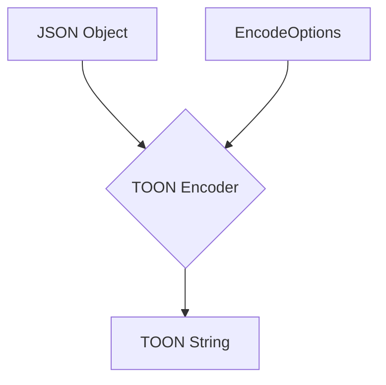

# Advanced TOON Encoding

## 1. Goal

This tutorial explores the advanced encoding features of the `@toon-format/toon` library. We will learn how to use options like `keyFolding` and `replacer` to create more compact and customized TOON representations of your JSON data.

## 2. Prerequisites

Make sure you have the `@toon-format/toon` package installed:

```bash
npm install @toon-format/toon
```

## 3. Architecture

The TOON encoding process can be customized by passing an `EncodeOptions` object. This allows for more control over the final output, enabling features like key folding for compactness and replacers for data manipulation.



## 4. Implementation

Let's dive into the advanced encoding options.

### Key Folding

Key folding is a powerful feature that collapses nested objects with single keys into a more compact, dot-separated path. This is particularly useful for deeply nested data structures where you want to reduce indentation and improve readability.

By setting the `keyFolding` option to `'safe'`, you enable this behavior.

### Replacer Function

The `replacer` function gives you fine-grained control over the encoding process. It works similarly to `JSON.stringify`'s replacer, allowing you to transform or filter values before they are encoded.

The replacer function receives the `key`, `value`, and `path` of the current element, allowing for context-aware transformations.

### Example

Let's combine these features in a practical example. We will use `keyFolding` to collapse a nested structure and a `replacer` to remove a sensitive field.

```javascript
import { encode } from '@toon-format/toon';

const data = {
  user: {
    metadata: {
      profile: {
        name: 'John Doe',
        email: 'john.doe@example.com',
        password: 'a-secret-password'
      }
    }
  }
};

// Replacer function to remove the password field
const replacer = (key, value) => {
  if (key === 'password') {
    return undefined; // Omit the password
  }
  return value;
};

const toonString = encode(data, {
  keyFolding: 'safe',
  replacer: replacer
});

console.log(toonString);
```

### Expected Output

The resulting TOON string will be:

```
user.metadata.profile
  name: "John Doe"
  email: "john.doe@example.com"
```

As you can see, the nested `user`, `metadata`, and `profile` keys have been folded into a single line, and the `password` field has been omitted, thanks to our advanced encoding options.