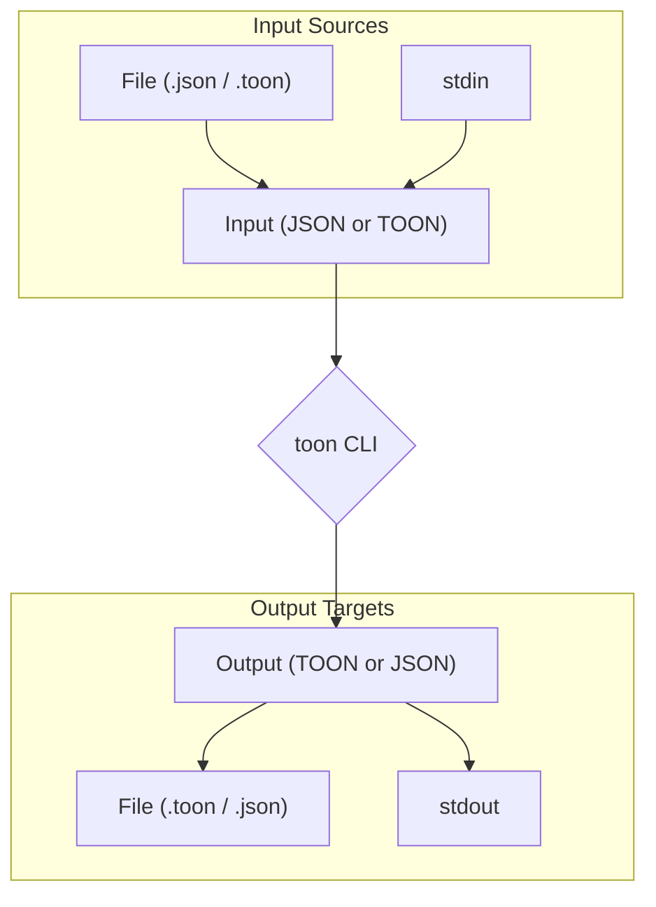

'''
# Using the TOON CLI

## 1. Goal

This tutorial will guide you through using the `@toon-format/cli` to convert files between JSON and TOON formats. We will cover encoding JSON to TOON and decoding TOON back to JSON, using both files and standard input/output streams.

## 2. Prerequisites

Before you begin, ensure you have Node.js installed and the `@toon-format/cli` package available.

## 3. Architecture



## 4. Implementation

### Step 1: Encoding JSON to TOON

Let's start with a simple JSON file named `data.json`:

```json
{
  "name": "TOON",
  "version": "1.0.0",
  "features": ["simple", "readable", "efficient"]
}
```

To convert this file to TOON format, run the following command:

```bash
toon data.json -o data.toon
```

*Verification*: You should see a new file `data.toon` with the following content:

```
name TOON
version 1.0.0
features simple, readable, efficient
```

### Step 2: Decoding TOON to JSON

Now, let's convert `data.toon` back to JSON:

```bash
toon data.toon -o data.json
```

*Verification*: The `data.json` file will be overwritten with the decoded JSON content.

### Step 3: Using stdin and stdout

The `toon` CLI also supports reading from `stdin` and writing to `stdout`. This is useful for piping data through different commands.

To encode from `stdin` to `stdout`:

```bash
cat data.json | toon > data.toon
```

To decode from `stdin` to `stdout`:

```bash
cat data.toon | toon
```

### Step 4: Advanced Options

The CLI provides several flags to customize the output.

- `--delimiter`: Change the delimiter for arrays (e.g., `|` or `\t`).
- `--indent`: Specify the indentation for JSON output.
- `--strict`: Enable or disable strict mode for decoding.

For example, to encode with a pipe delimiter:

```bash
toon data.json --delimiter " | "
```

This will produce:

```
name TOON
version 1.0.0
features simple | readable | efficient
```

## 5. Common Pitfalls

- **Invalid Delimiter**: Using a delimiter other than `comma`, `tab`, or `pipe` will result in an error.
- **Incorrect Mode**: While the CLI auto-detects the mode (encode/decode), you can force it with the `-e` or `-d` flags. If you have a `.toon` file that you want to encode, you must use the `-e` flag.

## 6. Challenge Yourself

1. Create a nested JSON object and convert it to TOON.
2. Experiment with the `--key-folding` and `--flatten-depth` options to see how they affect the output.
3. Create a script that uses `toon` to convert a directory of JSON files to TOON.
'''