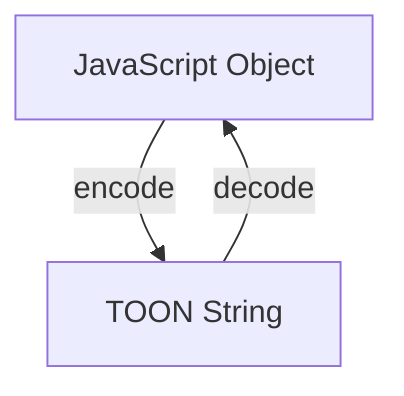

# Getting Started with TOON

## 1. Synopsis

TOON (Token-Oriented Object Notation) is a data format designed to be both human-readable and highly efficient for language model processing. It represents structured data (like JavaScript objects) in a way that uses fewer tokens than JSON, which can lead to cost savings and faster processing with large language models.

This tutorial will guide you through the basics of using the `@toon-format/toon` library to encode JavaScript objects into TOON strings and decode them back.

## 2. Prerequisites

Before you begin, you'll need to have Node.js and npm (or your favorite package manager) installed. 

To use TOON in your project, install the package from npm:

```bash
npm install @toon-format/toon
```

## 3. Architecture

At its core, the TOON library provides two main functions: `encode` and `decode`. The `encode` function takes a JavaScript object and serializes it into a TOON string. The `decode` function does the reverse, parsing a TOON string back into a JavaScript object.

Here's a diagram illustrating the process:



## 4. Implementation Steps

Let's walk through a simple example of encoding and decoding data.

### Step 1: Encode an Object to TOON

First, let's take a simple JavaScript object and encode it into a TOON string.

```javascript
import { encode } from '@toon-format/toon';

const user = {
  name: 'Alice',
  age: 30,
  roles: ['admin', 'editor'],
};

const toonString = encode(user);

console.log(toonString);
```

***Verification***

Running this code will produce the following output, which is the TOON representation of the `user` object:

```
name: Alice
age: 30
roles[]:
  - admin
  - editor
```

### Step 2: Decode a TOON String to an Object

Now, let's take the `toonString` we just created and decode it back into a JavaScript object.

```javascript
import { decode } from '@toon-format/toon';

const toonString = `
name: Alice
age: 30
roles[]:
  - admin
  - editor
`;

const userObject = decode(toonString);

console.log(userObject);
```

***Verification***

Running this code will give you back the original JavaScript object:

```json
{
  "name": "Alice",
  "age": 30,
  "roles": [
    "admin",
    "editor"
  ]
}
```

## 5. Common Pitfalls

- **Strict Mode**: By default, the `decode` function operates in `strict: true` mode. This means it will throw an error if it encounters a malformed TOON string. If you need to parse potentially invalid TOON, you can set `strict: false` in the options: `decode(toonString, { strict: false })`.
- **Indentation**: The TOON format is sensitive to indentation. When writing TOON manually or debugging, make sure your indentation is consistent. The default indentation is 2 spaces.

## 6. Challenge Yourself

As an exercise, try creating a more complex JavaScript object with nested objects and arrays. Encode it to a TOON string, and then decode it back to an object. Verify that the decoded object is identical to the original.

You can also experiment with the `encode` function's `indent` option to see how it affects the output. For example: `encode(user, { indent: 4 })`.