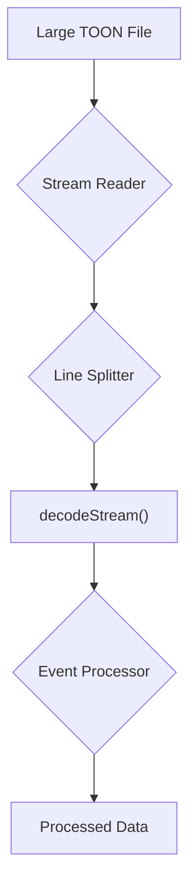

# Streaming with TOON: Handling Large Datasets

## 1. Synopsis

When working with large datasets, loading entire files into memory can be inefficient or even impossible. TOON provides a powerful streaming API to process data line-by-line, keeping memory consumption low and allowing you to handle files of any size. This tutorial covers the `decodeStream` function, which is ideal for processing large TOON files efficiently.

## 2. Prerequisites

- The `@toon-format/toon` package installed.
- A basic understanding of asynchronous operations in JavaScript (async/await).

## 3. Architecture

A streaming pipeline with `decodeStream` involves reading a source file, splitting it into lines, and then passing those lines to the decoder. The decoder, in turn, yields a series of events representing the structure of the data.



## 4. Implementation

Let's imagine we have a very large TOON file, `logs.toon`, containing a list of log entries. We want to count the number of error logs without loading the entire file into memory.

**`logs.toon`:**
```
logs[]:
  - level: info
    message: "User logged in"
  - level: error
    message: "Database connection failed"
  - level: info
    message: "Data processed"
  - level: error
    message: "File not found"
```

### Step 1: Process the Stream

We will use `fs.createReadStream` to read the file and an async line splitter to feed the lines to `decodeStream`.

```javascript
import { createReadStream } from 'fs';
import { decodeStream } from '@toon-format/toon';

async function* splitLines(stream) {
  let buffer = '';
  for await (const chunk of stream) {
    buffer += chunk;
    let lines = buffer.split('\n');
    buffer = lines.pop(); // Keep the last, possibly incomplete line
    for (const line of lines) {
      yield line;
    }
  }
  if (buffer) {
    yield buffer;
  }
}

async function countErrors(filePath) {
  const fileStream = createReadStream(filePath, { encoding: 'utf8' });
  const lines = splitLines(fileStream);
  const events = decodeStream(lines);

  let errorCount = 0;
  let isErrorLog = false;

  for await (const event of events) {
    if (event.type === 'key' && event.key === 'level') {
      // The next primitive will be the value for this key
    }

    if (event.type === 'primitive' && event.value === 'error') {
      isErrorLog = true;
    }

    if (event.type === 'endObject' && isErrorLog) {
      errorCount++;
      isErrorLog = false;
    }
  }

  return errorCount;
}

countErrors('logs.toon').then(count => {
  console.log(`Found ${count} error logs.`);
});
```

*Verification*:

Running this script will produce the following output:

```
Found 2 error logs.
```

The `decodeStream` function emits a series of events. Here’s a sample of the events for our `logs.toon` file:

```json
{"type":"startObject"}
{"type":"key","key":"logs"}
{"type":"startArray"}
{"type":"startObject"}
{"type":"key","key":"level"}
{"type":"primitive","value":"info"}
{"type":"key","key":"message"}
{"type":"primitive","value":"User logged in"}
{"type":"endObject"}
{"type":"startObject"}
{"type":"key","key":"level"}
{"type":"primitive","value":"error"}
{"type":"key","key":"message"}
{"type":"primitive","value":"Database connection failed"}
{"type":"endObject"}
{"type":"endArray"}
{"type":"endObject"}
```

## 5. Common Pitfalls

- **`expandPaths` is Not Supported**: The `expandPaths` option is not available in streaming mode. Path expansion requires the entire object to be in memory, which defeats the purpose of streaming.
- **Line Splitting**: Ensure your line splitter correctly handles the final line of the file, which may not have a trailing newline.

## 6. Challenge Yourself

Modify the example to not just count the error logs, but to also extract the `message` of each error log and print it to the console.