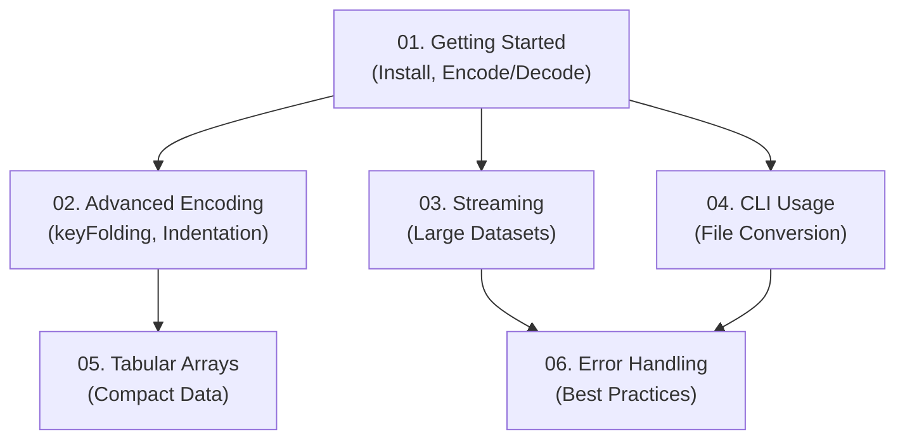

# Tutorial Series Plan: Mastering the TOON Data Format

This document outlines a comprehensive tutorial series designed to guide developers from the basics of the TOON data format to advanced usage patterns. The series is structured to build knowledge progressively, ensuring a solid understanding of each concept before moving to the next.

## Learning Pathway Architecture

## Tutorial Breakdown

### 1. `01_getting_started.md`
*   **Synopsis**: Introduction to TOON, its benefits over JSON for LLM prompts, and how to perform basic encoding and decoding operations.
*   **Core Concepts**: `encode`, `decode`.
*   **Verification**: Check the output of an encoded and then decoded object to ensure it matches the original.

### 2. `02_advanced_encoding.md`
*   **Synopsis**: Optimize the TOON output for specific use cases by exploring advanced encoding options like key folding and custom indentation.
*   **Core Concepts**: `EncodeOptions`, `keyFolding`, `indent`.
*   **Verification**: Compare the encoded output with and without `keyFolding` to see the difference in compactness.

### 3. `03_streaming.md`
*   **Synopsis**: Process large TOON files efficiently without loading the entire dataset into memory by using streaming decoding.
*   **Core Concepts**: `decodeStream`.
*   **Verification**: Process a large multi-document TOON file and log each decoded object as it's processed by the stream.

### 4. `04_cli_usage.md`
*   **Synopsis**: Use the TOON Command-Line Interface (CLI) to convert files between TOON and JSON, enabling easy integration into shell scripts and build processes.
*   **Core Concepts**: `@toon-format/cli`, `toon` command.
*   **Verification**: Run the `toon` command to convert a `.json` file to `.toon` and inspect the result.

### 5. `05_tabular_arrays.md`
*   **Synopsis**: Learn how to structure data using tabular arrays for a highly compact and token-efficient representation, ideal for lists of objects with the same schema.
*   **Core Concepts**: Tabular array syntax in TOON.
*   **Verification**: Encode an array of similar objects and confirm the output uses the compact tabular format.

### 6. `06_error_handling.md`
*   **Synopsis**: Write robust applications by implementing best practices for handling potential errors during the decoding process, such as syntax violations.
*   **Core Concepts**: `try...catch` blocks, `ToonDecodeError`.
*   **Verification**: Attempt to decode a malformed TOON string and catch the specific error, logging a user-friendly message.