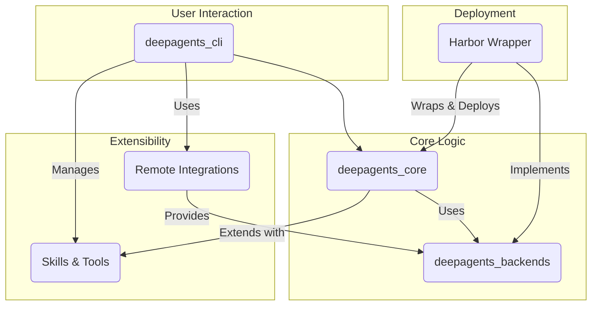

> **Disclaimer**: This is a high-level summary generated from detailed sub-agent analyses. For in-depth information on specific modules, refer to the source documents.

# DeepAgents Framework: Executive Summary

This document provides a consolidated overview of the DeepAgents framework, a comprehensive ecosystem for building, managing, and deploying sophisticated AI agents. The framework is designed with modularity, extensibility, and security in mind, enabling developers to create agents that can perform complex tasks, interact with filesystems, and delegate work to sub-agents.

## 1. High-Level Architecture

The DeepAgents framework is composed of several key libraries that work together to provide a robust platform for agent development and execution.



- **`deepagents_core`**: The heart of the framework. It provides the `create_deep_agent` function and a powerful middleware architecture (for filesystem access, sub-agent delegation, and message history patching) to construct complex agent behaviors.
- **`deepagents_backends`**: A pluggable backend system that abstracts filesystem operations and command execution. It includes implementations for in-memory state, the local filesystem, and sandboxed environments, all unified under a `CompositeBackend` router.
- **`deepagents_cli`**: The primary user-facing application. It provides a rich command-line interface for interacting with agents, managing their lifecycle (creating, listing, resetting), and handling human-in-the-loop (HITL) approvals for sensitive operations.
- **Skills & Tools (`deepagents_cli`)**: An extension system allowing agents to be augmented with "skills" (structured instructions) and custom tools (e.g., `web_search`, `http_request`). This allows capabilities to be added without modifying the core agent logic.
- **Remote Integrations (`deepagents_cli_integrations`)**: A factory module for connecting to and managing remote sandboxed execution environments like **Modal**, **Daytona**, and **Runloop**. This enables secure, isolated execution of agent-generated code.
- **Harbor Integration (`deepagents_harbor`)**: A specialized wrapper for deploying and running DeepAgents within the Harbor evaluation environment, including a custom `HarborSandbox` backend and trajectory logging for analysis.

## 2. Key Concepts & Capabilities

### Agent Creation & Middleware
The framework's core is the `create_deep_agent` function, which assembles an agent from a stack of middleware. This approach allows for a clean separation of concerns:
- **`FilesystemMiddleware`**: Grants the agent tools like `ls`, `read`, `write`, and `execute` by connecting to a configured backend.
- **`SubAgentMiddleware`**: Allows a primary agent to delegate complex, multi-step tasks to specialized, ephemeral sub-agents.
- **`SkillsMiddleware`**: Dynamically injects documentation about available "skills" into the agent's system prompt, enabling progressive discovery of capabilities.
- **`AgentMemoryMiddleware`**: Provides the agent with long-term memory by loading user-specific and project-specific context from `agent.md` files.

### Secure & Pluggable Backends
The `deepagents_backends` library is crucial for security and flexibility. The `CompositeBackend` can route file operations to different storage systems based on path prefixes (e.g., `/workspace/*` to the local filesystem, `/memories/*` to in-memory state). The `SandboxBackendProtocol` ensures that all remote execution environments provide a consistent interface for `execute`, `upload`, and `download` operations, abstracting away platform-specific SDKs.

### Interactive CLI & Human-in-the-Loop (HITL)
The `deepagents-cli` is more than a simple command runner. It provides a rich interactive experience:
- **Slash Commands**: For managing state (`/clear`), getting help (`/help`), and tracking costs (`/tokens`).
- **Tool Approval**: A sophisticated, interactive prompt for approving or rejecting potentially dangerous tool calls (like `shell` or `write_file`), complete with color-coded diffs for file modifications.
- **Skills Management**: CLI commands (`skills list`, `skills create`) for developers to manage the agent's capabilities.

## 3. How to Use the Framework

1.  **Define Agent Capabilities**: Create "skills" as `.md` files with YAML frontmatter in the `~/.deepagents/skills` (user) or `./.deepagents/skills` (project) directory. Add custom Python tools if needed.

2.  **Configure the Agent**: The agent's personality and core instructions are defined in an `agent.md` file.

3.  **Launch the CLI**: Run `deepagents-cli` to start an interactive session. Optionally, connect to a remote sandbox for secure code execution.
    ```bash
    # Run locally
    deepagents-cli

    # Run with a remote Modal sandbox
    deepagents-cli --sandbox modal --setup-script ./setup.sh
    ```

4.  **Interact with the Agent**: Give the agent a task. The agent will reason, use its tools, and ask for approval for sensitive actions.

    ```
    > Refactor the `utils.py` file to improve readability and add a new function `calculate_average(numbers)`.

    ⚠️ Tool Action Requires Approval
    > edit_file(utils.py)
    --- a/utils.py
    +++ b/utils.py
    @@ -1,3 +1,7 @@
     import random
     
     def generate_id():
    -  return random.randint(0, 1000)
    +    return f"id_{random.randint(0, 1000)}"
    +
    +def calculate_average(numbers):
    +    return sum(numbers) / len(numbers)

    [Approve] | Reject | Auto-Accept
    ```