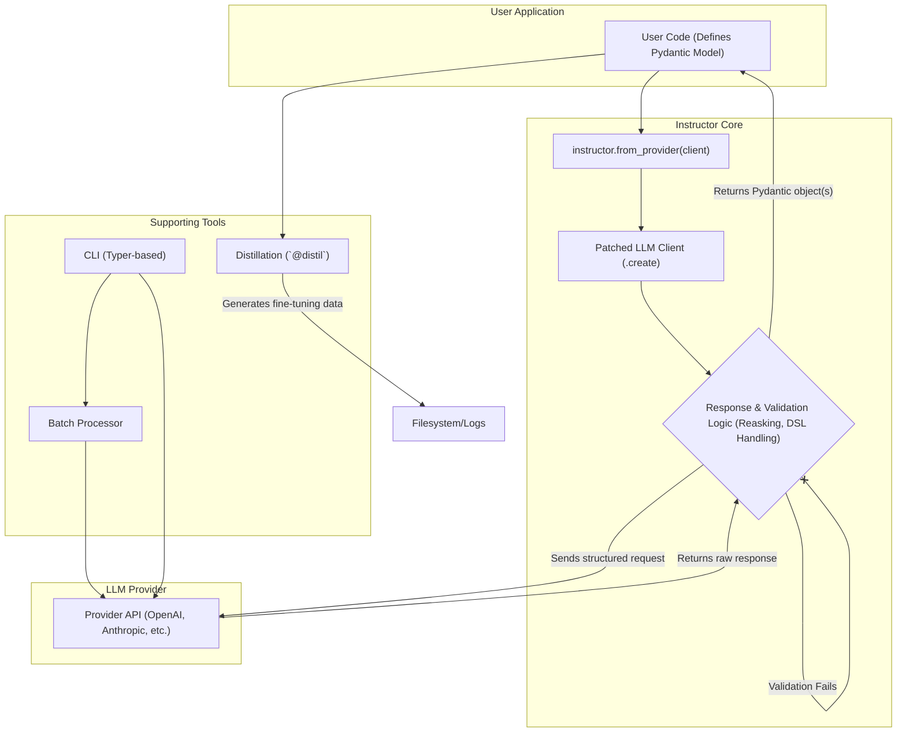

# Executive Summary: `instructor` Library

## 1. High-Level Purpose
The `instructor` library is a powerful toolkit designed to enhance Large Language Model (LLM) client libraries like those from OpenAI, Anthropic, and Google. Its primary purpose is to reliably extract structured, validated data (using Pydantic models) from LLM responses. It simplifies common patterns such as response validation, error correction (reasking), batch processing, and the generation of fine-tuning datasets, providing a unified and developer-friendly interface over various provider APIs.

## 2. When to Use
- **Structured Output:** When you need to get a specific JSON structure from an LLM and want it automatically parsed and validated into Pydantic objects.
- **Response Guarantee:** When the reliability of the LLM's output is critical, and you need a system that can automatically re-ask the model to correct its response upon validation failure.
- **Complex Data Extraction:** For extracting complex data structures, such as lists of objects (`Iterable`), optional results (`Maybe`), or multiple different objects in parallel (`Parallel`).
- **Cross-Provider Batch Processing:** When you need to process large batches of requests efficiently across different LLM providers (OpenAI, Anthropic) using a single interface.
- **Fine-Tuning Data Generation:** To automatically capture function calls and their outputs, creating a structured dataset suitable for fine-tuning models.

## 3. System Architecture & Key Components

The `instructor` library works by "patching" the native client of an LLM provider. This intercepts the request/response flow, injecting its own logic for structured data handling. The architecture is modular, with distinct components for different functionalities.



### Key Components:
- **Provider Integrations:** The entry point to the library, accessed via functions like `from_openai`, `from_anthropic`, etc. These patch the provider's client to enable `instructor`'s features.
- **DSL (Domain Specific Language):** A suite of Pydantic-based tools for handling complex extraction patterns:
    - `Iterable[...]`: For extracting a stream of multiple objects.
    - `Maybe[Model]`: For handling cases where the requested object may not be in the response.
    - `Parallel[ModelA, ModelB]`: For extracting multiple, different models from a single response using tool calls.
- **Batch Processor:** A unified interface (`BatchProcessor`) for creating, submitting, and monitoring batch jobs across different providers, normalizing their disparate APIs.
- **Distillation & Templating:** The `@distil` decorator captures function inputs/outputs to create fine-tuning datasets. Jinja2 templating allows for dynamic prompt engineering.
- **CLI:** A command-line interface built with Typer for managing batch jobs and OpenAI fine-tuning jobs directly from the terminal.

## 4. Quick Example: How to Use `instructor`

The following example demonstrates the core workflow: defining a Pydantic model, patching an OpenAI client, and receiving a structured, validated object from the LLM.

```python
import instructor
from openai import OpenAI
from pydantic import BaseModel

# 1. Define your desired data structure
class UserDetail(BaseModel):
    name: str
    age: int

# 2. Patch the OpenAI client
client = instructor.from_openai(OpenAI())

# 3. Call the client with the `response_model` parameter
response = client.chat.completions.create(
    model="gpt-4",
    messages=[{"role": "user", "content": "Extract Jason is 25 years old."}],
    response_model=UserDetail
)

# The `response` is now a validated Pydantic object
assert isinstance(response, UserDetail)
assert response.name == "Jason"
assert response.age == 25

print(response.model_dump_json(indent=2))
# Output:
# {
#   "name": "Jason",
#   "age": 25
# }
```