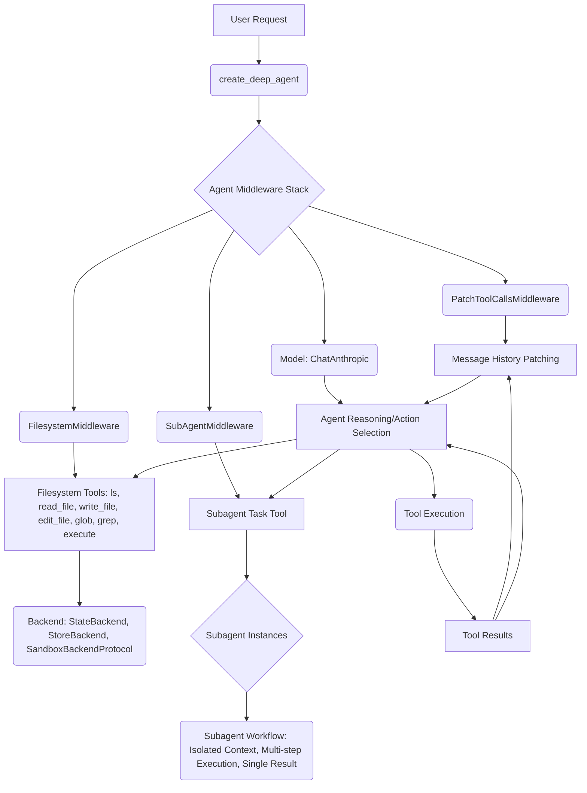

# deepagents_core Analysis

## 1. Overview
This document provides a technical analysis of the `deepagents_core` module, specifically focusing on its `graph.py` and `middleware` components. The core idea is to enable complex agentic behavior through structured sub-agents, a robust filesystem interaction layer, and intelligent patching of tool calls within the agent's message history. This architecture promotes modularity, allowing agents to delegate tasks, manage their workspace, and maintain coherent conversational context.

## 2. File-by-File Analysis

### `libs/deepagents/deepagents/graph.py`
- **Purpose**: This file defines the `create_deep_agent` function, which is the primary entry point for configuring and instantiating a deep agent. It orchestrates the integration of various middleware components and sets up the agent's core functionalities, including planning, filesystem access, and subagent management.
- **Key Components**:
  - `get_default_model()`: Returns a `ChatAnthropic` instance configured with a specific Claude Sonnet model, serving as the default language model for deep agents.
  - `create_deep_agent()`: A comprehensive function that assembles a deep agent. It accepts parameters for the language model, tools, system prompt, middleware, subagents, response format, context schema, checkpointer, store, backend, interrupt conditions, debug mode, name, and cache. This function is responsible for setting up a stack of `AgentMiddleware` instances, including `TodoListMiddleware`, `FilesystemMiddleware`, `SubAgentMiddleware`, `SummarizationMiddleware`, `AnthropicPromptCachingMiddleware`, and `PatchToolCallsMiddleware`. It also handles dynamic system prompt construction and configuration of the agent's recursion limit.

### `libs/deepagents/deepagents/middleware/filesystem.py`
- **Purpose**: This middleware provides deep agents with a robust set of tools to interact with a filesystem. It abstracts various backend storage mechanisms and offers functionalities like listing files (`ls`), reading files (`read_file`), writing files (`write_file`), editing files (`edit_file`), finding files by pattern (`glob`), searching content within files (`grep`), and executing shell commands (`execute`). It also includes mechanisms for path validation, handling large tool outputs, and managing file state.
- **Key Components**:
  - `FileData`: A `TypedDict` to represent file content and metadata (creation/modification timestamps).
  - `_file_data_reducer()`: A reducer function for LangGraph's state management, enabling merging of file updates and handling file deletions.
  - `_validate_path()`: A crucial utility for sanitizing and validating file paths to prevent security vulnerabilities like directory traversal.
  - `FilesystemState`: Extends `AgentState` to include `files`, annotated with the `_file_data_reducer` for state management.
  - `_ls_tool_generator()`, `_read_file_tool_generator()`, `_write_file_tool_generator()`, `_edit_file_tool_generator()`, `_glob_tool_generator()`, `_grep_tool_generator()`, `_execute_tool_generator()`: These functions are responsible for generating `StructuredTool` instances for each filesystem operation. They wrap synchronous and asynchronous backend calls and provide detailed descriptions for agent consumption.
  - `_supports_execution()`: A helper to determine if the configured backend supports command execution, dynamically enabling or disabling the `execute` tool.
  - `FilesystemMiddleware`: The core middleware class. It initializes the filesystem tools, dynamically adjusts the agent's system prompt based on tool availability (especially the `execute` tool), and includes logic to process potentially large tool outputs by writing them to the filesystem and providing a truncated preview.

### `libs/deepagents/deepagents/middleware/patch_tool_calls.py`
- **Purpose**: This middleware addresses a specific issue in agentic workflows where tool calls initiated by an AI message might not have corresponding `ToolMessage` responses, leading to "dangling" tool calls. It patches the message history by injecting synthetic `ToolMessage` instances for any uncompleted tool calls, ensuring a consistent and complete conversation history for the agent.
- **Key Components**:
  - `PatchToolCallsMiddleware`: The middleware class. Its `before_agent` method inspects the agent's message history, identifies AI messages with `tool_calls`, and checks if a corresponding `ToolMessage` exists further in the history. If a `ToolMessage` is missing, it injects a `ToolMessage` indicating that the tool call was cancelled, effectively patching the conversational state.

### `libs/deepagents/deepagents/middleware/subagents.py`
- **Purpose**: This middleware introduces the concept of "subagents," allowing a main agent to delegate complex, multi-step tasks to specialized, ephemeral agents. These subagents operate with isolated contexts, return a single structured result, and are particularly useful for tasks requiring focused reasoning or heavy token/context usage. It includes a general-purpose subagent and supports the creation of custom subagents.
- **Key Components**:
  - `SubAgent`: A `TypedDict` defining the specification for a subagent, including its name, description, system prompt, tools, model, middleware, and interrupt configurations.
  - `CompiledSubAgent`: A `TypedDict` for pre-compiled subagents, containing a runnable instance.
  - `_get_subagents()`: A helper function that processes a list of `SubAgent` or `CompiledSubAgent` specifications, creating runnable agent instances for each and generating descriptive summaries.
  - `_create_task_tool()`: This function generates the `task` tool, which is the primary interface for the main agent to interact with subagents. The `task` tool's description is dynamically generated, providing clear guidelines and examples for its usage. It handles the invocation of subagents, state preparation, and capturing their results.
  - `SubAgentMiddleware`: The core middleware class. It initializes the `task` tool, which encapsulates the logic for spawning and managing subagents. It also updates the main agent's system prompt with detailed instructions and best practices for utilizing the `task` tool and subagents.

## 3. Architecture & Data Flow



**Data Flow Description:**
1.  **User Request & Agent Creation**: A user request initiates the process, leading to the creation of a deep agent via `create_deep_agent`. This function sets up a layered stack of middleware.
2.  **Middleware Processing**: The core of the agent's functionality is managed by the middleware stack. Each piece of middleware intercepts and modifies the agent's requests and responses.
    *   **`FilesystemMiddleware`**: Provides the agent with capabilities to interact with a filesystem. Tool calls (e.g., `read_file`, `execute`) are routed through this middleware to a configured `Backend` (which could be an in-memory `StateBackend`, a persistent `StoreBackend`, or a `SandboxBackendProtocol` for execution).
    *   **`SubAgentMiddleware`**: Introduces the `task` tool. When the agent decides to delegate a complex task, it calls this `task` tool. The `task` tool then spawns a specialized subagent (`Subagent Instances`) which operates in an isolated context to complete the delegated task. The subagent's final result is returned to the main agent.
    *   **`PatchToolCallsMiddleware`**: Ensures the consistency of the agent's message history by detecting and resolving "dangling" tool calls (AI messages without corresponding tool responses) by injecting explanatory `ToolMessage` instances.
3.  **Model Interaction**: The agent's `ChatAnthropic` model (`H`) processes requests, utilizes the provided tools (`D1`, `E1`), and selects actions based on its reasoning. The `AnthropicPromptCachingMiddleware` and `SummarizationMiddleware` (not explicitly in diagram but part of C) optimize prompt usage.
4.  **Tool Execution**: Selected tools are executed (`J`), and their results (`K`) are fed back into the agent's message history. `FilesystemMiddleware` also handles large tool results by writing them to files and providing a reference.
5.  **Message History & Iteration**: `PatchToolCallsMiddleware` ensures the message history (`F1`) is always coherent, which informs subsequent agent reasoning (`I`). The agent continues this cycle until the task is complete.

## 4. Code Deep Dive

### `libs/deepagents/deepagents/middleware/filesystem.py` - `_validate_path`
This function is critical for security and path consistency within the filesystem tools.

```python
def _validate_path(path: str, *, allowed_prefixes: Sequence[str] | None = None) -> str:
    r"""Validate and normalize file path for security.

    Ensures paths are safe to use by preventing directory traversal attacks
    and enforcing consistent formatting. All paths are normalized to use
    forward slashes and start with a leading slash.

    This function is designed for virtual filesystem paths and rejects
    Windows absolute paths (e.g., C:/..., F:/...) to maintain consistency
    and prevent path format ambiguity.

    Args:
        path: The path to validate and normalize.
        allowed_prefixes: Optional list of allowed path prefixes. If provided,
            the normalized path must start with one of these prefixes.

    Returns:
        Normalized canonical path starting with `/` and using forward slashes.

    Raises:
        ValueError: If path contains traversal sequences (`..` or `~`), is a
            Windows absolute path (e.g., C:/...), or does not start with an
            allowed prefix when `allowed_prefixes` is specified.

    Example:
        ```python
        validate_path("foo/bar")  # Returns: "/foo/bar"
        validate_path("/./foo//bar")  # Returns: "/foo/bar"
        validate_path("../etc/passwd")  # Raises ValueError
        validate_path(r"C:\Users\file.txt")  # Raises ValueError
        validate_path("/data/file.txt", allowed_prefixes=["/data/"])  # OK
        validate_path("/etc/file.txt", allowed_prefixes=["/data/"])  # Raises ValueError
        ```
    """
    if ".." in path or path.startswith("~"):
        msg = f"Path traversal not allowed: {path}"
        raise ValueError(msg)

    # Reject Windows absolute paths (e.g., C:/..., F:/...)
    # This maintains consistency in virtual filesystem paths
    if re.match(r"^[a-zA-Z]:", path):
        msg = f"Windows absolute paths are not supported: {path}. Please use virtual paths starting with / (e.g., /workspace/file.txt)"
        raise ValueError(msg)

    normalized = os.path.normpath(path)
    normalized = normalized.replace("\\", "/")

    if not normalized.startswith("/"):
        normalized = f"/{normalized}"

    if allowed_prefixes is not None and not any(normalized.startswith(prefix) for prefix in allowed_prefixes):
        msg = f"Path must start with one of {allowed_prefixes}: {path}"
        raise ValueError(msg)

    return normalized


### `libs/deepagents/deepagents/middleware/subagents.py` - `_create_task_tool` (excerpt)
This excerpt shows how the `task` tool is dynamically created and its description formatted to guide the agent in using subagents effectively.

```python
def _create_task_tool(
    *,
    default_model: str | BaseChatModel,
    default_tools: Sequence[BaseTool | Callable | dict[str, Any]],
    default_middleware: list[AgentMiddleware] | None,
    default_interrupt_on: dict[str, bool | InterruptOnConfig] | None,
    subagents: list[SubAgent | CompiledSubAgent],
    general_purpose_agent: bool,
    task_description: str | None = None,
) -> BaseTool:
    """Create a task tool for invoking subagents.

    Args:
        default_model: Default model for subagents.
        default_tools: Default tools for subagents.
        default_middleware: Middleware to apply to all subagents.
        default_interrupt_on: The tool configs to use for the default general-purpose subagent. These
            are also the fallback for any subagents that don't specify their own tool configs.
        subagents: List of subagent specifications.
        general_purpose_agent: Whether to include general-purpose agent.
        task_description: Custom description for the task tool. If `None`,
            uses default template. Supports `{available_agents}` placeholder.

    Returns:
        A StructuredTool that can invoke subagents by type.
    """
    subagent_graphs, subagent_descriptions = _get_subagents(
        default_model=default_model,
        default_tools=default_tools,
        default_middleware=default_middleware,
        default_interrupt_on=default_interrupt_on,
        subagents=subagents,
        general_purpose_agent=general_purpose_agent,
    )
    subagent_description_str = "\n".join(subagent_descriptions)

    # ... (rest of the function)

    # Use custom description if provided, otherwise use default template
    if task_description is None:
        task_description = TASK_TOOL_DESCRIPTION.format(available_agents=subagent_description_str)
    elif "{available_agents}" in task_description:
        # If custom description has placeholder, format with agent descriptions
        task_description = task_description.format(available_agents=subagent_description_str)

    # ... (rest of the function that returns StructuredTool)
```

## 5. Integration Points
- **Dependencies**:
    - `langchain.agents.*`: Core agent framework components.
    - `langchain_anthropic.*`: Integration with Anthropic models.
    - `langgraph.*`: State management, graph definition, and execution.
    - `deepagents.backends.*`: Pluggable backend implementations for filesystem and execution.
- **Dependents**:
    - Any application or higher-level agent that needs to create intelligent, task-delegating, and context-aware agents would depend on `deepagents_core`.
    - Specific agent implementations that require filesystem access, subagent capabilities, or robust message history management would utilize these modules.

## 6. Future Considerations

### `FilesystemMiddleware` Enhancements
- **Backend Agnostic Execution**: Further abstract the `execute` tool to support various execution environments beyond local sandboxing (e.g., remote execution, containerized environments).
- **Advanced File Operations**: Introduce tools for archiving (zip/unzip), file permissions management, and symbolic link handling.
- **Version Control Integration**: Allow agents to interact with version control systems (e.g., Git) for collaborative code development and history tracking.

### `SubAgentMiddleware` Improvements
- **Dynamic Subagent Creation**: Enable the main agent to define and create new subagents on-the-fly based on emerging task requirements, rather than relying solely on pre-defined subagents.
- **Inter-Subagent Communication**: Develop mechanisms for subagents to communicate and collaborate with each other, forming more complex hierarchical or networked agent systems.
- **Resource Management**: Implement resource monitoring and management for subagents (e.g., token usage limits, execution time limits) to prevent runaway processes and optimize costs.

### General Deep Agent Enhancements
- **Observability and Debugging**: Enhance logging, tracing, and visualization tools to provide better insights into agent reasoning, decision-making, and tool usage across the middleware stack.
- **Security Hardening**: Conduct comprehensive security audits, especially for filesystem and execution tools, to identify and mitigate potential vulnerabilities.
- **Performance Optimization**: Profile and optimize the performance of critical middleware components and tool interactions, particularly for scenarios involving large contexts or high concurrency.