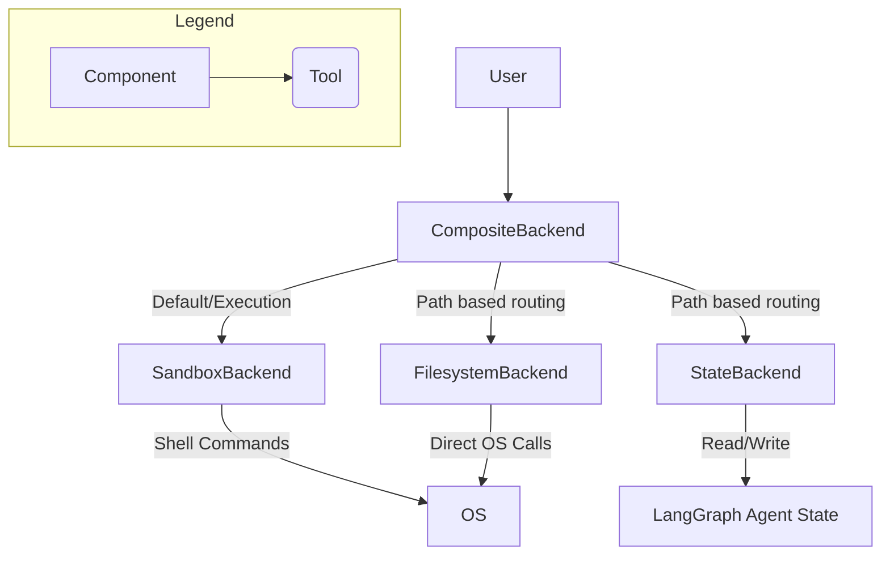

# deepagents_backends Analysis

## 1. Overview
This set of modules defines the core backend protocols and implementations for file-system-like operations within the `deepagents` framework. It provides a flexible way to interact with different storage mechanisms (e.g., in-memory state, local filesystem) and allows for the composition of these backends. The `BackendProtocol` serves as the abstract interface, ensuring uniformity across various backend implementations. Key features include file listing, reading, writing, editing, and searching, with support for both synchronous and asynchronous operations.

## 2. File-by-File Analysis

### `libs/deepagents/deepagents/backends/protocol.py`
- **Purpose**: Defines the abstract base classes and data structures that all backend implementations must adhere to. This ensures a consistent interface for file operations across different storage solutions.
- **Key Components**:
  - `FileOperationError`: A Literal type defining standardized error codes for file operations.
  - `FileDownloadResponse`: Dataclass for the result of a single file download operation, including path, content, and an optional error.
  - `FileUploadResponse`: Dataclass for the result of a single file upload operation, including path and an optional error.
  - `FileInfo`: TypedDict for structured file listing information, including path, `is_dir`, `size`, and `modified_at`.
  - `GrepMatch`: TypedDict for structured grep match entries, including path, line number, and text.
  - `WriteResult`: Dataclass for the result of a write operation, including error, path, and `files_update` (for state-backed updates).
  - `EditResult`: Dataclass for the result of an edit operation, including error, path, `files_update`, and the number of occurrences replaced.
  - `BackendProtocol` (ABC): The abstract base class defining the standard interface for file operations such as `ls_info`, `read`, `write`, `edit`, `grep_raw`, `glob_info`, `upload_files`, and `download_files`, along with their asynchronous counterparts.
  - `SandboxBackendProtocol` (ABC): Extends `BackendProtocol` to include `execute` for command execution in sandboxed environments.
  - `ExecuteResponse`: Dataclass for the result of a command execution, including output, exit code, and truncation flag.

### `libs/deepagents/deepagents/backends/filesystem.py`
- **Purpose**: Provides a concrete implementation of `BackendProtocol` that interacts directly with the local filesystem. It includes security measures for path resolution and supports efficient searching using `ripgrep` or a Python fallback.
- **Key Components**:
  - `FilesystemBackend`: Implements `BackendProtocol`.
    - `__init__()`: Initializes the backend with an optional root directory and `virtual_mode` setting. `virtual_mode` enables sandboxed operations within a specified root.
    - `_resolve_path()`: Resolves file paths, enforcing security checks, especially in `virtual_mode` to prevent directory traversal.
    - `ls_info()`: Lists files and directories, respecting `virtual_mode` for path presentation.
    - `read()`: Reads file content with line numbers, using `O_NOFOLLOW` for security.
    - `write()`: Writes content to a new file, ensuring it does not overwrite existing files and using `O_NOFOLLOW`.
    - `edit()`: Edits an existing file by performing string replacements, with `O_NOFOLLOW`.
    - `grep_raw()`: Searches for patterns in files, prioritizing `ripgrep` for performance and falling back to a Python implementation. Includes glob filtering.
    - `_ripgrep_search()`: Internal method to perform `ripgrep` based searches.
    - `_python_search()`: Internal method for Python-based regex search when `ripgrep` is unavailable or fails.
    - `glob_info()`: Finds files matching a glob pattern.
    - `upload_files()`: Uploads multiple files to the filesystem.
    - `download_files()`: Downloads multiple files from the filesystem.

### `libs/deepagents/deepagents/backends/state.py`
- **Purpose**: Implements `BackendProtocol` for storing files directly within the LangGraph agent's state. This provides an ephemeral, in-memory storage solution that benefits from LangGraph's checkpointing.
- **Key Components**:
  - `StateBackend`: Implements `BackendProtocol`.
    - `__init__()`: Initializes with a `ToolRuntime` instance to access the agent's state.
    - `ls_info()`: Lists files and directories from the in-memory state.
    - `read()`: Reads file content from the in-memory state.
    - `write()`: Writes content to a new file in the in-memory state, returning a `WriteResult` with `files_update`.
    - `edit()`: Edits a file in the in-memory state, returning an `EditResult` with `files_update` and `occurrences`.
    - `grep_raw()`: Searches for patterns within the in-memory files.
    - `glob_info()`: Finds files matching glob patterns within the in-memory files.

### `libs/deepagents/deepagents/backends/sandbox.py`
- **Purpose**: Provides a base implementation for sandboxed backends where file operations are performed by executing shell commands. Subclasses only need to implement the `execute()` method.
- **Key Components**:
  - `_GLOB_COMMAND_TEMPLATE`, `_WRITE_COMMAND_TEMPLATE`, `_EDIT_COMMAND_TEMPLATE`, `_READ_COMMAND_TEMPLATE`: Python script templates used to perform file operations via shell commands, ensuring proper escaping and error handling.
  - `BaseSandbox` (ABC): Implements `SandboxBackendProtocol`.
    - `execute()` (abstract method): The core method that subclasses must implement to execute shell commands within the sandbox.
    - `ls_info()`: Implemented using a Python script executed via `execute()` to list directory contents.
    - `read()`: Implemented using `_READ_COMMAND_TEMPLATE` via `execute()`.
    - `write()`: Implemented using `_WRITE_COMMAND_TEMPLATE` via `execute()`.
    - `edit()`: Implemented using `_EDIT_COMMAND_TEMPLATE` via `execute()`.
    - `grep_raw()`: Uses the system `grep` command via `execute()` to search for patterns.
    - `glob_info()`: Implemented using `_GLOB_COMMAND_TEMPLATE` via `execute()`.
    - `id` (abstract property): Unique identifier for the sandbox backend.
    - `upload_files()` (abstract method): Batch file upload (subclasses must implement).
    - `download_files()` (abstract method): Batch file download (subclasses must implement).

### `libs/deepagents/deepagents/backends/composite.py`
- **Purpose**: Enables routing file operations to different backend implementations based on path prefixes. This allows for combining multiple storage backends into a single virtual filesystem.
- **Key Components**:
  - `CompositeBackend`:
    - `__init__()`: Initializes with a `default` backend and a dictionary of `routes`, where each route maps a path prefix to a specific `BackendProtocol` instance. Routes are sorted by length for correct prefix matching.
    - `_get_backend_and_key()`: Determines the appropriate backend for a given file path based on configured routes and strips the prefix from the path.
    - `ls_info()`: Routes `ls_info` requests to the correct backend or aggregates results from all backends if the root path is requested.
    - `read()`, `write()`, `edit()`: Routes these operations to the appropriate backend.
    - `grep_raw()`: Routes or aggregates grep results from multiple backends.
    - `glob_info()`: Routes or aggregates glob search results.
    - `execute()`: Delegates command execution exclusively to the `default` backend, which must implement `SandboxBackendProtocol`.
    - `upload_files()`: Batches file uploads by target backend for efficiency.
    - `download_files()`: Batches file downloads by source backend for efficiency.
    - Asynchronous counterparts (`als_info`, `aread`, `awrite`, `aedit`, `agrep_raw`, `aglob_info`, `aexecute`, `aupload_files`, `adownload_files`) are provided for all methods.

## 3. Architecture & Data Flow



The `CompositeBackend` acts as a central router, directing file operations to specific backend implementations based on the path provided. For example, a request to `/workspace/file.txt` might go to a `FilesystemBackend`, while `/memories/note.md` could be handled by a `StateBackend`. Operations like `execute` are always delegated to the `default` backend, which typically would be a `SandboxBackend` capable of running shell commands.

`FilesystemBackend` interacts directly with the operating system's file system, providing persistent storage. `StateBackend` uses the ephemeral `LangGraph Agent State` for in-memory file storage, useful for conversational contexts where state needs to be managed and checkpointed.

`BaseSandbox` provides a layer of abstraction for sandboxed execution, translating file operations into shell commands that are then executed by an underlying environment. Concrete `SandboxBackend` implementations (not detailed here but inheriting from `BaseSandbox`) would provide the actual `execute` method.

## 4. Code Deep Dive

### `CompositeBackend` - Path Resolution and Routing

The `_get_backend_and_key` method in `CompositeBackend` is crucial for its routing logic. It iterates through configured routes, sorted by length (longest first), to find the most specific match for a given path. This prevents shorter, more general prefixes from prematurely claiming paths that should be handled by a more specific route.

```python
class CompositeBackend:
    # ... (init and other methods)

    def _get_backend_and_key(self, key: str) -> tuple[BackendProtocol, str]:
        # Check routes in order of length (longest first) for correct prefix matching
        for prefix, backend in self.sorted_routes:
            if key.startswith(prefix):
                # Strip full prefix and ensure a leading slash remains
                suffix = key[len(prefix) :]
                stripped_key = f"/{suffix}" if suffix else "/"
                return backend, stripped_key

        return self.default, key
```

### `FilesystemBackend` - Secure Path Resolution

The `_resolve_path` method in `FilesystemBackend` is critical for security, especially when `virtual_mode` is enabled. It ensures that all file operations are confined within the designated `cwd` and prevents directory traversal attacks (`..` or `~`).

```python
class FilesystemBackend(BackendProtocol):
    # ... (init and other methods)

    def _resolve_path(self, key: str) -> Path:
        if self.virtual_mode:
            vpath = key if key.startswith("/") else "/" + key
            if ".." in vpath or vpath.startswith("~"):
                raise ValueError("Path traversal not allowed")
            full = (self.cwd / vpath.lstrip("/")).resolve()
            try:
                full.relative_to(self.cwd)
            except ValueError:
                raise ValueError(f"Path:{full} outside root directory: {self.cwd}") from None
            return full

        path = Path(key)
        if path.is_absolute():
            return path
        return (self.cwd / path).resolve()
```

### `BaseSandbox` - Executing Python Scripts for File Operations

The `BaseSandbox` utilizes embedded Python scripts executed via the `execute` method to perform file operations. This approach standardizes how file operations are handled within a sandboxed environment, abstracting away the underlying shell commands and ensuring proper handling of data (e.g., base64 encoding for content).

```python
_WRITE_COMMAND_TEMPLATE = """python3 -c "\nimport os\nimport sys\nimport base64\n\nfile_path = '{file_path}'\n\n# Check if file already exists (atomic with write)\nif os.path.exists(file_path):\n    print(f'Error: File \\\'{file_path}\\\' already exists', file=sys.stderr)\n    sys.exit(1)\n\n# Create parent directory if needed\nparent_dir = os.path.dirname(file_path) or '.'\nos.makedirs(parent_dir, exist_ok=True)\n\n# Decode and write content\ncontent = base64.b64decode('{content_b64}').decode('utf-8')\nwith open(file_path, 'w') as f:\n    f.write(content)\n" 2>&1"""

class BaseSandbox(SandboxBackendProtocol, ABC):
    # ... (abstract execute method and other methods)

    def write(
        self,
        file_path: str,
        content: str,
    ) -> WriteResult:
        content_b64 = base64.b64encode(content.encode("utf-8")).decode("ascii")
        cmd = _WRITE_COMMAND_TEMPLATE.format(file_path=file_path, content_b64=content_b64)
        result = self.execute(cmd)
        # ... (error handling)
        return WriteResult(path=file_path, files_update=None)
```

## 5. Integration Points

- **Dependencies**: These modules primarily depend on Python's standard library (e.g., `os`, `pathlib`, `re`, `subprocess`, `json`, `base64`, `shlex`, `asyncio`), `wcmatch.glob` for advanced globbing in `FilesystemBackend`, `langchain.tools.ToolRuntime` for `StateBackend`, and `typing_extensions` for `TypedDict` and `NotRequired`.
- **Dependents**: The `deepagents_backends` package is a fundamental component for any `deepagents` application that requires file system interactions. It would be used by higher-level agent frameworks or tools that need to read, write, or manipulate files, providing a unified abstraction over various storage mechanisms. The `CompositeBackend` is particularly designed to be an entry point for agents that need to interact with multiple storage locations seamlessly.