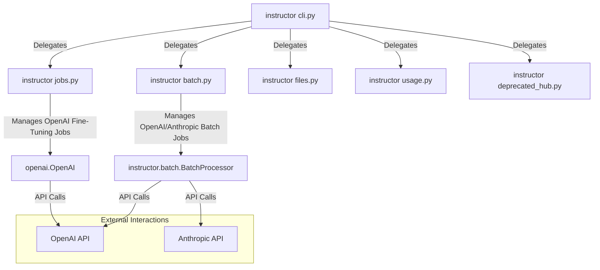

# CLI Analysis

## 1. Overview
This document provides a technical analysis of the Command Line Interface (CLI) for the `instructor` library, focusing on its structure, batch processing capabilities, and job management for fine-tuning. The CLI is built using `typer`, offering a user-friendly way to interact with OpenAI and Anthropic APIs for managing various tasks such as fine-tuning jobs, batch processing, and file management.

## 2. File-by-File Analysis

### `instructor/cli/cli.py`
- **Purpose**: This file serves as the main entry point for the `instructor` CLI application. It orchestrates the different subcommands available to the user.
- **Key Components**:
  - `app: Typer`: The main Typer application instance that all subcommands are attached to.
  - `app.add_typer(...)`: This is used to register other CLI modules (jobs, files, usage, hub, batch) as subcommands of the main `instructor` CLI.
  - `docs()`: A command that opens the `instructor` documentation website in a browser, optionally searching for a query.

### `instructor/cli/batch.py`
- **Purpose**: This module handles batch job management for both OpenAI and Anthropic providers. It allows users to list, create, cancel, delete, and download results of batch jobs.
- **Key Components**:
  - `app: Typer`: A Typer application instance for batch-related commands.
  - `generate_table(batch_jobs: list[BatchJobInfo], provider: str)`: Generates a rich `Table` for displaying batch job information, with provider-specific columns and status coloring.
  - `get_jobs(limit: int, provider: str)`: Retrieves a list of `BatchJobInfo` objects for a given provider using `BatchProcessor`.
  - `watch()`: Monitors the status of recent batch jobs, with options for limiting results, polling intervals, and live updates.
  - `create_from_file()`: Creates a batch job by submitting a file containing requests. It handles model selection and an optional completion window.
  - `cancel()`: Cancels a specified batch job.
  - `delete()`: Deletes a specified batch job.
  - `download_file()`: Downloads the output file associated with a completed batch job.
  - `results()`: Retrieves and saves the results of a completed batch job to a specified output file.
  - `create()`: Creates a batch job from a JSONL file of messages and a response model, generating an intermediate batch request file.

### `instructor/cli/jobs.py`
- **Purpose**: This module focuses on managing fine-tuning jobs specifically for OpenAI. It provides functionalities to list, create, and cancel fine-tuning jobs.
- **Key Components**:
  - `app: Typer`: A Typer application instance for fine-tuning job commands.
  - `generate_table(jobs: list[FineTuningJob])`: Creates a rich `Table` to display information about OpenAI fine-tuning jobs, including their status, creation time, and model details.
  - `status_color(status: str)`: Helper function to map job statuses to console colors.
  - `get_jobs(limit: int)`: Retrieves a list of OpenAI `FineTuningJob` objects.
  - `get_file_status(file_id: str)`: Checks the processing status of a file uploaded to OpenAI.
  - `watch()`: Monitors the status of the most recent fine-tuning jobs with live updates.
  - `create_from_id()`: Creates a fine-tuning job using an existing training file ID, with options for hyperparameters.
  - `create_from_file()`: Uploads a file for fine-tuning, monitors its processing, and then creates a fine-tuning job. It also supports validation files and custom hyperparameters.
  - `cancel()`: Cancels a specified fine-tuning job.

## 3. Architecture & Data Flow



## 4. Code Deep Dive

### `instructor/cli/batch.py` - `generate_table` function
This function is crucial for presenting batch job information clearly to the user, adapting its columns based on the provider (OpenAI or Anthropic) and color-coding status for quick visual cues.
```python
def generate_table(batch_jobs: list[BatchJobInfo], provider: str):
    table = Table(title=f"{provider.title()} Batch Jobs")

    table.add_column("Batch ID", style="dim", max_width=20, no_wrap=True)
    table.add_column("Status", min_width=10)
    table.add_column("Created", style="dim", min_width=10)
    table.add_column("Started", style="dim", min_width=10)
    table.add_column("Duration", style="dim", min_width=7)

    if provider == "openai":
        table.add_column("Completed", justify="right", min_width=8)
        table.add_column("Failed", justify="right", min_width=6)
        table.add_column("Total", justify="right", min_width=6)
    elif provider == "anthropic":
        table.add_column("Succeeded", justify="right", min_width=8)
        table.add_column("Errored", justify="right", min_width=7)
        table.add_column("Processing", justify="right", min_width=9)

    for batch_job in batch_jobs:
        status_color = {
            "pending": "yellow",
            "processing": "blue",
            "completed": "green",
            "failed": "red",
            "cancelled": "red",
            "expired": "red",
        }.get(batch_job.status.value, "white")

        colored_status = f"[{status_color}]{batch_job.status.value}[/{status_color}]"
        # ... (rest of the formatting logic)
        table.add_row(
            # ... (row data based on provider)
        )

    return table
```

### `instructor/cli/jobs.py` - `create_from_file` function
This function demonstrates the robust workflow for creating a fine-tuning job from a local file. It handles file upload, monitors its processing status, and then initiates the fine-tuning job with optional hyperparameters and validation files.
```python
def create_from_file(
    file: str = typer.Argument(help="Path to the file for fine-tuning"),
    model: str = typer.Option("gpt-3.5-turbo", help="Model to use for fine-tuning"),
    poll: int = typer.Option(2, help="Polling interval in seconds"),
    n_epochs: Optional[int] = typer.Option(
        None, help="Number of epochs for fine-tuning", show_default=False
    ),
    batch_size: Optional[int] = typer.Option(
        None, help="Batch size for fine-tuning", show_default=False
    ),
    learning_rate_multiplier: Optional[float] = typer.Option(
        None, help="Learning rate multiplier for fine-tuning", show_default=False
    ),
    validation_file: Optional[str] = typer.Option(
        None, help="Path to the validation file"
    ),
    model_suffix: Optional[str] = typer.Option(
        None, help="Suffix to identify the model"
    ),
) -> None:
    # ... (hyperparameters dictionary creation)

    with open(file, "rb") as file_buffer:
        response = client.files.create(file=file_buffer, purpose="fine-tune")

    file_id = response.id

    validation_file_id = None
    if validation_file:
        with open(validation_file, "rb") as val_file:
            val_response = client.files.create(file=val_file, purpose="fine-tune")
        validation_file_id = val_response.id

    with console.status(f"Monitoring upload: {file_id} before finetuning...") as status:
        # ... (file status polling logic)
        while True:
            file_status = get_file_status(file_id)
            validation_file_status = (
                get_file_status(validation_file_id) if validation_file_id else ""
            )

            if file_status == "processed" and (
                not validation_file_id or validation_file_status == "processed"
            ):
                console.log(f"[bold green]File {file_id} uploaded successfully!")
                if validation_file_id:
                    console.log(
                        f"[bold green]Validation file {validation_file_id} uploaded successfully!"
                    )
                break

            time.sleep(poll)

    additional_params: FuneTuningParams = {}
    if hyperparameters_dict:
        additional_params["hyperparameters"] = hyperparameters_dict
    if validation_file:
        additional_params["validation_file"] = validation_file
    if model_suffix:
        additional_params["suffix"] = model_suffix

    job = client.fine_tuning.jobs.create(
        training_file=file_id,
        model=model,
        **additional_params,
    )
    # ... (logging and watch call)
```

## 5. Integration Points
- **Dependencies**: The CLI modules extensively use `typer` for command-line interface creation, `rich` for rich terminal output (tables, live displays, status messages), `openai` for interacting with OpenAI APIs, and `anthropic` for Anthropic APIs. The `instructor.batch` module is a core dependency for batch processing functionalities.
- **Dependents**: The `instructor` CLI is an independent application designed for direct user interaction. Other parts of the `instructor` library or external applications might use the underlying `BatchProcessor` or interact with OpenAI/Anthropic APIs directly, but not necessarily through this CLI. Users would directly invoke the `instructor` command from their terminal. The main `instructor/cli/cli.py` file acts as the primary dependent, integrating all other `cli` submodules. This architecture allows for a modular and extensible CLI, where new functionalities can be added as new Typer sub-applications.