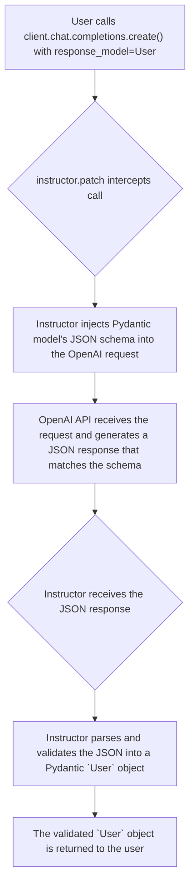

'''
# Getting Started with Instructor and OpenAI

## 1. Synopsis

Large Language Models (LLMs) excel at generating human-like text, but many real-world applications require structured, predictable data, not just free-form strings. For example, you might need to extract user details from a query, classify a support ticket, or pull structured information from a document. Relying on regex or manual parsing of LLM output is often brittle and error-prone.

This is where `instructor` comes in. It seamlessly bridges the gap between the unstructured text world of LLMs and the structured, validated world of Pydantic models. By patching your OpenAI client, `instructor` enables you to specify a Pydantic model as the desired output format, ensuring you get back clean, validated, and type-hinted data every time.

This tutorial will guide you through the process of setting up `instructor` and performing your first structured data extraction with an OpenAI client.

## 2. Prerequisites

To follow this tutorial, you'll need to have the following packages installed. `instructor` works by patching other libraries, so we need to install it alongside `openai` and `pydantic`.

```bash
pip install instructor openai pydantic
```

You will also need to have your OpenAI API key set up in your environment. You can do this by setting the `OPENAI_API_KEY` environment variable.

## 3. Architecture

The core of `instructor` is a "patching" mechanism that enhances the functionality of an existing LLM client. When you call `instructor.patch(client)`, it wraps the client's `chat.completions.create` method with new logic. The process looks like this:



## 4. Implementation Steps

### Step 1: Your First Structured Extraction

Let's dive in with a complete, runnable example. Our goal is to extract a user's name and age from a simple sentence.

First, we define a Pydantic `BaseModel` called `UserDetail`. This class serves as our schema, telling `instructor` exactly what kind of data we expect to receive. Then, we patch an `openai.OpenAI` client and call `chat.completions.create` with our new `response_model` parameter.

```python
import openai
from pydantic import BaseModel
import instructor

# 1. Define your desired data structure
class UserDetail(BaseModel):
    name: str
    age: int

# 2. Patch the OpenAI client
# By default, the patch will use the `openai.OpenAI()` client
# but you can also pass in your own client
client = instructor.patch(openai.OpenAI())

# 3. Call the API with the response_model parameter
def extract_user() -> UserDetail:
    return client.chat.completions.create(
        model="gpt-3.5-turbo",
        response_model=UserDetail,
        messages=[
            {"role": "user", "content": "Extract user details from the following sentence: Jason is 25 years old."},
        ]
    )

user = extract_user()

assert isinstance(user, UserDetail)
print(f"Successfully extracted user: {user.name}, Age: {user.age}")
# Expected Output:
# Successfully extracted user: Jason, Age: 25
```

### *Verification*

When you run the code above, `instructor` works behind the scenes:

1.  It takes the `UserDetail` model and generates a JSON schema that OpenAI's function-calling API can understand.
2.  It sends the request to OpenAI, along with the schema, asking the model to populate it.
3.  It receives the JSON response from OpenAI.
4.  It parses the JSON and uses it to instantiate a `UserDetail` object, automatically validating types (e.g., ensuring `age` is an `int`).

The final `user` variable is not a dictionary or a raw string, but a fully-fledged Pydantic model instance. You can access its attributes using dot notation (e.g., `user.name`), and your IDE will provide autocompletion and type-checking.

## 5. Common Pitfalls

*   **Forgetting `response_model`**: The most common mistake is forgetting to include the `response_model` parameter in your `create` call. If you don't provide it, the patched client will behave like a standard OpenAI client and return a regular `ChatCompletion` object, not your Pydantic model.
*   **Model In-line with response_model**: For `instructor` to work correctly, the model being used must be compatible with the `response_model` being passed. Not all models support the function calling or tool use APIs that `instructor` leverages. When in doubt, use a recent model like `gpt-3.5-turbo`, `gpt-4`, or `gpt-4-turbo-preview`.
*   **API Key Not Set**: Ensure your `OPENAI_API_KEY` environment variable is correctly set. If not, the `openai` client will raise an authentication error.

## 6. Challenge Yourself

Now that you've mastered basic extraction, try something more complex. 

1.  Define a new Pydantic model called `Transaction` with the following fields:
    *   `item`: a string
    *   `quantity`: an integer
    *   `price`: a float
    *   `currency`: a string, which can only be "USD" or "EUR". (Hint: use `typing.Literal`)

2.  Write a function that takes a sentence like `"Please order 3 bananas for me, they should be about $0.50 each."` and extracts a `Transaction` object from it.
3.  Print the resulting object to verify its contents.
'''