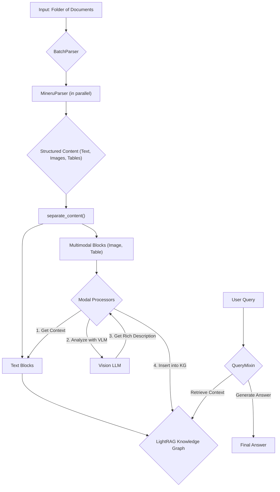

'''
# Getting Started with RAG-Anything

## 1. Synopsis

In the real world, information isn't always neatly organized in text files. We have to deal with complex documents like PDFs, research papers, and reports that are a mix of text, images, tables, and even equations. How do you build a smart search system that can understand all of this content?

This is the problem RAG-Anything solves. It's a powerful framework that creates a comprehensive, queryable knowledge base from your complex, multimodal documents. It handles the entire process: parsing the document, understanding the different content types, and generating accurate answers to your questions.

This tutorial will guide you through the basics of setting up RAG-Anything, processing your first document, and asking a question.

## 2. Prerequisites

Before we start, you need to have the following installed:

- Python 3.9+
- `rag-anything`: The core library.
- A PDF document to test with. You can create a dummy one for this tutorial.

Install the necessary libraries using pip:

```bash
pip install rag-anything
```

You will also need access to:
- A Large Language Model (LLM) for text generation.
- A Vision Language Model (VLM) for image understanding.
- An embedding model to create vector representations of your text.

For this tutorial, we will use placeholder functions for these models.

## 3. Architecture

The RAG-Anything pipeline can be visualized as follows:



## 4. Implementation Steps

### Step 1: Setup and Model Placeholders

First, let's create a Python script and set up our dummy model functions and a test PDF.

```python
import asyncio
import os
from raganything import RAGAnything

# --- 1. Create Dummy Models ---
def llm_func(prompt, **kwargs):
    return f"LLM response to: {prompt}"

def vision_func(prompt, image_data, **kwargs):
    return f"Vision model response to: {prompt}"

def embed_func(texts, **kwargs):
    # Return a list of dummy embeddings, one for each text
    return [[0.1] * 128 for _ in texts]

# --- 2. Create a Dummy PDF for testing ---
# In a real scenario, you would have your own PDF file.
from reportlab.pdfgen import canvas
from reportlab.lib.pagesizes import letter

def create_dummy_pdf(path="my_report.pdf"):
    if os.path.exists(path):
        return
    c = canvas.Canvas(path, pagesize=letter)
    c.drawString(100, 750, "This is a test report.")
    c.drawString(100, 735, "The net revenue in Q4 was $1,000,000.")
    c.save()

create_dummy_pdf()

async def main():
    # --- 3. Initialize RAGAnything ---
    print("Initializing RAGAnything...")
    rag_system = RAGAnything(
        llm_model_func=llm_func, 
        vision_model_func=vision_func, 
        embedding_func=embed_func
    )

    # --- 4. Process a Document ---
    # This will parse the document, extract text and multimodal content, 
    # and insert it into the knowledge graph.
    print("Processing document...")
    await rag_system.process_document_complete("my_report.pdf")
    print("Document processing complete.")

    # --- 5. Ask a Question ---
    print("Asking a question...")
    answer = await rag_system.aquery("What was the net revenue in Q4?")
    print("\n--- Query Result ---")
    print(answer)
    print("--------------------")

if __name__ == "__main__":
    asyncio.run(main())

```

***Verification***:

Save the code as `tutorial.py` and run it from your terminal:

```bash
python tutorial.py
```

You should see output indicating the system is initializing, processing the document, and then printing the answer from the LLM.

### Step 2: Breaking Down the Code

- **`RAGAnything(...)`**: We initialize the system by passing our model functions. `RAGAnything` will use these to understand the content of our documents.
- **`process_document_complete("my_report.pdf")`**: This is the core ingestion function. It takes the path to a document and handles everything needed to add it to the knowledge base. This includes:
    - **Parsing**: Using the `MineruParser` by default to extract text, images, and tables.
    - **Text Insertion**: Storing the text content in the underlying `LightRAG` knowledge graph.
    - **Multimodal Processing**: Analyzing any non-text content (if present) and adding descriptions to the knowledge graph.
- **`aquery("...")`**: This function is used to ask questions. It finds the most relevant information in the knowledge graph and uses the LLM to generate a natural language answer.

## 5. Common Pitfalls

- **Parser Not Installed**: RAG-Anything defaults to using the `Mineru` parser. If it's not installed, you will get an error. Make sure you have installed all the required dependencies.
- **Missing Model Functions**: The `llm_model_func` and `embedding_func` are required. If you want to process images, you also need to provide a `vision_model_func`.
- **File Paths**: Ensure the path to the document you want to process is correct.

## 6. Challenge Yourself

Now that you have the basics down, try the following:

1.  **Process a Folder**: Instead of a single file, use the `process_folder_complete` method to ingest all documents in a directory.
2.  **Use a Real Document**: Replace the dummy PDF with a real report you have. Ask more complex questions.
3.  **Explore Different Query Modes**: The `aquery` method has a `mode` parameter. Try `"local"`, `"global"`, or `"hybrid"` to see how it changes the results.

This concludes our getting started guide. You are now ready to explore the more advanced features of RAG-Anything!
'''